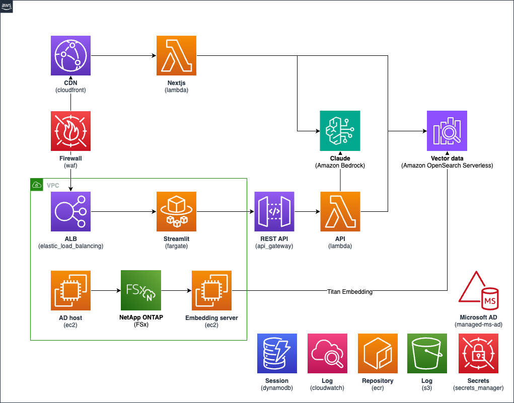
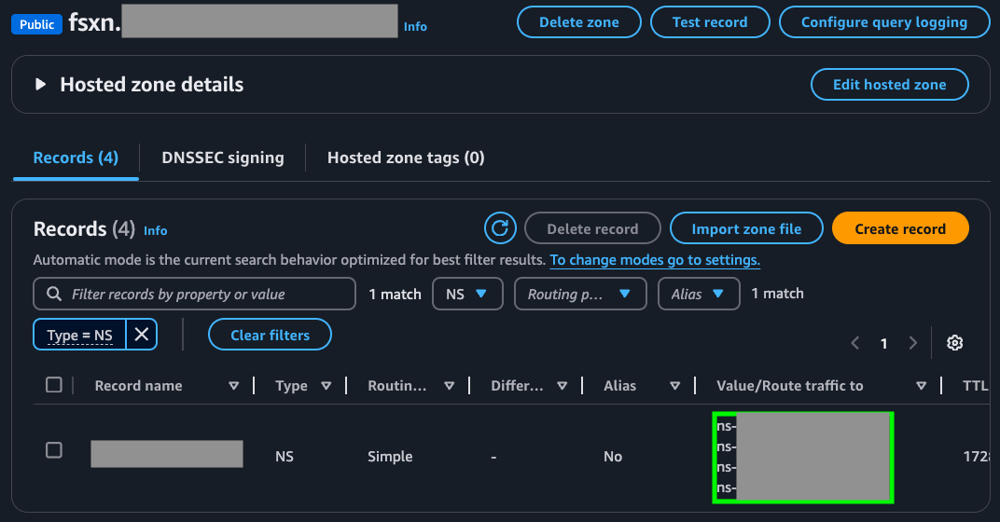
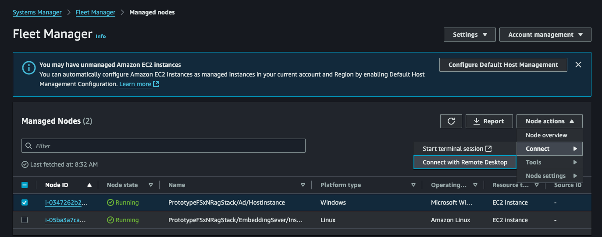
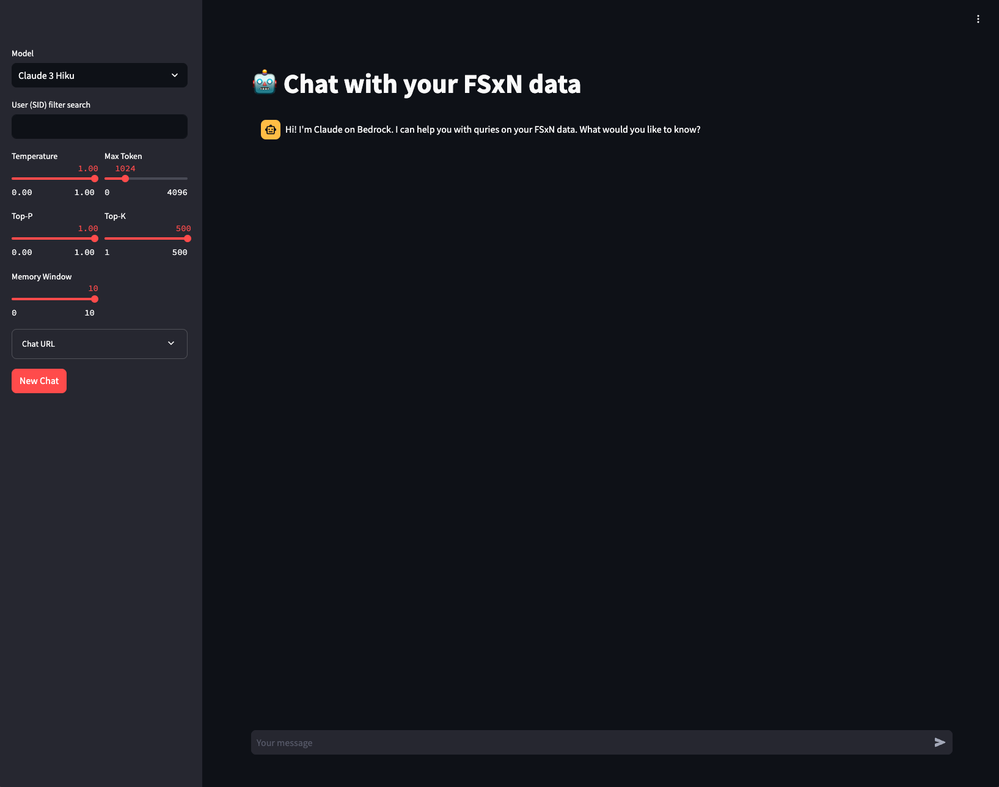
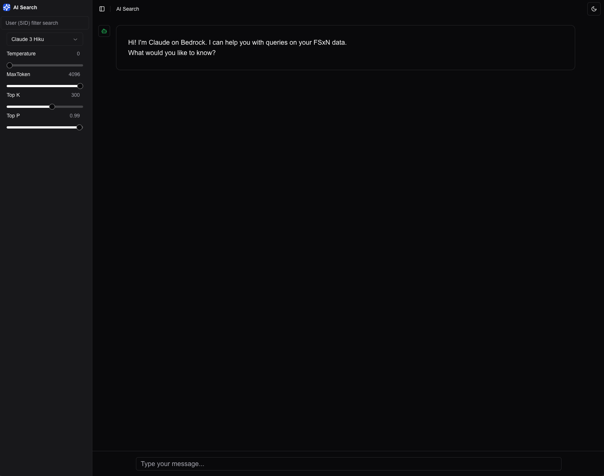

# RAG Chatbot with FSx for ONTAP

本プロトタイプは[Amazon FSx for NetApp ONTAP](https://aws.amazon.com/fsx/netapp-ontap/?nc1=h_ls)と[Amazon Bedrock](https://aws.amazon.com/bedrock/?nc1=h_ls)を利用した RAG Chatbot アプリケーションです。Chatbot アプリケーションは、1) [Nextjs](https://nextjs.org/) で実装した RAG Chatbot on AWS Lambda と、2) [Streamlit](https://streamlit.io/) で実装した RAG Chatbot on [Amazon ECS](https://aws.amazon.com/ecs/?nc1=h_ls)の 2 つが実装されています。それぞれのアプリケーションは [AWS WAF](https://aws.amazon.com/waf/?nc1=h_ls) で保護されており、API は IAM 認証を利用しています。RAG 検索で利用するベクトルデータは[Amazon OpenSearch Serverless](https://aws.amazon.com/opensearch-service/features/serverless/?nc1=h_ls)(以下、AOSS)
に保存されており、Amazon FSx for NetApp ONTAP をマウントしている Embedding Server がベクトルデータを AOSS に定期的に更新しています。データのベクトル化には[Amazon Titan Text Embeddings models](https://docs.aws.amazon.com/bedrock/latest/userguide/titan-embedding-models.html)を利用しています。

1. RAG Chatbot on AWS Lambda
   - [AWS Lambda Web Adapter](https://github.com/awslabs/aws-lambda-web-adapter) を利用して Nextjs を稼働
2. RAG Chatbot on Amazon ECS
   - [AWS Fargate](https://aws.amazon.com/fargate/?nc1=h_ls)と Amazon ECS を利用して Streamlit を稼働

## アーキテクチャ



### 特徴

#### 1. セキュリティ

1. **AWS WAF**: アプリケーションへのアクセスを制御するファイアウォール。Web アプリケーションにアクセスできる CIDR を設定し、不正アクセスをブロックできます。[Amazon CloudFront](https://aws.amazon.com/cloudfront/?nc2=type_a) と [Application Load Balancing](https://aws.amazon.com/jp/elasticloadbalancing/) に設定しています。
2. **[AWS IAM](https://aws.amazon.com/iam/?nc2=type_a)**: [AWS Lambda](https://aws.amazon.com/lambda/?nc2=type_a) の Endpoint URL と[Amazon API Gateway](https://aws.amazon.com/api-gateway/)の Endpoint へのアクセス認証を行います。
3. **アクセスログ**: Chatbot アプリのアクセスログを有効化しており、[Amazon S3](https://aws.amazon.com/pm/serv-s3/?nc1=h_ls) や [Amazon CloudWatch Logs](https://docs.aws.amazon.com/AmazonCloudWatch/latest/logs/WhatIsCloudWatchLogs.html) に格納しています。

## License

このプロジェクトのライセンスは Amazon Software License([ASL](https://d1.awsstatic.com/legal/Amazon%20Software%20License/Amazon_Software_License__Japanese__04-18-2008.pdf)) に基づきます。

## RAG チャットアプリケーション設定

- `config.ts`ファイルの作成
  以下のコマンドで config.ts ファイルを作成してください。

```zsh
cp config.sample.ts config.ts
```

各プロパティの定義は[config.sample.ts](config.sample.ts)に記載していますが、以下の設定は必ずご自身の環境の値に変更してください。(他のプロパティに関しては、デフォルト設定でも問題ありません)

| プロパティ      | 説明                                                                                                                                                                                |
| --------------- | ----------------------------------------------------------------------------------------------------------------------------------------------------------------------------------- |
| allowedIps      | AWS WAF 設定により Web アプリケーションに アクセス可能な CIDR を指定します。                                                                                                        |
| appDomainName   | Chatbot on ECS で利用するドメイン名を指定します。 このドメイン名は必ず、**Amazon Route53 で登録したドメイン**、もしくは**外部プロバイダーにて登録したドメイン**を指定してください。 |
| existingRoute53 | Amazon Route53 で登録したドメインを利用する際は`true`、外部プロバイダーにて登録したドメインを利用する際は`false`を指定してください。                                                |

## Deployment

### 前提条件

- Node.js

  - デプロイ実行するローカルマシンに Node.js バージョン、v18.20.2 以上のインストールが必要です。[こちら](https://nodejs.org/en/download/package-manager)のパッケージマネージャーを利用してインストール可能です。

- Docker Desktop

  - AWS Lambda のコードなどのファイルのビルドに利用します。[こちら](https://www.docker.com/products/docker-desktop/)のページからダウンロード可能です。

- AWS CLI

  - [こちらの手順](https://docs.aws.amazon.com/ja_jp/cli/latest/userguide/getting-started-install.html)で AWS CLI をインストールしてください。

- 設定ファイルと認証情報ファイルの設定

  - 以下のコマンドを利用して、任意の Profile 名で設定してください。設定詳細は[こちら](https://docs.aws.amazon.com/ja_jp/cli/latest/userguide/cli-configure-files.html)を参照ください。

  ```zsh
  aws configure --profile <任意のAWS PROFILE NAME>
  ```

- ドメインの取得
  Chatbot on ECS にはドメインが必要です、**Amazon Route53 で新しいドメインを登録する**、もしくは**外部プロバイダーにてドメインを登録**してください。Route53 でのドメイン取得の手順は[こちら](https://docs.aws.amazon.com/ja_jp/Route53/latest/DeveloperGuide/domain-register-update.html)です。

### 1. 依存関係のインストール

以下のコマンドを実行してください。

```zsh
npm ci
```

### 2. デプロイ

RAG チャットアプリケーション をデプロイします。以下のコマンドを実行してください。(`YOUR_AWS_PROFILE`は先程設定した、AWS PROFILE NAME を利用してください。)

```zsh
npm run cdk deploy -- --all --profile YOUR_AWS_PROFILE
```

> **注意**
> 初回デプロイ時のみ Bootstrapping が必要です。以下のコマンドを実行してください。詳細は[こちら](https://docs.aws.amazon.com/cdk/v2/guide/bootstrapping.html)をご確認ください。
>
> ```zsh
> npm run cdk bootstrap -- --profile YOUR_AWS_PROFILE
> ```

> **注意**  
> `appDomainName` に Route53 ではなく独自ドメインを利用する際は、Deploy の途中で Route53 に作成された NS Record をご自身の Name Server に設定する必要があります。AWS Console から Route53 の Hosted Zone の画面に移動し以下の緑枠の NS Record を Name Server に登録してください。
> (登録していない場合、Deploy が進まず場合によっては Deploy が失敗する恐れがあります)
> 

デプロイが完了すると以下が出力されます。
(利用するターミナルによっては表記が異なります)

```zsh

✅  PrototypeFSxNRagStack

✨  Deployment time: 147.17s

Outputs:
PrototypeFSxNRagStack.AdGetSecretValueCommand6F5CE13F = aws secretsmanager get-secret-value --secret-id AdSecretsForMicrosoftAdXXXX --profile YOUR_AWS_PROFILE
PrototypeFSxNRagStack.ApiLambdaRestApiEndpointFBD517A9 = https://XXXXX/prod/
PrototypeFSxNRagStack.ApiecrdeployDockerImageCustomResourceReport4C700C0C = CodeBuild completed successfully, see the logs here: "https://console.aws.amazon.com/cloudwatch/home?region=ap-northeast-1#logsV2:log-groups/log-group/$252Faws$252Fcodebuild$252FApiecrdeployDockerImageDock-wibjFxy1ffI7/log-events/b074a47a-748b-4e32-ba17-2f984156b228"
PrototypeFSxNRagStack.ChatAppAlbFargateServiceLoadBalancerDNS7F583184 = XXXX.ap-northeast-1.elb.amazonaws.com
PrototypeFSxNRagStack.ChatAppAlbFargateServiceServiceURLB2485628 = https://ECSChatbot
PrototypeFSxNRagStack.ChatAppEcrdeployDockerImageCustomResourceReport32E0E42D = CodeBuild completed successfully, see the logs here: "https://console.aws.amazon.com/cloudwatch/home?region=ap-northeast-1#logsV2:log-groups/log-group/$252Faws$252Fcodebuild$252FChatAppEcrdeployDockerImage-omdPv4ZAU1pp/log-events/6fe87265-aae9-4b8f-887e-516080a22212"
PrototypeFSxNRagStack.EmbeddingSeverEcrdeployDockerImageCustomResourceReport3FC9FF33 = CodeBuild completed successfully, see the logs here: "https://console.aws.amazon.com/cloudwatch/home?region=ap-northeast-1#logsV2:log-groups/log-group/$252Faws$252Fcodebuild$252FEmbeddingSeverEcrdeployDock-C1rVni30e6UU/log-events/0f592c51-4e5a-4ad5-baa1-84fd6c4944d9"
PrototypeFSxNRagStack.NextJsecrdeployDockerImageCustomResourceReport5F37804E = CodeBuild completed successfully, see the logs here: "https://console.aws.amazon.com/cloudwatch/home?region=ap-northeast-1#logsV2:log-groups/log-group/$252Faws$252Fcodebuild$252FNextJsecrdeployDockerImageD-IzaoN60LH1Xn/log-events/4aea23b6-c809-4cf7-adef-a3c5a426ed72"
PrototypeFSxNRagStack.NextJsurl26CBB678 = https://RAGChatbot.cloudfront.net
Stack ARN:
arn:aws:cloudformation:ap-northeast-1:123456789012:stack/PrototypeFSxNRagStack/01496990-a4bc-11ef-b309-063abe47de3f

✨  Total time: 157.51s

```

## AD Host へのアクセス

AD Host インスタンスへのアクセスは[AWS Systems Manager Fleet Manager](https://docs.aws.amazon.com/systems-manager/latest/userguide/fleet-manager.html)から行います。 [Systems Manager console](https://console.aws.amazon.com/systems-manager/fleet-manager)から Fleet Manager のページに移動し、Name が`/Ad/HostInstance`が含まれる Node をチェックし、Node actions > Connect > Connect with Remote Desktop を選択してクリックしてください。

次のページで Username と Password を入力して Connect をクリックすると接続できます。

- Username: `bedrock-01\Admin`
- Pasword: デプロイ時に出力される以下のコマンドを実行した出力される password

```zsh

aws secretsmanager get-secret-value --secret-id AdSecretsForMicrosoftAdXXXX --profile YOUR_AWS_PROFILE
{
"ARN": "arn:aws:secretsmanager:ap-northeast-1:123456789012:secret:AdSecretsForMicrosoftAd0143-yjOEzWv0vmLG-rpAhGu",
"Name": "AdSecretsForMicrosoftAdXXXX ",
"VersionId": "6f9501fd-baf1-3f64-638b-ae0be2e7c2da",
"SecretString": "{\"password\":\"XXXXXXXX\",\"username\":\"Admin\"}",
"VersionStages": [
"AWSCURRENT"
],
"CreatedDate": "2024-11-01T18:54:53.021000+09:00"
}
```

データのロードと権限設定に関しては、[こちら](https://aws.amazon.com/jp/blogs/machine-learning/build-rag-based-generative-ai-applications-in-aws-using-amazon-fsx-for-netapp-ontap-with-amazon-bedrock/)のブログの手順を参照ください。
(Map Network Drive の Folder path は、Blog 記載の`\\brsvm.bedrock-01.com\c$\bedrockrag`を利用ください。)

## RAG Chatbot へのアクセス

デプロイ時に出力された以下の URL でアクセスできます。

- RAG chatbot on ECS

```zsh
PrototypeFSxNRagStack.ChatAppAlbFargateServiceServiceURLB2485628 = https://ECSChatbot
```



- RAG chatbot on AWS Lambda

```zsh
PrototypeFSxNRagStack.NextJsurl26CBB678 = https://RAGChatbot.cloudfront.net
```



## Embedding server のスキャン間隔

デフォルトでは[こちら](https://aws.amazon.com/jp/blogs/machine-learning/build-rag-based-generative-ai-applications-in-aws-using-amazon-fsx-for-netapp-ontap-with-amazon-bedrock/)のブログ設定と同じ、**5 分**間隔となっています。変更する場合は、Embedding Server の[env](docker/embed/.env)の`SCANNER_INTERVAL`の値を変更してください。

## Clean up

AWS 環境の削除は、以下のコマンドを実行します。

```zsh
npm run cdk destroy -- --all --profile YOUR_AWS_PROFILE
```

> **注意**
> CloudFront の Edge で利用している Lambda@Edge は関数のレプリカが作成されているため、以下のような Error が出力されます。その場合は、数時間経ってから、再度コマンドを実行してください。レプリカに関する詳細は[こちら](https://docs.aws.amazon.com/AmazonCloudFront/latest/DeveloperGuide/lambda-edge-delete-replicas.html)を参照ください。
>
> ```zsh
> 12:18:51 PM | DELETE_FAILED        | AWS::Lambda::Function                           | FrontendSta...FunctionFnD44980B3
> Resource handler returned message: "Lambda was unable to delete arn:aws:lambda:us-east-1:123456789012:function:FrontendStack-FrontendStackMiddleWa-yo5G94clrdik:1 b
> ecause it is a replicated function. Please see our documentation for Deleting Lambda@Edge Functions and Replicas.
> ```

> **注意**
> S3 バケットの削除に失敗する場合があります。その場合は、AWS Management Console の S3 の画面から対象のバケットを削除後、再度コマンドを実行してください。
