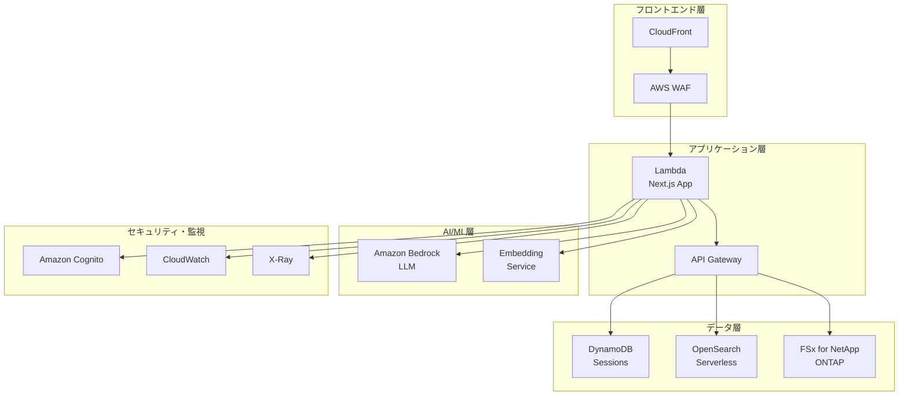
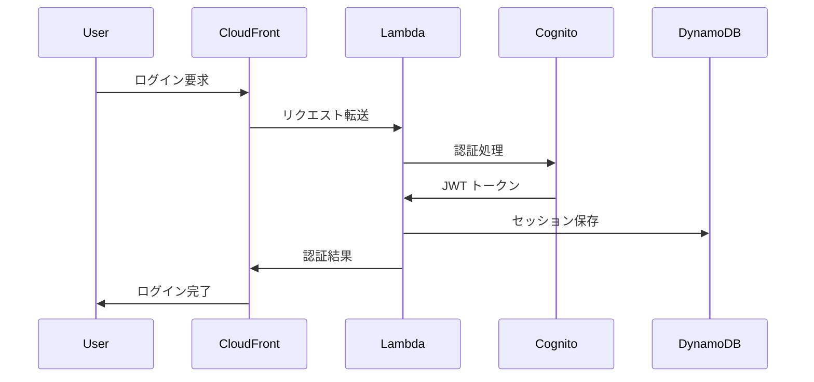
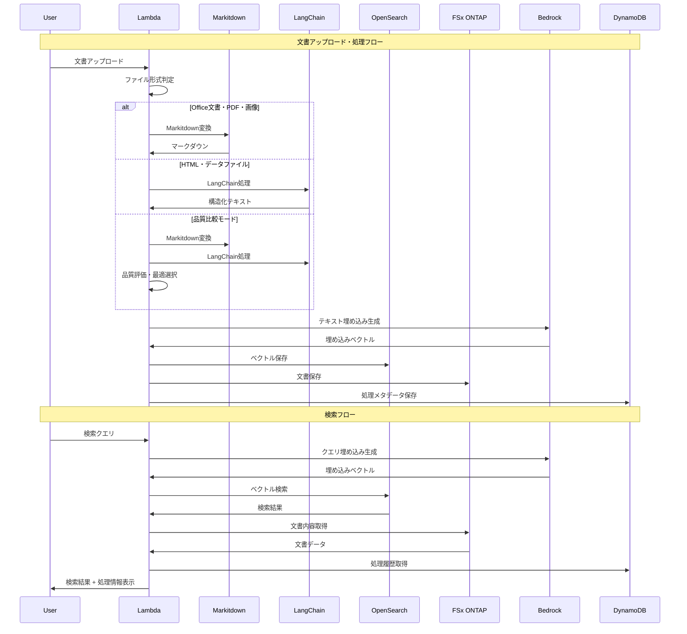
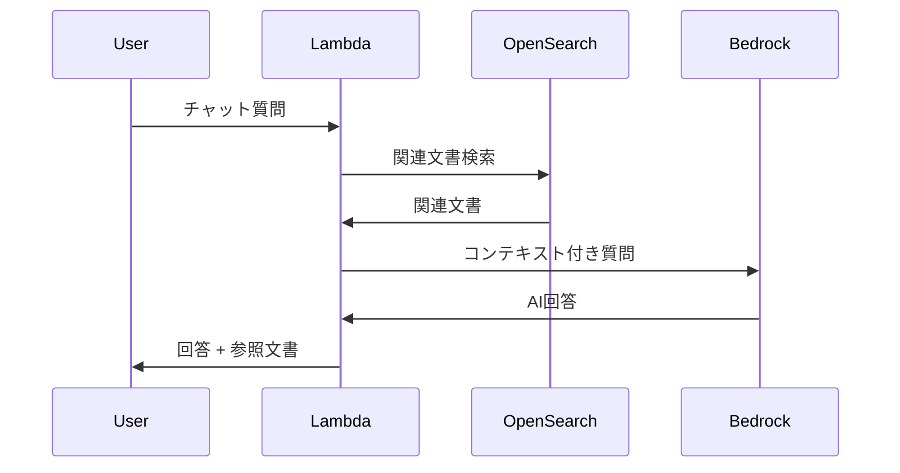
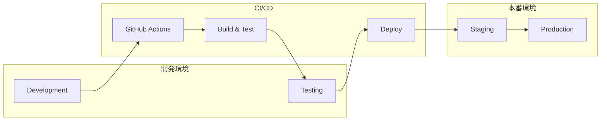

# システムアーキテクチャ

## 📋 概要

Permission-aware RAG System with FSx for NetApp ONTAP のシステムアーキテクチャドキュメントです。

## 🏗️ 全体アーキテクチャ

### システム構成図

## 🔧 コンポーネント詳細

### フロントエンド層

#### CloudFront
- **役割**: グローバルCDN、静的コンテンツ配信
- **機能**: キャッシュ、SSL終端、地理的分散
- **設定**: カスタムドメイン、セキュリティヘッダー

#### AWS WAF
- **役割**: Webアプリケーションファイアウォール
- **機能**: DDoS保護、SQLインジェクション防止
- **ルール**: IP制限、レート制限、地理的制限

### アプリケーション層

#### Lambda (Next.js)
- **役割**: サーバーレスWebアプリケーション
- **技術**: Next.js 14, React, TypeScript
- **機能**: SSR、API Routes、認証処理
- **設定**: メモリ3008MB、タイムアウト30秒

#### API Gateway
- **役割**: RESTful API エンドポイント
- **機能**: リクエストルーティング、認証、レート制限
- **統合**: Lambda プロキシ統合

### データ層

#### DynamoDB
- **役割**: セッション管理、ユーザー設定
- **テーブル**: Sessions, UserProfiles, AccessLogs
- **設定**: オンデマンド課金、暗号化有効

#### OpenSearch Serverless
- **役割**: ベクトル検索、全文検索
- **インデックス**: Documents, Embeddings
- **設定**: 自動スケーリング、セキュリティポリシー

#### FSx for NetApp ONTAP
- **役割**: 高性能ファイルストレージ
- **機能**: スナップショット、重複排除、圧縮
- **設定**: Multi-AZ、自動バックアップ

### AI/ML層

#### Amazon Bedrock
- **役割**: 大規模言語モデル (LLM)
- **モデル**: Claude-3, Titan Embeddings
- **機能**: テキスト生成、埋め込み生成

#### Embedding Service
- **役割**: 文書の埋め込みベクトル生成
- **技術**: Lambda、Bedrock Titan、Microsoft Markitdown
- **処理**: バッチ処理、リアルタイム処理
- **文書変換**: 
  - **Markitdown統合**: Office文書、PDF、画像のマークダウン変換
  - **処理戦略**: ファイル形式別の最適化された処理方法選択
  - **品質比較**: 複数処理方法の品質評価と自動選択
  - **追跡機能**: 処理方法の使用状況とパフォーマンス監視

## 🔒 セキュリティアーキテクチャ

### 認証・認可

### データ保護
- **暗号化**: 保存時・転送時暗号化
- **アクセス制御**: IAM ロール、リソースベースポリシー
- **監査**: CloudTrail、VPC Flow Logs

## 📊 パフォーマンス設計

### スケーラビリティ
- **Lambda**: 自動スケーリング（1000同時実行）
- **DynamoDB**: オンデマンドスケーリング
- **OpenSearch**: 自動スケーリング
- **CloudFront**: グローバル分散

### 可用性
- **Multi-AZ**: RDS、FSx
- **冗長化**: Lambda、API Gateway
- **フェイルオーバー**: 自動フェイルオーバー

## 🔄 データフロー

### 文書処理・検索フロー

### RAGチャットフロー

## 🚀 デプロイメントアーキテクチャ

### CI/CD パイプライン

### 環境分離
- **開発環境**: 開発・テスト用
- **ステージング環境**: 本番同等環境でのテスト
- **本番環境**: エンドユーザー向け環境

## 📈 監視・運用

### メトリクス
- **アプリケーション**: レスポンス時間、エラー率
- **インフラ**: CPU、メモリ、ネットワーク
- **ビジネス**: ユーザー数、検索回数、満足度

### アラート
- **重要度高**: サービス停止、セキュリティ侵害
- **重要度中**: パフォーマンス劣化、エラー増加
- **重要度低**: 使用量増加、設定変更

## 🔧 技術スタック

### フロントエンド
- **フレームワーク**: Next.js 14, React 18
- **言語**: TypeScript 5.3+
- **スタイリング**: Tailwind CSS
- **状態管理**: Zustand

### バックエンド
- **ランタイム**: Node.js 20
- **フレームワーク**: Next.js API Routes
- **データベース**: DynamoDB, OpenSearch
- **ストレージ**: FSx for NetApp ONTAP

### インフラ
- **IaC**: AWS CDK v2
- **CI/CD**: GitHub Actions
- **監視**: CloudWatch, X-Ray
- **セキュリティ**: AWS WAF, Cognito

---

**最終更新**: 2025/10/02 10:35:00  
**自動更新**: ドキュメント自動更新システムにより生成