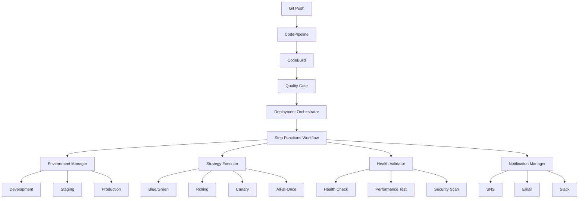

# デプロイメント自動化システムガイド

## 概要

Permission-aware RAG Systemのデプロイメント自動化システムは、多環境・多地域への安全で効率的なデプロイメントを実現する包括的なCI/CDソリューションです。

## 主な機能

### 🚀 デプロイメント戦略
- **Blue/Green デプロイメント**: ゼロダウンタイムでの安全な切り替え
- **Rolling デプロイメント**: 段階的なインスタンス更新
- **Canary デプロイメント**: 小規模テストから段階的拡大
- **All-at-Once デプロイメント**: 高速な一括更新

### 🔍 品質ゲート統合
- **事前品質ゲート**: コード品質、セキュリティ、コンプライアンスチェック
- **事後品質ゲート**: ヘルスチェック、パフォーマンステスト
- **自動ロールバック**: 品質基準未達成時の自動復旧

### 🌍 多地域対応
- **並行デプロイメント**: 複数地域への同時デプロイ
- **地域別設定**: 各地域の要件に応じた個別設定
- **災害復旧**: 地域間でのフェイルオーバー対応

### 📊 監視・通知
- **リアルタイム監視**: デプロイメント状況の可視化
- **多チャンネル通知**: SNS、Email、Slackでの通知
- **詳細ログ**: 包括的な実行ログとメトリクス

## アーキテクチャ



## 使用方法

### 基本的なデプロイメント

```bash
# 開発環境への自動デプロイメント
npm run deploy:automation -- --environment=development

# ステージング環境へのCanaryデプロイメント
npm run deploy:automation -- --environment=staging --strategy=CANARY

# 本番環境へのBlue/Greenデプロイメント（承認必要）
npm run deploy:automation -- --environment=production --strategy=BLUE_GREEN
```

### 高度なオプション

```bash
# 並行デプロイメント（複数地域）
npm run deploy:automation -- --environment=production --parallel --max-concurrency=3

# ドライラン（設定確認のみ）
npm run deploy:automation -- --environment=production --dry-run

# 自動承認付きデプロイメント
npm run deploy:automation -- --environment=staging --auto-approval

# 特定地域へのデプロイメント
npm run deploy:automation -- --environment=production --region=us-east-1
```

## 設定

### 環境別設定

#### 開発環境
```typescript
development: {
  region: 'ap-northeast-1',
  autoApproval: true,
  healthCheckTimeout: 300,
  rollbackTimeout: 600,
  strategy: 'ALL_AT_ONCE'  // 高速デプロイメント
}
```

#### ステージング環境
```typescript
staging: {
  region: 'ap-northeast-1',
  autoApproval: false,
  healthCheckTimeout: 600,
  rollbackTimeout: 900,
  canaryPercentage: 20,
  warmupTime: 300,
  strategy: 'CANARY'  // 本番環境のテスト
}
```

#### 本番環境
```typescript
production: {
  region: 'ap-northeast-1',
  autoApproval: false,
  healthCheckTimeout: 900,
  rollbackTimeout: 1200,
  canaryPercentage: 10,
  warmupTime: 600,
  strategy: 'BLUE_GREEN'  // 安全性重視
}
```

### デプロイメント戦略の詳細

#### Blue/Green デプロイメント
- **利点**: ゼロダウンタイム、即座のロールバック
- **適用場面**: 本番環境、重要なサービス
- **所要時間**: 約20分
- **リスク**: 低

```typescript
{
  strategy: 'BLUE_GREEN',
  phases: [
    'Green環境準備',
    'Green環境デプロイ',
    'Green環境検証',
    'トラフィック切り替え',
    'Blue環境クリーンアップ'
  ]
}
```

#### Canary デプロイメント
- **利点**: 段階的リスク軽減、詳細監視
- **適用場面**: 新機能リリース、重要な変更
- **所要時間**: 約30分
- **リスク**: 非常に低

```typescript
{
  strategy: 'CANARY',
  phases: [
    'Canary環境準備 (10%)',
    'トラフィック開始',
    '監視期間 (5-10分)',
    '段階的拡大 (50%)',
    '最終展開 (100%)'
  ]
}
```

#### Rolling デプロイメント
- **利点**: リソース効率、段階的更新
- **適用場面**: 通常の更新、リソース制約がある場合
- **所要時間**: 約15分
- **リスク**: 中

```typescript
{
  strategy: 'ROLLING',
  phases: [
    'バッチ1更新 (33%)',
    'ヘルスチェック',
    'バッチ2更新 (33%)',
    'ヘルスチェック',
    'バッチ3更新 (34%)',
    '最終検証'
  ]
}
```

#### All-at-Once デプロイメント
- **利点**: 最高速度、シンプル
- **適用場面**: 開発環境、緊急修正
- **所要時間**: 約5分
- **リスク**: 高

```typescript
{
  strategy: 'ALL_AT_ONCE',
  phases: [
    '全インスタンス停止',
    '新バージョンデプロイ',
    '全インスタンス開始',
    'ヘルスチェック'
  ]
}
```

## 品質ゲート

### 事前品質ゲート
```typescript
preDeploymentChecks: {
  codeQuality: {
    threshold: 80,
    tools: ['SonarQube', 'ESLint', 'TypeScript']
  },
  security: {
    threshold: 95,
    tools: ['Snyk', 'OWASP', 'AWS Security Hub']
  },
  performance: {
    threshold: 90,
    tools: ['Lighthouse', 'WebPageTest']
  },
  compliance: {
    threshold: 100,
    frameworks: ['GDPR', 'SOX', 'HIPAA']
  }
}
```

### 事後品質ゲート
```typescript
postDeploymentChecks: {
  healthCheck: {
    endpoints: ['/health', '/api/status'],
    timeout: 30,
    retries: 3
  },
  performanceTest: {
    responseTime: 500,  // ms
    throughput: 1000,   // req/sec
    errorRate: 0.01     // 1%
  },
  securityScan: {
    vulnerabilities: 0,
    complianceScore: 95
  }
}
```

## 監視とアラート

### メトリクス
- **デプロイメント成功率**: 目標 >95%
- **平均デプロイメント時間**: 戦略別ベンチマーク
- **ロールバック率**: 目標 <5%
- **品質ゲート通過率**: 目標 >90%

### アラート設定
```typescript
alerts: {
  deploymentFailure: {
    severity: 'HIGH',
    channels: ['SNS', 'Email', 'Slack'],
    escalation: 'immediate'
  },
  qualityGateFailure: {
    severity: 'MEDIUM',
    channels: ['SNS', 'Email'],
    escalation: '15min'
  },
  performanceDegradation: {
    severity: 'MEDIUM',
    channels: ['SNS'],
    escalation: '30min'
  }
}
```

## トラブルシューティング

### よくある問題

#### デプロイメント失敗
```bash
# ログの確認
aws logs tail /aws/lambda/rag-system-deployment-orchestrator --follow

# デプロイメント履歴の確認
aws dynamodb scan --table-name rag-system-deployment-history

# ロールバックの実行
npm run rollback -- --deployment-id=<ID>
```

#### 品質ゲート失敗
```bash
# 品質ゲート結果の確認
aws lambda invoke --function-name quality-gate-checker response.json

# 詳細レポートの取得
aws s3 cp s3://quality-reports/latest-report.json ./
```

#### パフォーマンス問題
```bash
# CloudWatchメトリクスの確認
aws cloudwatch get-metric-statistics \
  --namespace AWS/Lambda \
  --metric-name Duration \
  --dimensions Name=FunctionName,Value=deployment-orchestrator

# X-Rayトレースの確認
aws xray get-trace-summaries --time-range-type TimeRangeByStartTime
```

## ベストプラクティス

### 1. 環境別戦略選択
- **開発**: All-at-Once（速度重視）
- **ステージング**: Canary（本番テスト）
- **本番**: Blue/Green（安全性重視）

### 2. 品質ゲート設定
- **厳格な事前チェック**: セキュリティ、コンプライアンス
- **包括的事後チェック**: パフォーマンス、機能性
- **自動ロールバック**: 基準未達成時の即座復旧

### 3. 監視・通知
- **リアルタイム監視**: デプロイメント進行状況
- **多段階通知**: 重要度別の通知チャンネル
- **詳細ログ**: トラブルシューティング用

### 4. セキュリティ
- **最小権限原則**: IAMロールの適切な設定
- **暗号化**: 保存時・転送時の暗号化
- **監査ログ**: 全操作の記録・保持

## コスト最適化

### 推定月額コスト
- **Lambda実行**: $10-50
- **DynamoDB**: $5-20
- **S3ストレージ**: $1-5
- **Step Functions**: $5-15
- **CloudWatch**: $2-10
- **SNS**: $1-3
- **合計**: $24-103/月

### コスト削減のヒント
1. **不要なログの削除**: 古いログの自動削除設定
2. **リザーブドキャパシティ**: DynamoDBの予約容量利用
3. **S3ライフサイクル**: アーティファクトの自動アーカイブ
4. **Lambda最適化**: メモリ・タイムアウト設定の調整

## まとめ

デプロイメント自動化システムにより、Permission-aware RAG Systemは以下を実現します：

- ✅ **安全なデプロイメント**: 複数の戦略と品質ゲート
- ✅ **高い可用性**: ゼロダウンタイムデプロイメント
- ✅ **スケーラビリティ**: 多地域・並行デプロイメント
- ✅ **運用効率**: 自動化による人的エラー削減
- ✅ **コスト効率**: 最適化されたリソース利用

このシステムにより、開発チームは安心してコードをデプロイし、ビジネス価値の提供に集中できます。