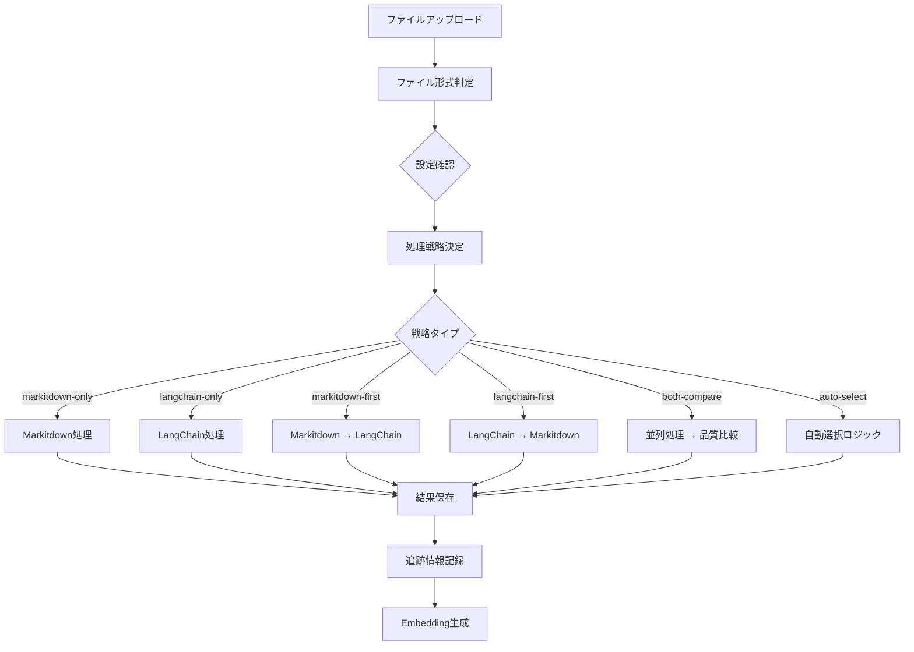

# Markitdown統合機能 運用ガイド

## 📋 概要

Permission-aware RAG SystemにMicrosoft Markitdownライブラリを統合し、多様なファイル形式の高品質な文書変換とEmbedding処理を実現します。

## 🎯 主要機能

### サポートファイル形式
- **Office文書**: docx, xlsx, pptx
- **PDF文書**: OCR対応、スキャン文書も処理可能
- **画像ファイル**: png, jpg, jpeg, gif（OCR機能）
- **Web文書**: html, xml
- **データファイル**: csv, tsv

### 処理戦略
- **markitdown-only**: Markitdownのみ使用
- **langchain-only**: LangChainのみ使用
- **markitdown-first**: Markitdown優先、失敗時LangChain
- **langchain-first**: LangChain優先、失敗時Markitdown
- **both-compare**: 両方実行して品質比較
- **auto-select**: ファイル特性に基づく自動選択

## 🚀 設定管理

### 基本設定ファイル

**`config/markitdown-config.json`**
```json
{
  "markitdown": {
    "enabled": true,
    "supportedFormats": {
      "docx": {
        "enabled": true,
        "timeout": 30,
        "description": "Microsoft Word文書",
        "processingStrategy": "markitdown-first",
        "useMarkitdown": true,
        "useLangChain": true,
        "enableQualityComparison": false
      },
      "pdf": {
        "enabled": true,
        "timeout": 120,
        "ocr": true,
        "description": "PDF文書（OCR対応）",
        "processingStrategy": "both-compare",
        "useMarkitdown": true,
        "useLangChain": true,
        "enableQualityComparison": true
      }
    }
  }
}
```

### 環境別設定オーバーライド

**`config/environments/markitdown-overrides.json`**
```json
{
  "dev": {
    "performance": {
      "maxFileSize": "5MB",
      "parallelProcessing": false,
      "maxConcurrentProcesses": 1
    },
    "logging": {
      "level": "debug",
      "enableDetailedLogs": true
    }
  },
  "prod": {
    "performance": {
      "maxFileSize": "10MB",
      "parallelProcessing": true,
      "maxConcurrentProcesses": 3
    },
    "logging": {
      "level": "warn",
      "enableDetailedLogs": false
    }
  }
}
```

## 🔧 動的設定変更

### 処理戦略の変更

```typescript
import { updateProcessingStrategy, loadMarkitdownConfig } from './config/config-loader';

// 設定読み込み
const config = loadMarkitdownConfig('prod');

// PDF処理戦略を品質比較モードに変更
const updatedConfig = updateProcessingStrategy(config, 'pdf', 'both-compare');

// 複数ファイル形式の一括変更
const multipleUpdates = updateMultipleProcessingStrategies(config, {
  'docx': 'markitdown-only',
  'xlsx': 'markitdown-only',
  'pdf': 'both-compare'
});
```

### 処理方法の確認

```typescript
import { 
  shouldUseMarkitdown, 
  shouldUseLangChain, 
  getProcessingOrder 
} from './types/markitdown-config';

// ファイル形式別の処理方法確認
const useMarkitdown = shouldUseMarkitdown(config, 'pdf');  // true/false
const useLangChain = shouldUseLangChain(config, 'csv');    // true/false
const processingOrder = getProcessingOrder(config, 'docx'); // ['markitdown', 'langchain']
```

## 📊 処理追跡・監視

### Embedding処理追跡

**DynamoDBテーブル**: `EmbeddingProcessingTracking`

```typescript
interface EmbeddingTrackingRecord {
  fileHash: string;                    // パーティションキー
  processedAt: string;                 // ソートキー
  fileName: string;
  fileFormat: SupportedFileFormat;
  processingStrategy: ProcessingStrategy;
  usedMarkitdown: boolean;             // Markitdownが使用されたか
  usedLangChain: boolean;              // LangChainが使用されたか
  finalMethod: 'markitdown' | 'langchain';
  processingTime: number;              // 処理時間（ミリ秒）
  qualityScore?: number;               // 品質スコア（0-100）
  hasError: boolean;
  errorMessage?: string;
}
```

### 処理統計レポート

```typescript
import { generateProcessingMethodReport } from './config/config-loader';

const report = generateProcessingMethodReport(config);
console.log(`総ファイル形式数: ${report.summary.totalFormats}`);
console.log(`Markitdownのみ: ${report.summary.markitdownOnlyFormats}`);
console.log(`ハイブリッド処理: ${report.summary.hybridFormats}`);
console.log(`品質比較有効: ${report.summary.qualityComparisonFormats}`);
```

## 🔄 処理フロー詳細

### 1. ファイルアップロード時の処理選択



### 2. 品質比較処理


## 📈 パフォーマンス最適化

### ファイル形式別推奨設定

| ファイル形式 | 推奨戦略 | 理由 | タイムアウト |
|-------------|----------|------|-------------|
| **docx** | markitdown-first | Office文書に最適化 | 30秒 |
| **xlsx** | markitdown-first | 表構造の保持 | 45秒 |
| **pptx** | markitdown-first | レイアウト情報保持 | 60秒 |
| **pdf** | both-compare | 品質差が大きい | 120秒 |
| **png/jpg** | markitdown-only | OCR機能必須 | 90秒 |
| **html** | langchain-first | 構造解析に優位 | 30秒 |
| **csv/tsv** | langchain-only | データ構造処理 | 15秒 |

### 環境別最適化

#### 開発環境
- 軽量設定、画像処理無効
- 単一処理方法でデバッグ容易性重視
- 詳細ログ有効

#### 本番環境
- 全機能有効、品質比較有効
- 並列処理でパフォーマンス最適化
- エラーログのみで運用効率重視

## 🔍 トラブルシューティング

### よくある問題と解決方法

#### 1. Markitdown変換エラー

**症状**: Office文書の変換が失敗する
```
❌ Markitdown変換エラー: CONVERSION_FAILED
```

**解決方法**:
```typescript
// フォールバック設定の確認
const config = loadMarkitdownConfig();
if (!config.fallback.enabled) {
  // フォールバック機能を有効化
  config.fallback.enabled = true;
  config.fallback.useLangChainOnFailure = true;
}
```

#### 2. OCR処理タイムアウト

**症状**: 画像ファイルの処理が時間切れになる
```
⚠️ OCR処理タイムアウト: 90秒
```

**解決方法**:
```typescript
// タイムアウト時間の延長
const updatedConfig = updateProcessingStrategy(config, 'pdf', 'markitdown-only');
updatedConfig.supportedFormats.pdf.timeout = 180; // 3分に延長
```

#### 3. メモリ不足エラー

**症状**: 大きなファイルの処理でメモリ不足
```
❌ メモリ制限超過: 1024MB
```

**解決方法**:
```typescript
// ファイルサイズ制限の調整
config.performance.maxFileSizeBytes = 5 * 1024 * 1024; // 5MBに制限
config.performance.memoryLimitMB = 2048; // メモリ制限を2GBに拡張
```

### デバッグ手順

#### 1. 処理状況の確認

```typescript
// 処理追跡情報の取得
const trackingInfo = await getEmbeddingTrackingRecord(fileHash);
console.log(`使用された処理方法: ${trackingInfo.finalMethod}`);
console.log(`処理時間: ${trackingInfo.processingTime}ms`);
console.log(`品質スコア: ${trackingInfo.qualityScore}`);
```

#### 2. 設定の検証

```typescript
import { validateMarkitdownConfig } from './config/config-loader';

const config = loadMarkitdownConfig('prod');
const isValid = validateMarkitdownConfig(config);
if (!isValid) {
  console.error('設定に問題があります');
}
```

## 📊 監視・メトリクス

### 主要メトリクス

1. **処理成功率**
   - ファイル形式別成功率
   - 処理方法別成功率
   - エラー種別統計

2. **パフォーマンス**
   - 平均処理時間
   - ファイルサイズ別処理時間
   - 並列処理効率

3. **品質指標**
   - 品質比較結果
   - 処理方法選択精度
   - ユーザー満足度

### CloudWatchメトリクス

```typescript
// カスタムメトリクスの送信例
const cloudwatch = new AWS.CloudWatch();

await cloudwatch.putMetricData({
  Namespace: 'RAG/DocumentProcessing',
  MetricData: [
    {
      MetricName: 'MarkitdownProcessingTime',
      Value: processingTime,
      Unit: 'Milliseconds',
      Dimensions: [
        { Name: 'FileFormat', Value: fileFormat },
        { Name: 'ProcessingMethod', Value: 'markitdown' }
      ]
    }
  ]
}).promise();
```

## 🔄 運用手順

### 日次運用

1. **処理統計の確認**
   ```bash
   # 処理レポートの生成
   npx ts-node config/test-markitdown-config.ts
   ```

2. **エラーログの確認**
   ```bash
   # エラー発生状況の確認
   aws logs filter-log-events \
     --log-group-name /aws/lambda/document-processor \
     --filter-pattern "ERROR"
   ```

### 週次運用

1. **設定の最適化**
   - 処理統計に基づく戦略調整
   - パフォーマンス改善の検討

2. **品質評価**
   - 品質比較結果の分析
   - ユーザーフィードバックの反映

### 月次運用

1. **設定レビュー**
   - 新しいファイル形式の対応検討
   - 処理戦略の見直し

2. **パフォーマンス分析**
   - 処理時間トレンドの分析
   - リソース使用量の最適化

## 🚀 今後の拡張予定

### 短期計画（1-3ヶ月）
- 新しいファイル形式の対応（epub, rtf等）
- 処理品質の自動学習機能
- リアルタイム設定変更API

### 中期計画（3-6ヶ月）
- 機械学習による処理方法自動選択
- 分散処理によるスケーラビリティ向上
- 高度な品質評価アルゴリズム

### 長期計画（6ヶ月以上）
- カスタム処理エンジンの統合
- 多言語文書処理の最適化
- エッジコンピューティング対応

## 📚 関連ドキュメント

### 技術仕様
- [Markitdown設定型定義](../types/markitdown-config.ts)
- [Embedding追跡システム](../types/embedding-tracking.ts)
- [設定ローダー実装](../config/config-loader.ts)

### 運用ガイド
- [統合テストガイド](./INTEGRATION_TEST_GUIDE.md)
- [アーキテクチャドキュメント](../architecture/ARCHITECTURE.md)
- [デプロイメントガイド](../deployment/DEPLOYMENT_GUIDE.md)

### 外部リソース
- [Microsoft Markitdown](https://github.com/microsoft/markitdown)
- [LangChain Documentation](https://python.langchain.com/)
- [Amazon Bedrock User Guide](https://docs.aws.amazon.com/bedrock/)

---

**最終更新**: 2025/10/19  
**バージョン**: 1.0.0  
**メンテナンス**: 開発チーム  
**ライセンス**: MIT