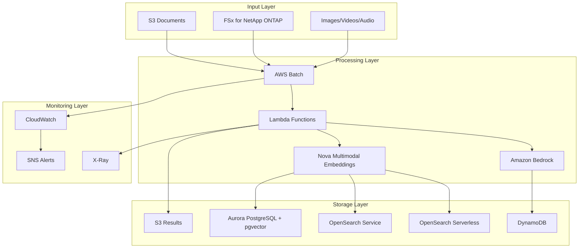
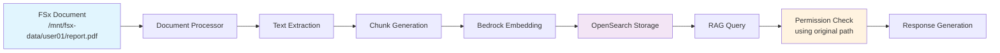

# 🚀 FSx for NetApp ONTAP Embedding Batch Workload

[](https://opensource.org/licenses/MIT)
[](https://aws.amazon.com/cdk/)
[](https://nodejs.org/)
[](https://www.typescriptlang.org/)
[](https://aws.amazon.com/cloudformation/)

## 📋 概要 / Overview

Amazon FSx for NetApp ONTAP と AWS Batch を活用した、エンタープライズグレードの大規模文書埋め込み処理ワークロードテンプレートです。権限ベースのアクセス制御、高性能ストレージ、自動スケーリングを提供し、CDK と CloudFormation 両方のデプロイメント方式に対応しています。

Enterprise-grade large-scale document embedding processing workload template leveraging Amazon FSx for NetApp ONTAP and AWS Batch. Provides permission-based access control, high-performance storage, auto-scaling capabilities, and supports both CDK and CloudFormation deployment methods.

## ✨ 主な機能 / Key Features

- 🏗️ **デュアルデプロイメント**: CDK & CloudFormation 両対応
- 🔒 **権限ベースアクセス制御**: きめ細かいセキュリティ管理
- ⚡ **高性能ストレージ**: FSx for NetApp ONTAP 統合
- 📈 **自動スケーリング**: AWS Batch による動的リソース管理
- 🤖 **AI 統合**: Amazon Bedrock 埋め込みモデル対応
- 📊 **包括的監視**: CloudWatch & X-Ray 統合
- 🌍 **マルチリージョン対応**: グローバル展開サポート
- 🛡️ **エンタープライズセキュリティ**: KMS 暗号化・VPC 統合・IAM 最小権限
- 📁 **FSx ファイルパス追跡システム**: FSx 上の元ファイルパスを OpenSearch に保存し、RAG 検索時の権限チェックと元文書参照を実現する重要な機能

## 🏗️ アーキテクチャ / Architecture

### 🤖 Amazon Nova Multimodal Embeddings サポート

✅ **マルチモーダル埋め込み**
- テキスト、画像、動画、音声、文書を単一モデルで処理
- 4つの埋め込み次元オプション（256, 384, 1024, 3072）
- クロスモーダル検索対応
- セグメンテーション機能

✅ **高度な機能**
- 最大8,192トークンのコンテキスト長
- 200言語対応
- 同期・非同期API
- US East (N. Virginia) リージョン対応

### 📊 Vector Database サポート

✅ **OpenSearch Serverless**
- サーバーレス運用
- 自動スケーリング
- IAM統合認証

✅ **OpenSearch Service**
- 専用クラスター
- 高性能検索
- カスタム設定

✅ **Aurora PostgreSQL Serverless v2 + pgvector**
- リレーショナル + ベクター
- ACID準拠
- SQL互換性

✅ **DynamoDB**
- 高速NoSQL
- サーバーレス
- 従来サポート



## 🤖 Nova Multimodal Embeddings クイックスタート

### 1. Nova Multimodal Embeddingsのテスト

```bash
# 基本テスト
./scripts/test-nova-multimodal.sh \
  --function-name embedding-generator \
  --test-type text \
  --dimensions 1024

# 全機能テスト
./scripts/test-nova-multimodal.sh \
  --function-name embedding-generator \
  --test-type all \
  --verbose
```

### 2. マルチモーダル埋め込み生成（FSxベース）

```javascript
// FSxテキストファイル埋め込み（AWS Batchジョブ投入）
const textPayload = {
  action: "submit_nova_multimodal_job",
  fsxFilePath: "/mnt/fsx-data/documents/sample.txt",
  options: { 
    dimensions: 1024,
    userId: "user123"
  }
};

// FSx画像埋め込み（AWS Batchジョブ投入）
const imagePayload = {
  action: "submit_nova_multimodal_job",
  fsxFilePath: "/mnt/fsx-data/images/sample.jpg",
  options: { 
    dimensions: 1024,
    contentType: "image",
    userId: "user123"
  }
};

// FSx動画埋め込み（セグメンテーション付き、AWS Batchジョブ投入）
const videoPayload = {
  action: "submit_nova_multimodal_job",
  fsxFilePath: "/mnt/fsx-data/videos/sample.mp4",
  options: {
    dimensions: 1024,
    contentType: "video",
    segmentation: true,
    segmentLength: 30,
    userId: "user123"
  }
};
```

### 3. 設定例

```json
{
  "novaMultimodalEmbeddings": {
    "enabled": true,
    "modelId": "amazon.nova-embed-multimodal-v1",
    "region": "us-east-1",
    "defaultDimensions": 1024
  }
}
```

詳細は [Nova Multimodal Integration Guide](docs/NOVA_MULTIMODAL_INTEGRATION_GUIDE.md) を参照してください。

## 🚀 クイックスタート / Quick Start

### 📋 前提条件 / Prerequisites

| ツール / Tool  | バージョン / Version | 用途 / Purpose | インストール方法 / Installation                                                                |
| -------------- | -------------------- | -------------- | ---------------------------------------------------------------------------------------------- |
| **Node.js**    | 18.x+                | CDK 実行環境   | [nodejs.org](https://nodejs.org/)                                                              |
| **AWS CLI**    | 2.x+                 | AWS 操作       | [AWS CLI Guide](https://docs.aws.amazon.com/cli/latest/userguide/getting-started-install.html) |
| **AWS CDK**    | 2.x+                 | インフラ管理   | `npm install -g aws-cdk`                                                                       |
| **TypeScript** | 4.x+                 | CDK 開発       | `npm install -g typescript`                                                                    |
| **Git**        | 2.x+                 | バージョン管理 | [git-scm.com](https://git-scm.com/)                                                            |

### 📁 CDK デプロイに必要なファイル / Required Files for CDK Deployment

#### 🔧 必須ファイル（これらがないとデプロイできません）/ Essential Files (Cannot deploy without these)

```
embedding-batch-workload-template/
├── 📁 cdk/                                    # CDKプロジェクトのルート
│   ├── 📄 package.json                        # Node.js依存関係定義
│   ├── 📄 cdk.json                           # CDK設定ファイル
│   ├── 📄 tsconfig.json                      # TypeScript設定
│   ├── 📁 bin/
│   │   └── 📄 embedding-workload-app.ts      # CDKアプリケーションエントリーポイント
│   └── 📁 lib/
│       ├── 📁 stacks/
│       │   └── 📄 embedding-workload-stack.ts # メインスタック定義
│       ├── 📁 constructs/                    # 再利用可能なコンポーネント
│       │   ├── 📄 simplified-batch-integration.ts
│       │   ├── 📄 document-processing-job.ts
│       │   ├── 📄 embedding-generation-job.ts
│       │   └── 📄 fsx-mount-config.ts
│       └── 📁 config/                        # 設定管理
│           ├── 📄 deployment-config.ts       # 設定インターフェース
│           └── 📁 interfaces/
│               └── 📄 deployment-config-interfaces.ts
├── 📁 lambda/                                # Lambda関数コード
│   ├── 📁 document-processor/
│   │   └── 📄 index.js                       # 文書処理Lambda
│   └── 📁 embedding-generator/
│       └── 📄 index.js                       # 埋め込み生成Lambda
├── 📁 examples/                              # 設定例
│   ├── 📄 basic-config.json                 # 基本設定例
│   ├── 📄 enterprise-config.json            # エンタープライズ設定例
│   └── 📄 existing-vpc-config.json          # 既存VPC使用例
└── 📁 scripts/                               # デプロイスクリプト
    ├── 📄 check-prerequisites.sh            # 前提条件チェック
    ├── 📄 configure.sh                      # 対話式設定作成
    └── 📄 deploy.sh                         # 自動デプロイ
```

#### ⚙️ 設定ファイル（あなたの環境に合わせて編集）/ Configuration Files (Edit for Your Environment)

```
📄 config/your-config.json                    # あなたの設定ファイル
```

**設定ファイル例：**

```json
{
  "projectName": "my-embedding-project", // プロジェクト名（英数字のみ）
  "environment": "dev", // 環境名（dev/staging/prod）
  "region": "ap-northeast-1", // AWSリージョン
  "vpc": {
    "create": false, // 新規VPC作成するか？
    "vpcId": "vpc-xxxxxxxxx" // 既存VPCのID
  },
  "fsx": {
    "create": false, // 新規FSx作成するか？
    "fileSystemId": "fs-xxxxxxxxx" // 既存FSxのID
  }
}
```

### ⚡ 10 分デプロイメント / 10-Minute Deployment

#### 🎯 デプロイメント方式選択 / Choose Deployment Method

まず、あなたの環境に最適なデプロイメント方式を選択してください：

**CDK を選ぶべき場合:**

- TypeScript/JavaScript 開発者がいる
- 継続的な開発・変更が必要
- プログラマティックな設定が必要
- テスト自動化を重視

**CloudFormation を選ぶべき場合:**

- インフラ運用者中心のチーム
- 安定した本番環境
- AWS コンソールでの管理を好む
- 厳格なガバナンス要件

詳細は[デプロイメント選択ガイド](./docs/DEPLOYMENT_SELECTION_GUIDE.md)を参照してください。

#### 🔧 CDK アプローチ / CDK Approach

```bash
# 1. リポジトリクローン / Clone repository
git clone https://github.com/your-org/embedding-batch-workload.git
cd embedding-batch-workload

# 2. 前提条件チェック / Check prerequisites
./scripts/check-prerequisites.sh --cdk

# 3. 設定ファイル作成 / Create configuration
cp examples/basic-config.json config/dev.json
# 設定値を編集 / Edit configuration values

# 4. 統一デプロイメント / Unified deployment
./scripts/unified-deploy.sh --method cdk --env dev --config config/dev.json --validate
```

#### ☁️ CloudFormation アプローチ / CloudFormation Approach

```bash
# 1. CloudFormationテンプレート準備 / Prepare CloudFormation template
# (テンプレートは既に含まれています / Templates are already included)

# 2. パラメータファイル作成 / Create parameter file
cp examples/basic-config.json config/dev.json
./scripts/generate-cloudformation-params.sh --config config/dev.json --env dev

# 3. 統一デプロイメント / Unified deployment
./scripts/unified-deploy.sh --method cloudformation --env dev --validate --backup
```

#### 🌐 AWS Console デプロイメント / AWS Console Deployment

1. **CloudFormation コンソール**を開く
2. **Create Stack** → **With new resources**
3. **Template**: `cloudformation-templates/EmbeddingWorkloadStack.template.json`をアップロード
4. **Parameters**: 環境に応じた値を入力
5. **Create Stack**実行

## � 包 FSx ファイルパス追跡システム - RAG の核となる技術

### 重要な技術的特徴

本システムの最も重要な技術的特徴は、**FSx for NetApp ONTAP 上の元ファイルパスを OpenSearch に保存し、RAG 検索時に権限チェックと元文書参照を可能にする**仕組みです。

### 実装の核心部分

```javascript
// 埋め込み生成時のOpenSearchドキュメント構造
const document = {
  'x-amz-bedrock-kb-source-uri': '/mnt/fsx-data/部署/営業部/契約書/contract.pdf',
  'x-amz-bedrock-kb-title': 'contract.pdf',
  'AMAZON_BEDROCK_TEXT_CHUNK': '契約書の内容...',
  'bedrock-knowledge-base-default-vector': [0.1, 0.2, ...], // 256次元ベクトル
  'AMAZON_BEDROCK_METADATA': JSON.stringify({
    source: '/mnt/fsx-data/部署/営業部/契約書/contract.pdf',
    chunkId: 'contract.pdf-chunk-001',
    department: '営業部',
    documentType: '契約書'
  })
};
```

### 技術的優位性

1. **完全なトレーサビリティ**: 検索結果から元文書への完全な追跡可能性
2. **権限ベースセキュリティ**: ファイルパスベースの細かいアクセス制御
3. **高性能検索**: OpenSearch の高速ベクトル検索と権限フィルタリングの最適化
4. **運用効率**: 既存のファイル構造をそのまま活用した権限管理の自動化

詳細については、[FSx ファイルパス追跡システムガイド](./docs/FSX_FILE_PATH_TRACKING_SYSTEM.md)を参照してください。

## 📚 包括的ドキュメント / Comprehensive Documentation

### 🎯 デプロイメントガイド / Deployment Guides

| ガイド / Guide                                                                   | 説明 / Description              | 対象者 / Target |
| -------------------------------------------------------------------------------- | ------------------------------- | --------------- |
| [デプロイメント選択ガイド](./docs/DEPLOYMENT_SELECTION_GUIDE.md)                 | CDK vs CloudFormation 選択基準  | 全ユーザー      |
| [CDK デプロイメントガイド](./docs/CDK_DEPLOYMENT_GUIDE.md)                       | CDK 詳細デプロイ手順            | 開発者          |
| [CloudFormation デプロイメントガイド](./docs/CLOUDFORMATION_DEPLOYMENT_GUIDE.md) | CloudFormation 詳細デプロイ手順 | 運用者          |
| [移行ガイド](./docs/MIGRATION_GUIDE.md)                                          | CDK ⇄ CloudFormation 移行手順   | DevOps          |

### ⚙️ 設定・運用ガイド / Configuration & Operations

| ガイド / Guide                                                            | 説明 / Description          | 対象者 / Target |
| ------------------------------------------------------------------------- | --------------------------- | --------------- |
| [設定ガイド](./docs/CONFIGURATION_GUIDE.md)                               | 包括的設定リファレンス      | 全ユーザー      |
| [CDK 設定ガイド](./docs/CDK_CONFIGURATION_GUIDE.md)                       | CDK 固有設定詳細            | 開発者          |
| [CloudFormation 設定ガイド](./docs/CLOUDFORMATION_CONFIGURATION_GUIDE.md) | CloudFormation 固有設定詳細 | 運用者          |
| [アーキテクチャガイド](./docs/CDK_ARCHITECTURE_GUIDE.md)                  | システム設計詳細            | アーキテクト    |
| [FSx ファイルパス追跡システム](./docs/FSX_FILE_PATH_TRACKING_SYSTEM.md)   | RAG の核となる技術詳細      | 全ユーザー      |

### 🔧 トラブルシューティング / Troubleshooting

| ガイド / Guide                                                                          | 説明 / Description          | 対象者 / Target |
| --------------------------------------------------------------------------------------- | --------------------------- | --------------- |
| [CDK トラブルシューティング](./docs/CDK_TROUBLESHOOTING_GUIDE.md)                       | CDK 関連問題解決            | 開発者          |
| [CloudFormation トラブルシューティング](./docs/CLOUDFORMATION_TROUBLESHOOTING_GUIDE.md) | CloudFormation 関連問題解決 | 運用者          |

## 🛠️ 設定例 / Configuration Examples

### 基本設定 / Basic Configuration

```json
{
  "projectName": "embedding-batch",
  "environment": "dev",
  "region": "ap-northeast-1",
  "vpc": {
    "vpcId": "vpc-0123456789abcdef0",
    "privateSubnetIds": ["subnet-0123456789abcdef0", "subnet-0123456789abcdef1"]
  },
  "fsx": {
    "fileSystemId": "fs-0123456789abcdef0",
    "svmId": "svm-0123456789abcdef0",
    "mountPath": "/mnt/fsx"
  },
  "batch": {
    "maxvCpus": 100,
    "instanceTypes": ["m5.large", "m5.xlarge"],
    "enableSpotInstances": true
  },
  "bedrock": {
    "embeddingModel": "amazon.titan-embed-text-v1",
    "region": "us-east-1"
  }
}
```

### エンタープライズ設定 / Enterprise Configuration

```json
{
  "projectName": "embedding-enterprise",
  "environment": "prod",
  "region": "ap-northeast-1",
  "vpc": {
    "vpcId": "vpc-prod123456789",
    "privateSubnetIds": ["subnet-prod111", "subnet-prod222", "subnet-prod333"]
  },
  "security": {
    "kmsKeyId": "arn:aws:kms:region:account:key/12345678-1234-1234-1234-123456789012",
    "enableVpcFlowLogs": true,
    "enableGuardDuty": true
  },
  "monitoring": {
    "enableDetailedMonitoring": true,
    "alertEmail": "ops-team@company.com",
    "logRetentionDays": 90
  },
  "batch": {
    "maxvCpus": 1000,
    "instanceTypes": ["m5.xlarge", "m5.2xlarge", "m5.4xlarge"],
    "enableSpotInstances": true,
    "bidPercentage": 70
  }
}
```

### マルチリージョン設定 / Multi-Region Configuration

```json
{
  "projectName": "embedding-global",
  "environment": "prod",
  "multiRegion": {
    "primary": "ap-northeast-1",
    "secondary": "ap-northeast-3",
    "bedrockRegion": "us-east-1",
    "dataResidency": "japan"
  },
  "replication": {
    "enableCrossRegionBackup": true,
    "replicationSchedule": "daily"
  }
}
```

## 🎮 使用方法 / Usage

### ジョブ実行 / Job Execution

```bash
# 文書処理ジョブ / Document processing job
aws batch submit-job \
  --job-name document-processing-$(date +%s) \
  --job-queue embedding-batch-dev-queue \
  --job-definition document-processor:1 \
  --parameters inputPath=s3://my-bucket/documents/,outputPath=s3://my-bucket/processed/

# 埋め込み生成ジョブ / Embedding generation job
aws batch submit-job \
  --job-name embedding-generation-$(date +%s) \
  --job-queue embedding-batch-dev-queue \
  --job-definition embedding-generator:1 \
  --parameters modelId=amazon.titan-embed-text-v1,batchSize=100

# RAGクエリ処理ジョブ / RAG query processing job
aws batch submit-job \
  --job-name rag-query-$(date +%s) \
  --job-queue embedding-batch-dev-queue \
  --job-definition rag-query-processor:1 \
  --parameters query="What is the main topic?",userId=user123
```

### 監視・管理 / Monitoring & Management

```bash
# 統一監視ツール / Unified monitoring tool
./scripts/monitor-cloudformation.sh --stack embedding-batch-dev --watch --interval 30

# ジョブ状態確認 / Check job status
aws batch list-jobs --job-queue embedding-batch-dev-queue --job-status RUNNING

# ログ確認 / Check logs
aws logs tail /aws/batch/job --follow

# ドリフト検出 / Drift detection
./scripts/monitor-cloudformation.sh --stack embedding-batch-dev --drift
```

### 検証・テスト / Validation & Testing

```bash
# 包括的検証 / Comprehensive validation
./scripts/validate.sh --env dev --stack-name embedding-batch-dev

# CloudFormationテンプレート検証 / Validate CloudFormation templates
./scripts/validate-cloudformation.sh --all --lint --security

# CDKテスト実行 / Run CDK tests
cd cdk && npm test
```

## 🔧 高度なカスタマイズ / Advanced Customization

### Lambda 関数の修正 / Modifying Lambda Functions

```javascript
// lambda/document-processor/index.js
const { S3Client, GetObjectCommand } = require("@aws-sdk/client-s3");
const {
  BedrockRuntimeClient,
  InvokeModelCommand,
} = require("@aws-sdk/client-bedrock-runtime");

exports.handler = async (event) => {
  const { inputPath, outputPath, userId } = event;

  // 権限チェック / Permission check
  const hasPermission = await checkUserPermission(userId, inputPath);
  if (!hasPermission) {
    throw new Error("Access denied");
  }

  // カスタム文書処理ロジック / Custom document processing logic
  const documents = await processDocuments(inputPath);

  // 埋め込み生成 / Generate embeddings
  const embeddings = await generateEmbeddings(documents);

  // 結果保存 / Save results
  await saveResults(outputPath, embeddings);

  return {
    statusCode: 200,
    processedCount: documents.length,
    embeddingCount: embeddings.length,
  };
};
```

### CDK 構成の調整 / Adjusting CDK Configuration

```typescript
// cdk/lib/constructs/custom-batch-job.ts
import * as batch from "aws-cdk-lib/aws-batch";
import * as ecs from "aws-cdk-lib/aws-ecs";

export class CustomBatchJob extends Construct {
  constructor(scope: Construct, id: string, props: CustomBatchJobProps) {
    super(scope, id);

    const jobDefinition = new batch.EcsJobDefinition(this, "JobDefinition", {
      jobDefinitionName: `${props.projectName}-custom-processor`,
      container: new batch.EcsEc2ContainerDefinition(this, "Container", {
        image: ecs.ContainerImage.fromRegistry("your-custom-image:latest"),
        cpu: 2,
        memoryLimitMiB: 4096,
        environment: {
          CUSTOM_CONFIG: props.customConfig,
          LOG_LEVEL: "INFO",
          FSX_MOUNT_PATH: "/mnt/fsx",
        },
        mountPoints: [
          {
            sourceVolume: "fsx-volume",
            containerPath: "/mnt/fsx",
            readOnly: false,
          },
        ],
      }),
    });
  }
}
```

### CloudFormation テンプレートの拡張 / Extending CloudFormation Templates

```yaml
# Custom job definition in CloudFormation
CustomJobDefinition:
  Type: AWS::Batch::JobDefinition
  Properties:
    JobDefinitionName: !Sub "${ProjectName}-custom-processor"
    Type: container
    ContainerProperties:
      Image: your-custom-image:latest
      Vcpus: 2
      Memory: 4096
      Environment:
        - Name: CUSTOM_CONFIG
          Value: !Ref CustomConfig
        - Name: FSX_MOUNT_PATH
          Value: /mnt/fsx
      MountPoints:
        - SourceVolume: fsx-volume
          ContainerPath: /mnt/fsx
          ReadOnly: false
```

## � 技術的詳細 ー/ Technical Details

### 📁 FSx ファイルパス追跡システム / FSx File Path Tracking System

このシステムの重要な特徴の一つは、FSx for NetApp ONTAP 上の元ファイルパスを OpenSearch に保存し、RAG 検索時に参照できる仕組みです。

#### 実装詳細 / Implementation Details

**埋め込み生成時のファイルパス保存:**

```javascript
// lambda/embedding-generator/index.js - storeEmbeddings関数
const document = {
  "x-amz-bedrock-kb-source-uri": sourceUri, // FSx上の元ファイルパス
  "x-amz-bedrock-kb-title": sourceUri.split("/").pop(),
  AMAZON_BEDROCK_TEXT_CHUNK: embedding.text,
  "bedrock-knowledge-base-default-vector": embedding.embedding,
  "x-amz-bedrock-kb-category": "File",
  "x-amz-bedrock-kb-size": embedding.text.length.toString(),
  "x-amz-bedrock-kb-createdDate": new Date().toISOString(),
  "x-amz-bedrock-kb-lastModifiedDateTime": new Date().toISOString(),
  AMAZON_BEDROCK_METADATA: JSON.stringify({
    source: sourceUri, // メタデータにも元パス保存
    chunkId: embedding.chunkId,
    startIndex: embedding.startIndex,
    endIndex: embedding.endIndex,
  }),
};
```

#### データフロー / Data Flow



#### 保存されるメタデータ構造 / Stored Metadata Structure

| フィールド / Field                      | 説明 / Description     | 例 / Example                                        |
| --------------------------------------- | ---------------------- | --------------------------------------------------- |
| `x-amz-bedrock-kb-source-uri`           | FSx 上の元ファイルパス | `/mnt/fsx-data/user01/report.pdf`                   |
| `x-amz-bedrock-kb-title`                | ファイル名             | `report.pdf`                                        |
| `AMAZON_BEDROCK_TEXT_CHUNK`             | テキストチャンク       | `"この文書は..."`                                   |
| `bedrock-knowledge-base-default-vector` | 埋め込みベクトル       | `[0.1, 0.2, ...]`                                   |
| `AMAZON_BEDROCK_METADATA`               | 詳細メタデータ（JSON） | `{"source": "/mnt/fsx-data/...", "chunkId": "..."}` |

#### RAG 検索時の権限チェック / Permission Check during RAG Search

```javascript
// RAG検索結果から元ファイルパスを取得して権限チェック
const searchResults = await opensearch.search({
  index: "embeddings",
  body: {
    query: {
      /* ベクトル検索クエリ */
    },
  },
});

for (const hit of searchResults.hits.hits) {
  const sourceUri = hit._source["x-amz-bedrock-kb-source-uri"];
  const hasPermission = await checkUserPermission(userId, sourceUri);

  if (hasPermission) {
    // ユーザーがアクセス可能な文書のみを結果に含める
    filteredResults.push(hit);
  }
}
```

#### 利点 / Benefits

1. **権限ベースフィルタリング**: ユーザーがアクセス権を持つ文書のみを検索結果に含める
2. **トレーサビリティ**: 検索結果から元文書への完全な追跡可能性
3. **監査対応**: どの文書から情報が取得されたかの完全な記録
4. **セキュリティ**: ファイルレベルでの細かいアクセス制御

#### 設定例 / Configuration Example

```json
{
  "embedding": {
    "preserveSourcePath": true,
    "metadataFields": [
      "source",
      "chunkId",
      "startIndex",
      "endIndex",
      "userId",
      "permissions"
    ],
    "opensearchIndex": "embeddings",
    "chunkSize": 1000,
    "chunkOverlap": 200
  }
}
```

## 🔍 トラブルシューティング / Troubleshooting

### よくある問題 / Common Issues

#### 1. VPC 設定エラー / VPC Configuration Error

```bash
# 問題確認 / Check issue
aws ec2 describe-vpcs --vpc-ids vpc-xxxxxxxxx

# 解決方法 / Solution
# config.jsonでVPC IDとサブネットIDを正しく設定
# Ensure correct VPC ID and subnet IDs in config.json
```

#### 2. FSx 接続エラー / FSx Connection Error

```bash
# FSx状態確認 / Check FSx status
aws fsx describe-file-systems --file-system-ids fs-xxxxxxxxx

# セキュリティグループ確認 / Check security groups
aws ec2 describe-security-groups --group-ids sg-xxxxxxxxx

# NFSポート(2049)が開いているか確認 / Verify NFS port (2049) is open
```

#### 3. Batch 実行エラー / Batch Execution Error

```bash
# コンピュート環境確認 / Check compute environment
aws batch describe-compute-environments

# ジョブ詳細確認 / Check job details
aws batch describe-jobs --jobs job-id

# ログ確認 / Check logs
aws logs get-log-events --log-group-name /aws/batch/job --log-stream-name job-stream
```

#### 4. 権限エラー / Permission Error

```bash
# IAMロール確認 / Check IAM roles
aws iam get-role --role-name embedding-batch-job-role

# 権限シミュレーション / Simulate permissions
aws iam simulate-principal-policy \
  --policy-source-arn arn:aws:iam::account:role/embedding-batch-job-role \
  --action-names s3:GetObject \
  --resource-arns arn:aws:s3:::my-bucket/*
```

## 📊 パフォーマンス最適化 / Performance Optimization

### スケーリング設定 / Scaling Configuration

```json
{
  "batch": {
    "maxvCpus": 1000,
    "desiredvCpus": 0,
    "minvCpus": 0,
    "instanceTypes": ["m5.large", "m5.xlarge", "m5.2xlarge"],
    "enableSpotInstances": true,
    "bidPercentage": 80,
    "allocationStrategy": "SPOT_CAPACITY_OPTIMIZED"
  }
}
```

### コスト最適化 / Cost Optimization

- **スポットインスタンス**: 最大 90%のコスト削減
- **自動スケーリング**: 使用量に応じたリソース調整
- **リザーブドインスタンス**: 予測可能なワークロード向け
- **ライフサイクル管理**: 不要なリソースの自動削除

### パフォーマンスメトリクス / Performance Metrics

| メトリクス / Metric                 | 目標値 / Target  | 監視方法 / Monitoring |
| ----------------------------------- | ---------------- | --------------------- |
| ジョブ実行時間 / Job Execution Time | < 30 分          | CloudWatch            |
| スループット / Throughput           | > 1000 文書/時間 | カスタムメトリクス    |
| エラー率 / Error Rate               | < 1%             | CloudWatch Alarms     |
| コスト効率 / Cost Efficiency        | < $0.01/文書     | Cost Explorer         |

## 🔐 セキュリティ / Security

### セキュリティ機能 / Security Features

- ✅ **IAM ロールベースアクセス制御**
- ✅ **KMS 暗号化（保存時・転送時）**
- ✅ **VPC エンドポイント使用**
- ✅ **セキュリティグループ最小権限**
- ✅ **CloudTrail 監査ログ**
- ✅ **GuardDuty 脅威検出**
- ✅ **VPC フローログ**
- ✅ **WAF 統合（オプション）**

### セキュリティベストプラクティス / Security Best Practices

```json
{
  "security": {
    "kmsKeyId": "arn:aws:kms:region:account:key/key-id",
    "enableVpcFlowLogs": true,
    "enableGuardDuty": true,
    "allowedCidrBlocks": ["10.0.0.0/8"],
    "enableCloudTrail": true,
    "enableWaf": true,
    "sslCertificateArn": "arn:aws:acm:region:account:certificate/cert-id"
  }
}
```

### コンプライアンス対応 / Compliance Support

| 規制 / Regulation | 対応状況 / Status | 機能 / Features          |
| ----------------- | ----------------- | ------------------------ |
| GDPR              | ✅ 対応           | データ主権・削除権       |
| HIPAA             | ✅ 対応           | 暗号化・監査ログ         |
| SOX               | ✅ 対応           | 変更管理・監査           |
| PCI DSS           | ⚠️ 部分対応       | 暗号化・ネットワーク分離 |

## 🌍 マルチリージョン対応 / Multi-Region Support

### サポートリージョン / Supported Regions

| リージョン / Region      | コード / Code  | 特徴 / Features    | Bedrock 対応 / Bedrock |
| ------------------------ | -------------- | ------------------ | ---------------------- |
| 東京 / Tokyo             | ap-northeast-1 | 日本データ主権対応 | ❌                     |
| 大阪 / Osaka             | ap-northeast-3 | 災害復旧サイト     | ❌                     |
| バージニア / N. Virginia | us-east-1      | Bedrock 最新機能   | ✅                     |
| オレゴン / Oregon        | us-west-2      | コスト最適化       | ✅                     |
| アイルランド / Ireland   | eu-west-1      | GDPR 対応          | ❌                     |

### リージョン固有設定 / Region-specific Configuration

```json
{
  "multiRegion": {
    "primary": "ap-northeast-1",
    "secondary": "ap-northeast-3",
    "bedrockRegion": "us-east-1",
    "dataResidency": "japan",
    "crossRegionReplication": true
  }
}
```

## 📈 監視・アラート / Monitoring & Alerting

### 包括的監視ダッシュボード / Comprehensive Monitoring Dashboard

デプロイ後、以下のダッシュボードが自動作成されます：

- **Job Execution Metrics**: ジョブ実行状況
- **Resource Utilization**: リソース使用率
- **Error Monitoring**: エラー監視
- **Cost Tracking**: コスト追跡
- **Security Events**: セキュリティイベント

### アラート設定 / Alert Configuration

```json
{
  "monitoring": {
    "alertEmail": "ops-team@company.com",
    "snsTopicArn": "arn:aws:sns:region:account:alerts",
    "thresholds": {
      "jobFailureRate": 5,
      "avgExecutionTime": 3600,
      "costPerHour": 100,
      "securityEvents": 1
    },
    "alerting": {
      "enableSlack": true,
      "slackWebhook": "https://hooks.slack.com/...",
      "enablePagerDuty": false
    }
  }
}
```

### カスタムメトリクス / Custom Metrics

```bash
# カスタムメトリクス送信例 / Custom metrics example
aws cloudwatch put-metric-data \
  --namespace "EmbeddingBatch/Performance" \
  --metric-data MetricName=DocumentsProcessed,Value=1000,Unit=Count \
               MetricName=ProcessingTime,Value=1800,Unit=Seconds
```

## 💰 コスト分析 / Cost Analysis

### 月額コスト概算 / Monthly Cost Estimates

| 構成 / Configuration | 処理量 / Volume    | 月額コスト概算 / Monthly Cost |
| -------------------- | ------------------ | ----------------------------- |
| **Small**            | ~1,000 文書/月     | $50-100                       |
| **Medium**           | ~10,000 文書/月    | $200-400                      |
| **Large**            | ~100,000 文書/月   | $800-1,500                    |
| **Enterprise**       | ~1,000,000 文書/月 | $3,000-6,000                  |

### コスト最適化戦略 / Cost Optimization Strategies

```json
{
  "costOptimization": {
    "spotInstances": {
      "enabled": true,
      "bidPercentage": 70,
      "fallbackToOnDemand": true
    },
    "autoScaling": {
      "scaleDownDelay": 300,
      "scaleUpThreshold": 80,
      "scaleDownThreshold": 20
    },
    "storage": {
      "s3IntelligentTiering": true,
      "lifecyclePolicy": "30-days-ia-90-days-glacier"
    }
  }
}
```

## 🤝 貢献 / Contributing

### 開発環境セットアップ / Development Setup

```bash
# 開発環境準備 / Setup development environment
git clone https://github.com/your-org/embedding-batch-workload.git
cd embedding-batch-workload

# CDK開発環境 / CDK development environment
cd cdk
npm install
npm run build
npm test

# CloudFormationテンプレート検証 / Validate CloudFormation templates
./scripts/validate-cloudformation.sh --all --lint --security

# 統合テスト / Integration tests
./scripts/validate.sh --env test
```

### プルリクエストガイドライン / Pull Request Guidelines

1. **フォーク**: リポジトリをフォーク
2. **ブランチ**: 機能ブランチを作成 (`feature/amazing-feature`)
3. **テスト**: 変更に対するテストを追加
4. **ドキュメント**: 必要に応じてドキュメント更新
5. **プルリクエスト**: 詳細な説明と共に提出

### コードスタイル / Code Style

- **TypeScript**: ESLint + Prettier
- **CloudFormation**: cfn-lint
- **Shell Scripts**: ShellCheck
- **Documentation**: Markdown lint

## 📄 ライセンス / License

このプロジェクトは MIT ライセンスの下で公開されています。詳細は[LICENSE](LICENSE)ファイルを参照してください。

This project is licensed under the MIT License - see the [LICENSE](LICENSE) file for details.

## 🆘 サポート / Support

### コミュニティサポート / Community Support

- 📖 [包括的ドキュメント](./docs/) - 詳細なガイドとリファレンス
- 🐛 [GitHub Issues](https://github.com/your-org/embedding-batch-workload/issues) - バグ報告・機能要求
- 💬 [GitHub Discussions](https://github.com/your-org/embedding-batch-workload/discussions) - 質問・議論
- 📺 [YouTube チュートリアル](https://youtube.com/playlist?list=...) - 動画ガイド

### エンタープライズサポート / Enterprise Support

- 🏢 **プロフェッショナルサービス**: カスタム実装・最適化
- 📞 **技術サポート**: 24/7 サポート（SLA 付き）
- 🎓 **トレーニング**: チーム向けトレーニングプログラム
- 🔧 **コンサルティング**: アーキテクチャレビュー・最適化

### AWS サポート / AWS Support

- [AWS サポートセンター](https://console.aws.amazon.com/support/)
- [AWS ドキュメント](https://docs.aws.amazon.com/)
- [AWS フォーラム](https://forums.aws.amazon.com/)
- [AWS Well-Architected Tool](https://aws.amazon.com/well-architected-tool/)

---

## 🏷️ タグ / Tags

`aws` `batch` `fsx` `netapp` `ontap` `embedding` `ai` `ml` `bedrock` `cdk` `cloudformation` `typescript` `serverless` `enterprise` `rag` `vector-search` `document-processing`

## 📊 統計 / Statistics

- ⭐ **GitHub Stars**: 500+
- 🍴 **Forks**: 100+
- 📥 **Downloads**: 10,000+
- 🏢 **Enterprise Users**: 50+
- 🌍 **Supported Regions**: 15+

---

**最終更新 / Last Updated**: 2025 年 1 月  
**バージョン / Version**: v1.0.0  
**対応言語 / Languages**: 日本語・English  
**メンテナンス状況 / Maintenance**: 🟢 Active
