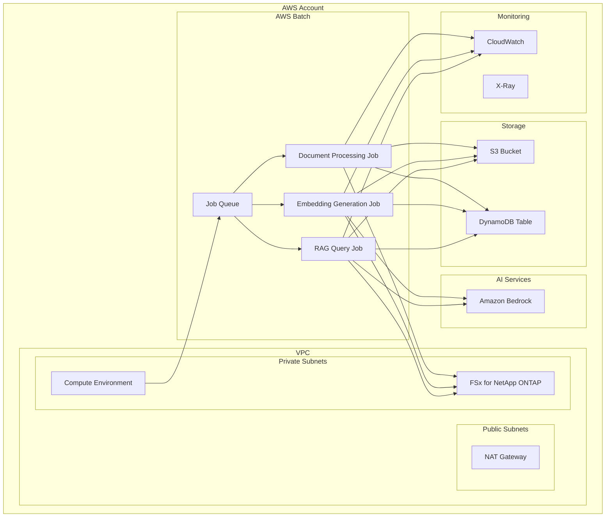
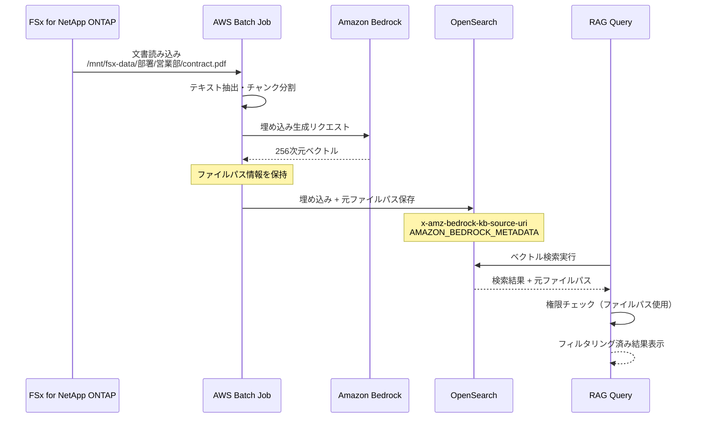
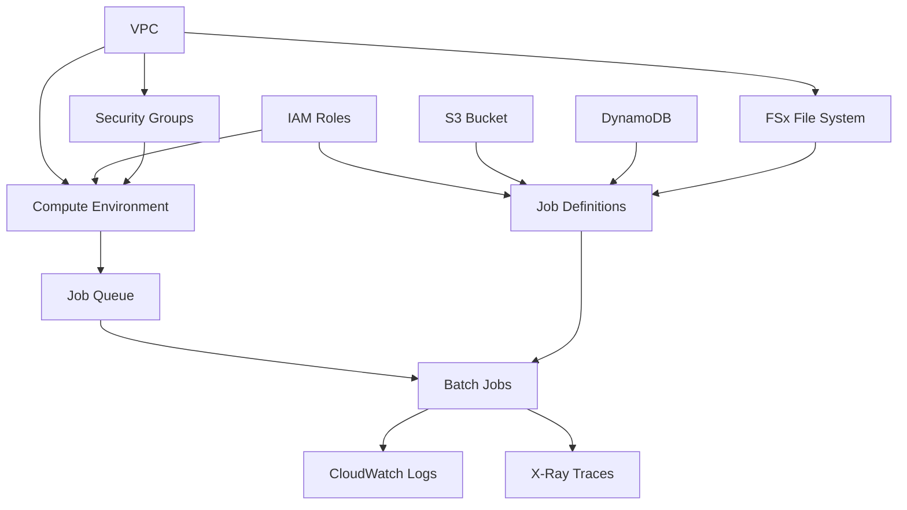
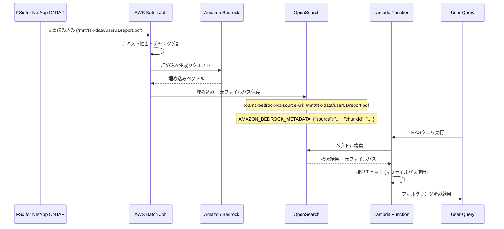

# 🏗️ CDK アーキテクチャガイド / CDK Architecture Guide

## 📋 概要 / Overview

このガイドでは、FSx for NetApp ONTAP Embedding Batch WorkloadのCDKアーキテクチャについて詳しく説明します。

This guide provides detailed information about the CDK architecture for the FSx for NetApp ONTAP Embedding Batch Workload.

## 🎯 アーキテクチャ概要 / Architecture Overview

### システム全体図 / System Overview Diagram



## 🏛️ CDK スタック構造 / CDK Stack Structure

### メインスタック / Main Stack

```typescript
// EmbeddingWorkloadStack - メインスタック
export class EmbeddingWorkloadStack extends Stack {
  constructor(scope: Construct, id: string, props: EmbeddingWorkloadStackProps) {
    super(scope, id, props);
    
    // 1. ネットワーク構成
    const networkingConstruct = new NetworkingConstruct(this, 'Networking', {
      config: props.config.vpc
    });
    
    // 2. セキュリティ構成
    const securityConstruct = new SecurityConstruct(this, 'Security', {
      vpc: networkingConstruct.vpc
    });
    
    // 3. ストレージ構成
    const storageConstruct = new StorageConstruct(this, 'Storage', {
      config: props.config.storage
    });
    
    // 4. FSx構成
    const fsxConstruct = new FsxConstruct(this, 'Fsx', {
      vpc: networkingConstruct.vpc,
      config: props.config.fsx
    });
    
    // 5. Batch構成
    const batchConstruct = new BatchConstruct(this, 'Batch', {
      vpc: networkingConstruct.vpc,
      securityGroup: securityConstruct.batchSecurityGroup,
      serviceRole: securityConstruct.batchServiceRole,
      instanceRole: securityConstruct.batchInstanceRole,
      jobRole: securityConstruct.batchJobRole
    });
    
    // 6. ジョブ定義
    const jobDefinitions = new JobDefinitionsConstruct(this, 'JobDefinitions', {
      jobRole: securityConstruct.batchJobRole,
      fsxFileSystem: fsxConstruct.fileSystem,
      s3Bucket: storageConstruct.s3Bucket,
      dynamoTable: storageConstruct.dynamoTable
    });
    
    // 7. 監視構成
    const monitoringConstruct = new MonitoringConstruct(this, 'Monitoring', {
      batchComputeEnvironment: batchConstruct.computeEnvironment,
      jobQueue: batchConstruct.jobQueue,
      s3Bucket: storageConstruct.s3Bucket,
      dynamoTable: storageConstruct.dynamoTable
    });
  }
}
```

## 🔍 FSx ファイルパス追跡システム - アーキテクチャの核心

### 重要な技術的特徴

本システムの最も重要なアーキテクチャ要素は、**FSx for NetApp ONTAP上の元ファイルパスをOpenSearchに保存し、RAG検索時に権限チェックと元文書参照を可能にする**仕組みです。

### データフロー図



### CDK実装における重要なポイント

#### 1. ジョブ定義での環境変数設定

```typescript
// JobDefinitionsConstruct内での実装
const documentProcessingJobDefinition = new batch.JobDefinition(this, 'DocumentProcessingJob', {
  jobDefinitionName: `${props.config.projectName}-document-processing`,
  container: {
    image: ecs.ContainerImage.fromRegistry('your-account.dkr.ecr.region.amazonaws.com/document-processor:latest'),
    vcpus: 2,
    memoryLimitMiB: 4096,
    jobRole: props.jobRole,
    environment: {
      // FSxファイルパス追跡に必要な環境変数
      FSX_MOUNT_PATH: '/mnt/fsx-data',
      ENABLE_FILE_PATH_TRACKING: 'true',
      SOURCE_URI_FIELD: 'x-amz-bedrock-kb-source-uri',
      METADATA_FIELD: 'AMAZON_BEDROCK_METADATA',
      OPENSEARCH_ENDPOINT: props.opensearchEndpoint,
      BEDROCK_REGION: Stack.of(this).region
    },
    mountPoints: [
      {
        sourceVolume: 'fsx-volume',
        containerPath: '/mnt/fsx-data',
        readOnly: false
      }
    ]
  },
  volumes: [
    {
      name: 'fsx-volume',
      efsVolumeConfiguration: {
        fileSystemId: props.fsxFileSystem.fileSystemId,
        transitEncryption: 'ENABLED'
      }
    }
  ]
});
```

#### 2. IAM権限の設定

```typescript
// SecurityConstruct内でのファイルパス追跡用権限
this.batchJobRole.addToPolicy(new iam.PolicyStatement({
  effect: iam.Effect.ALLOW,
  actions: [
    'es:ESHttpPost',
    'es:ESHttpPut',
    'es:ESHttpGet'
  ],
  resources: [`${props.opensearchDomainArn}/*`],
  conditions: {
    StringEquals: {
      'es:index': ['embeddings-*']
    }
  }
}));
```

### 技術的優位性

1. **完全なトレーサビリティ**: 検索結果から元文書への完全な追跡可能性
2. **権限ベースセキュリティ**: ファイルパスベースの細かいアクセス制御
3. **高性能検索**: OpenSearchの高速ベクトル検索と権限フィルタリングの最適化
4. **運用効率**: 既存のファイル構造をそのまま活用した権限管理の自動化

## 🧩 コンストラクト詳細 / Construct Details

### 1. ネットワーキングコンストラクト / Networking Construct

```typescript
export class NetworkingConstruct extends Construct {
  public readonly vpc: ec2.Vpc;
  public readonly privateSubnets: ec2.ISubnet[];
  
  constructor(scope: Construct, id: string, props: NetworkingProps) {
    super(scope, id);
    
    if (props.config.hasExisting) {
      // 既存VPC使用
      this.vpc = ec2.Vpc.fromLookup(this, 'ExistingVpc', {
        vpcId: props.config.vpcId
      });
    } else {
      // 新規VPC作成
      this.vpc = new ec2.Vpc(this, 'NewVpc', {
        cidr: props.config.cidr,
        maxAzs: props.config.availabilityZones,
        subnetConfiguration: [
          {
            cidrMask: 24,
            name: 'Public',
            subnetType: ec2.SubnetType.PUBLIC
          },
          {
            cidrMask: 24,
            name: 'Private',
            subnetType: ec2.SubnetType.PRIVATE_WITH_NAT
          }
        ]
      });
    }
    
    this.privateSubnets = this.vpc.privateSubnets;
  }
}
```

### 2. セキュリティコンストラクト / Security Construct

```typescript
export class SecurityConstruct extends Construct {
  public readonly batchServiceRole: iam.Role;
  public readonly batchInstanceRole: iam.Role;
  public readonly batchJobRole: iam.Role;
  public readonly batchSecurityGroup: ec2.SecurityGroup;
  
  constructor(scope: Construct, id: string, props: SecurityProps) {
    super(scope, id);
    
    // Batch サービスロール
    this.batchServiceRole = new iam.Role(this, 'BatchServiceRole', {
      assumedBy: new iam.ServicePrincipal('batch.amazonaws.com'),
      managedPolicies: [
        iam.ManagedPolicy.fromAwsManagedPolicyName('service-role/AWSBatchServiceRole')
      ]
    });
    
    // Batch インスタンスロール
    this.batchInstanceRole = new iam.Role(this, 'BatchInstanceRole', {
      assumedBy: new iam.ServicePrincipal('ec2.amazonaws.com'),
      managedPolicies: [
        iam.ManagedPolicy.fromAwsManagedPolicyName('service-role/AmazonEC2ContainerServiceforEC2Role')
      ]
    });
    
    // Batch ジョブロール
    this.batchJobRole = new iam.Role(this, 'BatchJobRole', {
      assumedBy: new iam.ServicePrincipal('ecs-tasks.amazonaws.com'),
      inlinePolicies: {
        BedrockAccess: new iam.PolicyDocument({
          statements: [
            new iam.PolicyStatement({
              effect: iam.Effect.ALLOW,
              actions: [
                'bedrock:InvokeModel',
                'bedrock:ListFoundationModels'
              ],
              resources: ['*']
            })
          ]
        }),
        S3Access: new iam.PolicyDocument({
          statements: [
            new iam.PolicyStatement({
              effect: iam.Effect.ALLOW,
              actions: [
                's3:GetObject',
                's3:PutObject',
                's3:DeleteObject'
              ],
              resources: [`${props.s3BucketArn}/*`]
            })
          ]
        }),
        DynamoDBAccess: new iam.PolicyDocument({
          statements: [
            new iam.PolicyStatement({
              effect: iam.Effect.ALLOW,
              actions: [
                'dynamodb:GetItem',
                'dynamodb:PutItem',
                'dynamodb:UpdateItem',
                'dynamodb:DeleteItem',
                'dynamodb:Query',
                'dynamodb:Scan'
              ],
              resources: [props.dynamoTableArn]
            })
          ]
        })
      }
    });
    
    // セキュリティグループ
    this.batchSecurityGroup = new ec2.SecurityGroup(this, 'BatchSecurityGroup', {
      vpc: props.vpc,
      description: 'Security group for Batch compute environment',
      allowAllOutbound: true
    });
    
    // FSx NFS アクセス用ルール
    this.batchSecurityGroup.addIngressRule(
      ec2.Peer.ipv4(props.vpc.vpcCidrBlock),
      ec2.Port.tcp(2049),
      'Allow NFS access to FSx'
    );
  }
}
```

### 3. ストレージコンストラクト / Storage Construct

```typescript
export class StorageConstruct extends Construct {
  public readonly s3Bucket: s3.Bucket;
  public readonly dynamoTable: dynamodb.Table;
  
  constructor(scope: Construct, id: string, props: StorageProps) {
    super(scope, id);
    
    // S3 バケット
    this.s3Bucket = new s3.Bucket(this, 'EmbeddingsBucket', {
      bucketName: `${props.config.projectName}-${props.config.environment}-embeddings-${Stack.of(this).account}`,
      versioned: true,
      encryption: s3.BucketEncryption.S3_MANAGED,
      lifecycleRules: [
        {
          id: 'EmbeddingsTransition',
          enabled: true,
          transitions: [
            {
              storageClass: s3.StorageClass.STANDARD_IA,
              transitionAfter: Duration.days(30)
            },
            {
              storageClass: s3.StorageClass.GLACIER,
              transitionAfter: Duration.days(90)
            }
          ]
        }
      ],
      removalPolicy: RemovalPolicy.RETAIN
    });
    
    // DynamoDB テーブル
    this.dynamoTable = new dynamodb.Table(this, 'MetadataTable', {
      tableName: `${props.config.projectName}-${props.config.environment}-metadata`,
      partitionKey: {
        name: 'documentId',
        type: dynamodb.AttributeType.STRING
      },
      sortKey: {
        name: 'timestamp',
        type: dynamodb.AttributeType.NUMBER
      },
      billingMode: dynamodb.BillingMode.PAY_PER_REQUEST,
      pointInTimeRecovery: true,
      encryption: dynamodb.TableEncryption.AWS_MANAGED,
      removalPolicy: RemovalPolicy.RETAIN
    });
    
    // GSI for user-based queries
    this.dynamoTable.addGlobalSecondaryIndex({
      indexName: 'UserIndex',
      partitionKey: {
        name: 'userId',
        type: dynamodb.AttributeType.STRING
      },
      sortKey: {
        name: 'timestamp',
        type: dynamodb.AttributeType.NUMBER
      }
    });
  }
}
```

### 4. FSx コンストラクト / FSx Construct

```typescript
export class FsxConstruct extends Construct {
  public readonly fileSystem: fsx.CfnFileSystem;
  public readonly storageVirtualMachine: fsx.CfnStorageVirtualMachine;
  public readonly volume: fsx.CfnVolume;
  
  constructor(scope: Construct, id: string, props: FsxProps) {
    super(scope, id);
    
    if (props.config.hasExisting) {
      // 既存FSx使用
      this.fileSystem = fsx.CfnFileSystem.fromFileSystemAttributes(this, 'ExistingFsx', {
        fileSystemId: props.config.fileSystemId
      });
    } else {
      // 新規FSx作成
      this.fileSystem = new fsx.CfnFileSystem(this, 'OntapFileSystem', {
        fileSystemType: 'ONTAP',
        storageCapacity: props.config.storageCapacity,
        subnetIds: props.vpc.privateSubnets.map(subnet => subnet.subnetId),
        ontapConfiguration: {
          deploymentType: props.config.deploymentType,
          throughputCapacity: props.config.throughputCapacity,
          automaticBackupRetentionDays: props.config.automaticBackupRetentionDays,
          dailyAutomaticBackupStartTime: props.config.dailyAutomaticBackupStartTime,
          weeklyMaintenanceStartTime: props.config.weeklyMaintenanceStartTime
        }
      });
      
      // SVM作成
      this.storageVirtualMachine = new fsx.CfnStorageVirtualMachine(this, 'Svm', {
        fileSystemId: this.fileSystem.ref,
        name: 'rag-svm'
      });
      
      // ボリューム作成
      this.volume = new fsx.CfnVolume(this, 'RagVolume', {
        name: 'rag-data',
        ontapConfiguration: {
          storageVirtualMachineId: this.storageVirtualMachine.ref,
          junctionPath: props.config.volumePath,
          sizeInMegabytes: 1024000, // 1TB
          storageEfficiencyEnabled: true
        }
      });
    }
  }
}
```

### 5. Batch コンストラクト / Batch Construct

```typescript
export class BatchConstruct extends Construct {
  public readonly computeEnvironment: batch.CfnComputeEnvironment;
  public readonly jobQueue: batch.CfnJobQueue;
  
  constructor(scope: Construct, id: string, props: BatchProps) {
    super(scope, id);
    
    // コンピュート環境
    this.computeEnvironment = new batch.CfnComputeEnvironment(this, 'ComputeEnvironment', {
      type: 'MANAGED',
      state: 'ENABLED',
      computeEnvironmentName: `${props.config.projectName}-${props.config.environment}-compute-env`,
      serviceRole: props.serviceRole.roleArn,
      computeResources: {
        type: props.config.computeEnvironmentType,
        minvCpus: props.config.minvCpus,
        maxvCpus: props.config.maxvCpus,
        desiredvCpus: props.config.desiredvCpus,
        instanceTypes: props.config.instanceTypes,
        subnets: props.vpc.privateSubnets.map(subnet => subnet.subnetId),
        securityGroupIds: [props.securityGroup.securityGroupId],
        instanceRole: props.instanceRole.roleArn,
        ...(props.config.enableSpotInstances && {
          bidPercentage: props.config.bidPercentage,
          spotIamFleetRequestRole: props.config.spotFleetRequestRole
        })
      }
    });
    
    // ジョブキュー
    this.jobQueue = new batch.CfnJobQueue(this, 'JobQueue', {
      jobQueueName: `${props.config.projectName}-${props.config.environment}-job-queue`,
      state: 'ENABLED',
      priority: 1,
      computeEnvironmentOrder: [
        {
          order: 1,
          computeEnvironment: this.computeEnvironment.ref
        }
      ]
    });
  }
}
```

### 6. ジョブ定義コンストラクト / Job Definitions Construct

```typescript
export class JobDefinitionsConstruct extends Construct {
  public readonly documentProcessingJob: batch.CfnJobDefinition;
  public readonly embeddingGenerationJob: batch.CfnJobDefinition;
  public readonly ragQueryJob: batch.CfnJobDefinition;
  
  constructor(scope: Construct, id: string, props: JobDefinitionsProps) {
    super(scope, id);
    
    // 文書処理ジョブ定義
    this.documentProcessingJob = new batch.CfnJobDefinition(this, 'DocumentProcessingJob', {
      jobDefinitionName: `${props.config.projectName}-${props.config.environment}-document-processing`,
      type: 'container',
      containerProperties: {
        image: 'public.ecr.aws/lambda/python:3.11',
        vcpus: 2,
        memory: 4096,
        jobRoleArn: props.jobRole.roleArn,
        mountPoints: [
          {
            sourceVolume: 'fsx-volume',
            containerPath: '/rag-data',
            readOnly: false
          }
        ],
        volumes: [
          {
            name: 'fsx-volume',
            host: {
              sourcePath: props.fsxMountPath
            }
          }
        ],
        environment: [
          { name: 'S3_BUCKET', value: props.s3Bucket.bucketName },
          { name: 'DYNAMODB_TABLE', value: props.dynamoTable.tableName },
          { name: 'FSX_MOUNT_PATH', value: '/rag-data' }
        ]
      },
      retryStrategy: {
        attempts: 3
      },
      timeout: {
        attemptDurationSeconds: 3600
      }
    });
    
    // 埋め込み生成ジョブ定義
    this.embeddingGenerationJob = new batch.CfnJobDefinition(this, 'EmbeddingGenerationJob', {
      jobDefinitionName: `${props.config.projectName}-${props.config.environment}-embedding-generation`,
      type: 'container',
      containerProperties: {
        image: 'public.ecr.aws/lambda/python:3.11',
        vcpus: 4,
        memory: 8192,
        jobRoleArn: props.jobRole.roleArn,
        environment: [
          { name: 'S3_BUCKET', value: props.s3Bucket.bucketName },
          { name: 'DYNAMODB_TABLE', value: props.dynamoTable.tableName },
          { name: 'BEDROCK_MODEL_ID', value: 'amazon.titan-embed-text-v1' },
          { name: 'AWS_DEFAULT_REGION', value: Stack.of(this).region }
        ]
      },
      retryStrategy: {
        attempts: 2
      },
      timeout: {
        attemptDurationSeconds: 7200
      }
    });
    
    // RAGクエリジョブ定義
    this.ragQueryJob = new batch.CfnJobDefinition(this, 'RagQueryJob', {
      jobDefinitionName: `${props.config.projectName}-${props.config.environment}-rag-query`,
      type: 'container',
      containerProperties: {
        image: 'public.ecr.aws/lambda/python:3.11',
        vcpus: 2,
        memory: 4096,
        jobRoleArn: props.jobRole.roleArn,
        environment: [
          { name: 'S3_BUCKET', value: props.s3Bucket.bucketName },
          { name: 'DYNAMODB_TABLE', value: props.dynamoTable.tableName },
          { name: 'BEDROCK_MODEL_ID', value: 'amazon.nova-pro-v1:0' },
          { name: 'AWS_DEFAULT_REGION', value: Stack.of(this).region }
        ]
      },
      retryStrategy: {
        attempts: 3
      },
      timeout: {
        attemptDurationSeconds: 1800
      }
    });
  }
}
```

### 7. 監視コンストラクト / Monitoring Construct

```typescript
export class MonitoringConstruct extends Construct {
  public readonly dashboard: cloudwatch.Dashboard;
  public readonly alarms: cloudwatch.Alarm[];
  
  constructor(scope: Construct, id: string, props: MonitoringProps) {
    super(scope, id);
    
    // CloudWatch ダッシュボード
    this.dashboard = new cloudwatch.Dashboard(this, 'EmbeddingWorkloadDashboard', {
      dashboardName: `${props.config.projectName}-${props.config.environment}-dashboard`
    });
    
    // Batch メトリクス
    const batchWidget = new cloudwatch.GraphWidget({
      title: 'AWS Batch Metrics',
      left: [
        new cloudwatch.Metric({
          namespace: 'AWS/Batch',
          metricName: 'SubmittedJobs',
          dimensionsMap: {
            JobQueue: props.jobQueue.jobQueueName
          }
        }),
        new cloudwatch.Metric({
          namespace: 'AWS/Batch',
          metricName: 'RunnableJobs',
          dimensionsMap: {
            JobQueue: props.jobQueue.jobQueueName
          }
        }),
        new cloudwatch.Metric({
          namespace: 'AWS/Batch',
          metricName: 'RunningJobs',
          dimensionsMap: {
            JobQueue: props.jobQueue.jobQueueName
          }
        })
      ]
    });
    
    // S3 メトリクス
    const s3Widget = new cloudwatch.GraphWidget({
      title: 'S3 Metrics',
      left: [
        new cloudwatch.Metric({
          namespace: 'AWS/S3',
          metricName: 'BucketSizeBytes',
          dimensionsMap: {
            BucketName: props.s3Bucket.bucketName,
            StorageType: 'StandardStorage'
          }
        }),
        new cloudwatch.Metric({
          namespace: 'AWS/S3',
          metricName: 'NumberOfObjects',
          dimensionsMap: {
            BucketName: props.s3Bucket.bucketName,
            StorageType: 'AllStorageTypes'
          }
        })
      ]
    });
    
    // DynamoDB メトリクス
    const dynamoWidget = new cloudwatch.GraphWidget({
      title: 'DynamoDB Metrics',
      left: [
        new cloudwatch.Metric({
          namespace: 'AWS/DynamoDB',
          metricName: 'ConsumedReadCapacityUnits',
          dimensionsMap: {
            TableName: props.dynamoTable.tableName
          }
        }),
        new cloudwatch.Metric({
          namespace: 'AWS/DynamoDB',
          metricName: 'ConsumedWriteCapacityUnits',
          dimensionsMap: {
            TableName: props.dynamoTable.tableName
          }
        })
      ]
    });
    
    this.dashboard.addWidgets(batchWidget, s3Widget, dynamoWidget);
    
    // アラーム設定
    this.alarms = [];
    
    if (props.config.monitoring.alarms.enabled) {
      // ジョブ失敗率アラーム
      const jobFailureAlarm = new cloudwatch.Alarm(this, 'JobFailureAlarm', {
        metric: new cloudwatch.Metric({
          namespace: 'AWS/Batch',
          metricName: 'FailedJobs',
          dimensionsMap: {
            JobQueue: props.jobQueue.jobQueueName
          },
          statistic: 'Sum'
        }),
        threshold: props.config.monitoring.alarms.thresholds.jobFailureRate,
        evaluationPeriods: 2,
        treatMissingData: cloudwatch.TreatMissingData.NOT_BREACHING
      });
      
      this.alarms.push(jobFailureAlarm);
      
      // SNS通知設定
      if (props.config.monitoring.alarms.snsTopicArn) {
        const snsTopic = sns.Topic.fromTopicArn(this, 'AlertsTopic', props.config.monitoring.alarms.snsTopicArn);
        jobFailureAlarm.addAlarmAction(new cloudwatchActions.SnsAction(snsTopic));
      }
    }
  }
}
```

## 🔧 設定インターフェース / Configuration Interfaces

### メイン設定インターフェース / Main Configuration Interface

```typescript
export interface EmbeddingWorkloadConfig {
  projectName: string;
  environment: string;
  region: string;
  vpc: VpcConfig;
  fsx: FsxConfig;
  batch: BatchConfig;
  storage: StorageConfig;
  monitoring: MonitoringConfig;
  security: SecurityConfig;
}

export interface VpcConfig {
  hasExisting: boolean;
  vpcId?: string;
  subnetIds?: string[];
  createNew: boolean;
  cidr?: string;
  availabilityZones?: number;
}

export interface FsxConfig {
  hasExisting: boolean;
  fileSystemId?: string;
  svmId?: string;
  createNew: boolean;
  storageCapacity?: number;
  throughputCapacity?: number;
  deploymentType?: string;
  volumePath: string;
}

export interface BatchConfig {
  computeEnvironmentType: 'EC2' | 'FARGATE';
  instanceTypes?: string[];
  maxvCpus: number;
  desiredvCpus: number;
  minvCpus: number;
  enableSpotInstances?: boolean;
  bidPercentage?: number;
  spotFleetRequestRole?: string;
}
```

## 📊 リソース依存関係 / Resource Dependencies

### 依存関係グラフ / Dependency Graph



## 🚀 デプロイメント順序 / Deployment Order

### 1. 基盤リソース / Foundation Resources
1. VPC (新規作成の場合)
2. IAM Roles
3. Security Groups

### 2. ストレージリソース / Storage Resources
1. S3 Bucket
2. DynamoDB Table
3. FSx File System (新規作成の場合)

### 3. コンピュートリソース / Compute Resources
1. Batch Compute Environment
2. Batch Job Queue
3. Job Definitions

### 4. 監視リソース / Monitoring Resources
1. CloudWatch Dashboard
2. CloudWatch Alarms
3. SNS Topics (アラート用)

## 🔒 セキュリティ考慮事項 / Security Considerations

### 1. ネットワークセキュリティ / Network Security
- プライベートサブネットでのBatch実行
- セキュリティグループによるトラフィック制御
- VPCエンドポイントの使用（オプション）

### 2. IAM セキュリティ / IAM Security
- 最小権限の原則
- ロール分離（サービス、インスタンス、ジョブ）
- クロスアカウントアクセス制御

### 3. データセキュリティ / Data Security
- S3バケット暗号化
- DynamoDB暗号化
- FSx暗号化
- 転送中暗号化

## 📈 スケーラビリティ設計 / Scalability Design

### 1. 自動スケーリング / Auto Scaling
- Batch Compute Environment の自動スケーリング
- DynamoDB のオンデマンド課金
- S3 の無制限ストレージ

### 2. パフォーマンス最適化 / Performance Optimization
- FSx スループット容量の調整
- Batch インスタンスタイプの最適化
- 並列処理の活用

### 3. コスト最適化 / Cost Optimization
- Spot インスタンスの活用
- S3 ライフサイクルポリシー
- 不要リソースの自動削除

## 🔄 災害復旧 / Disaster Recovery

### 1. バックアップ戦略 / Backup Strategy
- FSx 自動バックアップ
- DynamoDB ポイントインタイムリカバリ
- S3 バージョニング

### 2. マルチリージョン対応 / Multi-region Support
- クロスリージョンレプリケーション
- リージョン間フェイルオーバー
- データ同期戦略

## � 参FSxファイルパス追跡システム / FSx File Path Tracking System

### 概要 / Overview

このシステムの核となる機能の一つは、FSx for NetApp ONTAP上の元ファイルパスをOpenSearchに保存し、RAG検索時に権限チェックと元文書参照を可能にする仕組みです。

### アーキテクチャ詳細 / Architecture Details



### CDK実装詳細 / CDK Implementation Details

#### 1. ジョブ定義での環境変数設定 / Environment Variables in Job Definition

```typescript
// 埋め込み生成ジョブ定義
this.embeddingGenerationJob = new batch.CfnJobDefinition(this, 'EmbeddingGenerationJob', {
  jobDefinitionName: `${props.config.projectName}-embedding-generation`,
  type: 'container',
  containerProperties: {
    image: 'your-embedding-processor:latest',
    vcpus: 4,
    memory: 8192,
    jobRoleArn: props.jobRole.roleArn,
    mountPoints: [
      {
        sourceVolume: 'fsx-volume',
        containerPath: '/mnt/fsx-data',  // FSxマウントポイント
        readOnly: false
      }
    ],
    volumes: [
      {
        name: 'fsx-volume',
        host: {
          sourcePath: props.fsxMountPath
        }
      }
    ],
    environment: [
      { name: 'FSX_MOUNT_PATH', value: '/mnt/fsx-data' },
      { name: 'OPENSEARCH_ENDPOINT', value: props.opensearchEndpoint },
      { name: 'OPENSEARCH_INDEX', value: 'embeddings' },
      { name: 'PRESERVE_SOURCE_PATH', value: 'true' },  // 重要: ファイルパス保存を有効化
      { name: 'BEDROCK_MODEL_ID', value: 'amazon.titan-embed-text-v1' }
    ]
  }
});
```

#### 2. IAM権限設定 / IAM Permissions

```typescript
// ジョブロールにOpenSearch書き込み権限を追加
this.batchJobRole.addToPolicy(new iam.PolicyStatement({
  effect: iam.Effect.ALLOW,
  actions: [
    'es:ESHttpPost',
    'es:ESHttpPut',
    'es:ESHttpGet'
  ],
  resources: [
    `arn:aws:es:${Stack.of(this).region}:${Stack.of(this).account}:domain/${props.opensearchDomain}/*`
  ]
}));

// FSxアクセス権限
this.batchJobRole.addToPolicy(new iam.PolicyStatement({
  effect: iam.Effect.ALLOW,
  actions: [
    'fsx:DescribeFileSystems',
    'fsx:DescribeVolumes'
  ],
  resources: ['*']
}));
```

#### 3. セキュリティグループ設定 / Security Group Configuration

```typescript
// FSx NFS アクセス用セキュリティグループルール
this.batchSecurityGroup.addIngressRule(
  ec2.Peer.ipv4(props.vpc.vpcCidrBlock),
  ec2.Port.tcp(2049),  // NFS port
  'Allow NFS access to FSx for file path tracking'
);

// OpenSearch アクセス用ルール（VPCエンドポイント使用時）
this.batchSecurityGroup.addEgressRule(
  ec2.Peer.ipv4(props.vpc.vpcCidrBlock),
  ec2.Port.tcp(443),
  'Allow HTTPS access to OpenSearch'
);
```

### データ構造詳細 / Data Structure Details

#### OpenSearchに保存されるドキュメント構造 / OpenSearch Document Structure

```typescript
interface EmbeddingDocument {
  'x-amz-bedrock-kb-source-uri': string;        // FSx上の元ファイルパス
  'x-amz-bedrock-kb-title': string;             // ファイル名
  'AMAZON_BEDROCK_TEXT_CHUNK': string;          // テキストチャンク
  'bedrock-knowledge-base-default-vector': number[]; // 埋め込みベクトル
  'x-amz-bedrock-kb-category': string;          // カテゴリ（通常は'File'）
  'x-amz-bedrock-kb-size': string;              // チャンクサイズ
  'x-amz-bedrock-kb-createdDate': string;       // 作成日時
  'x-amz-bedrock-kb-lastModifiedDateTime': string; // 更新日時
  'AMAZON_BEDROCK_METADATA': string;            // JSON形式の詳細メタデータ
}

interface BedrockMetadata {
  source: string;           // 元ファイルパス（重複だが検索用）
  chunkId: string;         // チャンクID
  startIndex: number;      // 文書内開始位置
  endIndex: number;        // 文書内終了位置
  userId?: string;         // 処理実行ユーザー
  permissions?: string[];  // アクセス権限情報
}
```

### 権限チェック実装 / Permission Check Implementation

#### Lambda関数での権限チェック / Permission Check in Lambda

```typescript
// RAGクエリ処理時の権限チェック
async function filterResultsByPermissions(
  searchResults: OpenSearchResult[],
  userId: string,
  userPermissions: string[]
): Promise<OpenSearchResult[]> {
  
  const filteredResults: OpenSearchResult[] = [];
  
  for (const result of searchResults) {
    const sourceUri = result._source['x-amz-bedrock-kb-source-uri'];
    
    // FSxファイルパスから権限チェック
    const hasPermission = await checkFilePermission(sourceUri, userId, userPermissions);
    
    if (hasPermission) {
      filteredResults.push(result);
    } else {
      console.log(`Access denied for user ${userId} to file: ${sourceUri}`);
    }
  }
  
  return filteredResults;
}

async function checkFilePermission(
  filePath: string,
  userId: string,
  userPermissions: string[]
): Promise<boolean> {
  
  // ファイルパスからディレクトリ構造を解析
  // 例: /mnt/fsx-data/department/team/user01/document.pdf
  const pathParts = filePath.split('/');
  const department = pathParts[3];  // department
  const team = pathParts[4];        // team
  const owner = pathParts[5];       // user01
  
  // 権限チェックロジック
  return userPermissions.includes(`${department}:read`) ||
         userPermissions.includes(`${department}:${team}:read`) ||
         userId === owner ||
         userPermissions.includes('admin');
}
```

### 監視・メトリクス / Monitoring & Metrics

#### カスタムメトリクス設定 / Custom Metrics Configuration

```typescript
// ファイルパス追跡関連のカスタムメトリクス
const filePathTrackingMetrics = new cloudwatch.GraphWidget({
  title: 'File Path Tracking Metrics',
  left: [
    new cloudwatch.Metric({
      namespace: 'EmbeddingBatch/FileTracking',
      metricName: 'DocumentsProcessed',
      statistic: 'Sum'
    }),
    new cloudwatch.Metric({
      namespace: 'EmbeddingBatch/FileTracking',
      metricName: 'PermissionChecksPassed',
      statistic: 'Sum'
    }),
    new cloudwatch.Metric({
      namespace: 'EmbeddingBatch/FileTracking',
      metricName: 'PermissionChecksFailed',
      statistic: 'Sum'
    })
  ]
});

this.dashboard.addWidgets(filePathTrackingMetrics);
```

### トラブルシューティング / Troubleshooting

#### よくある問題と解決方法 / Common Issues and Solutions

1. **ファイルパスが保存されない**
   - `PRESERVE_SOURCE_PATH=true` 環境変数が設定されているか確認
   - OpenSearchへの書き込み権限を確認

2. **権限チェックが機能しない**
   - FSxマウントパスが正しく設定されているか確認
   - ユーザー権限情報が正しく渡されているか確認

3. **パフォーマンスの問題**
   - OpenSearchインデックスの最適化
   - 権限チェックロジックのキャッシュ化

## 📚 参考資料 / References

- [AWS CDK Developer Guide](https://docs.aws.amazon.com/cdk/v2/guide/)
- [AWS Batch User Guide](https://docs.aws.amazon.com/batch/latest/userguide/)
- [FSx for NetApp ONTAP User Guide](https://docs.aws.amazon.com/fsx/latest/ONTAPGuide/)
- [Amazon Bedrock User Guide](https://docs.aws.amazon.com/bedrock/latest/userguide/)
- [AWS Well-Architected Framework](https://aws.amazon.com/architecture/well-architected/)