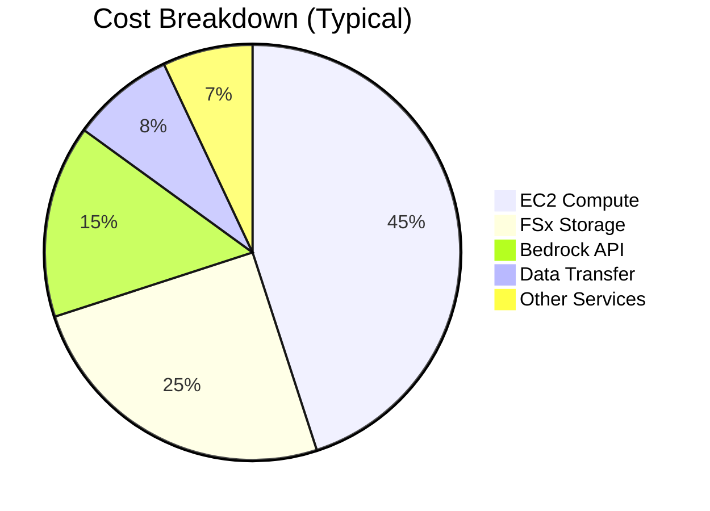

# 💰 Cost Optimization Guide

このガイドでは、Embedding Batch Workload Template のコスト最適化戦略、リソースサイジング、予算管理について説明します。

## 📋 目次

- [💡 コスト最適化戦略](#-コスト最適化戦略)
- [📊 コスト分析](#-コスト分析)
- [⚙️ リソースサイジング](#️-リソースサイジング)
- [🎯 Spot インスタンス活用](#-spot-インスタンス活用)
- [📈 予算管理](#-予算管理)
- [🔄 自動化](#-自動化)

---

## 💡 コスト最適化戦略

### コスト最適化の5つの柱

#### 1. Right Sizing (適切なサイジング)
- **目標**: ワークロードに最適なインスタンスタイプとサイズの選択
- **手法**: 使用率監視、パフォーマンス分析、段階的サイジング

#### 2. Elasticity (弾力性)
- **目標**: 需要に応じた自動スケーリング
- **手法**: Auto Scaling、スケジュールベーススケーリング

#### 3. Optimal Pricing Model (最適な料金モデル)
- **目標**: Spot、Reserved、Savings Plans の活用
- **手法**: 使用パターン分析、コミットメント戦略

#### 4. Optimize Data Transfer (データ転送最適化)
- **目標**: 不要なデータ転送の削減
- **手法**: VPC Endpoints、リージョン最適化

#### 5. Monitor & Analyze (監視・分析)
- **目標**: 継続的なコスト監視と最適化
- **手法**: Cost Explorer、Budgets、Trusted Advisor

### コスト構造の理解



---

## 📊 コスト分析

### 1. 現在のコスト分析

#### Cost Explorer による分析
```bash
#!/bin/bash
# cost-analysis.sh

PROJECT_NAME="embedding-batch-workload"
ENVIRONMENT="production"
START_DATE=$(date -d '30 days ago' +%Y-%m-%d)
END_DATE=$(date +%Y-%m-%d)

echo "=== Cost Analysis ($START_DATE to $END_DATE) ==="

# サービス別コスト
aws ce get-cost-and-usage \
  --time-period Start=$START_DATE,End=$END_DATE \
  --granularity MONTHLY \
  --metrics BlendedCost \
  --group-by Type=DIMENSION,Key=SERVICE \
  --filter file://cost-filter.json \
  --query 'ResultsByTime[0].Groups[*].{Service:Keys[0],Cost:Metrics.BlendedCost.Amount}' \
  --output table

# リソース別コスト
aws ce get-cost-and-usage \
  --time-period Start=$START_DATE,End=$END_DATE \
  --granularity MONTHLY \
  --metrics BlendedCost \
  --group-by Type=DIMENSION,Key=RESOURCE_ID \
  --filter file://cost-filter.json \
  --query 'ResultsByTime[0].Groups[*].{Resource:Keys[0],Cost:Metrics.BlendedCost.Amount}' \
  --output table
```

#### コストフィルター設定
```json
{
  "Dimensions": {
    "Key": "RESOURCE_ID",
    "Values": [
      "*embedding-batch-workload*"
    ],
    "MatchOptions": ["CONTAINS"]
  }
}
```

### 2. コスト傾向分析

#### Python スクリプトによる詳細分析
```python
#!/usr/bin/env python3
# cost-trend-analysis.py

import boto3
import pandas as pd
import matplotlib.pyplot as plt
from datetime import datetime, timedelta
import json

class CostAnalyzer:
    def __init__(self, project_name, environment):
        self.project_name = project_name
        self.environment = environment
        self.ce_client = boto3.client('ce')
        self.cloudwatch = boto3.client('cloudwatch')
    
    def get_cost_trends(self, days=30):
        """過去N日間のコスト傾向を取得"""
        end_date = datetime.now()
        start_date = end_date - timedelta(days=days)
        
        response = self.ce_client.get_cost_and_usage(
            TimePeriod={
                'Start': start_date.strftime('%Y-%m-%d'),
                'End': end_date.strftime('%Y-%m-%d')
            },
            Granularity='DAILY',
            Metrics=['BlendedCost'],
            GroupBy=[
                {
                    'Type': 'DIMENSION',
                    'Key': 'SERVICE'
                }
            ],
            Filter={
                'Dimensions': {
                    'Key': 'RESOURCE_ID',
                    'Values': [f'*{self.project_name}*'],
                    'MatchOptions': ['CONTAINS']
                }
            }
        )
        
        return response
    
    def analyze_usage_patterns(self):
        """使用パターンの分析"""
        # Batch ジョブの実行パターン
        metrics = self.cloudwatch.get_metric_statistics(
            Namespace='AWS/Batch',
            MetricName='RunningJobs',
            Dimensions=[
                {
                    'Name': 'JobQueue',
                    'Value': f'{self.project_name}-{self.environment}-job-queue'
                }
            ],
            StartTime=datetime.now() - timedelta(days=7),
            EndTime=datetime.now(),
            Period=3600,
            Statistics=['Average', 'Maximum']
        )
        
        return metrics
    
    def generate_recommendations(self):
        """コスト最適化の推奨事項を生成"""
        recommendations = []
        
        # 使用率ベースの推奨
        usage_data = self.analyze_usage_patterns()
        avg_usage = sum(d['Average'] for d in usage_data['Datapoints']) / len(usage_data['Datapoints'])
        
        if avg_usage < 0.3:  # 30%未満の使用率
            recommendations.append({
                'category': 'Right Sizing',
                'recommendation': 'Consider reducing instance types or using smaller instances',
                'potential_savings': '20-40%',
                'priority': 'High'
            })
        
        # Spot インスタンスの推奨
        recommendations.append({
            'category': 'Pricing Model',
            'recommendation': 'Implement Spot instances for fault-tolerant workloads',
            'potential_savings': '50-70%',
            'priority': 'High'
        })
        
        return recommendations
    
    def generate_report(self):
        """包括的なコスト分析レポートを生成"""
        cost_trends = self.get_cost_trends()
        usage_patterns = self.analyze_usage_patterns()
        recommendations = self.generate_recommendations()
        
        report = {
            'analysis_date': datetime.now().isoformat(),
            'project': f'{self.project_name}-{self.environment}',
            'cost_trends': cost_trends,
            'usage_patterns': usage_patterns,
            'recommendations': recommendations
        }
        
        return report

if __name__ == "__main__":
    analyzer = CostAnalyzer("embedding-batch-workload", "production")
    report = analyzer.generate_report()
    
    # レポートをJSON形式で出力
    print(json.dumps(report, indent=2, default=str))
```

---

## ⚙️ リソースサイジング

### 1. Compute Environment サイジング

#### 使用率ベースサイジング
```yaml
# 低使用率環境（開発・テスト）
DevelopmentComputeEnvironment:
  Type: AWS::Batch::ComputeEnvironment
  Properties:
    ComputeResources:
      Type: EC2
      MinvCpus: 0
      MaxvCpus: 50
      DesiredvCpus: 0
      InstanceTypes:
        - t3.medium
        - t3.large
      AllocationStrategy: BEST_FIT_PROGRESSIVE

# 中使用率環境（ステージング）
StagingComputeEnvironment:
  Type: AWS::Batch::ComputeEnvironment
  Properties:
    ComputeResources:
      Type: EC2
      MinvCpus: 0
      MaxvCpus: 200
      DesiredvCpus: 5
      InstanceTypes:
        - m5.large
        - m5.xlarge
      AllocationStrategy: BEST_FIT_PROGRESSIVE

# 高使用率環境（本番）
ProductionComputeEnvironment:
  Type: AWS::Batch::ComputeEnvironment
  Properties:
    ComputeResources:
      Type: EC2
      MinvCpus: 10
      MaxvCpus: 1000
      DesiredvCpus: 50
      InstanceTypes:
        - m5.large
        - m5.xlarge
        - m5.2xlarge
        - c5.large
        - c5.xlarge
      AllocationStrategy: DIVERSIFIED
```

### 2. インスタンスタイプ選択

#### ワークロード別最適化
```bash
#!/bin/bash
# instance-type-optimizer.sh

echo "=== Instance Type Optimization Analysis ==="

# CPU集約的ワークロード
echo "CPU-Intensive Workloads:"
echo "Recommended: c5.large, c5.xlarge, c5.2xlarge"
echo "Cost per vCPU hour: $0.017 - $0.068"

# メモリ集約的ワークロード
echo "Memory-Intensive Workloads:"
echo "Recommended: r5.large, r5.xlarge, r5.2xlarge"
echo "Cost per GB RAM hour: $0.013 - $0.052"

# バランス型ワークロード
echo "Balanced Workloads:"
echo "Recommended: m5.large, m5.xlarge, m5.2xlarge"
echo "Cost per hour: $0.096 - $0.384"

# GPU ワークロード
echo "GPU Workloads:"
echo "Recommended: g4dn.xlarge, g4dn.2xlarge"
echo "Cost per hour: $0.526 - $0.752"
```

#### 動的サイジング
```python
#!/usr/bin/env python3
# dynamic-sizing.py

import boto3
import json
from datetime import datetime, timedelta

class DynamicSizer:
    def __init__(self, compute_env_name):
        self.compute_env_name = compute_env_name
        self.batch_client = boto3.client('batch')
        self.cloudwatch = boto3.client('cloudwatch')
    
    def analyze_current_usage(self):
        """現在の使用状況を分析"""
        # 過去7日間のメトリクス取得
        end_time = datetime.now()
        start_time = end_time - timedelta(days=7)
        
        metrics = self.cloudwatch.get_metric_statistics(
            Namespace='AWS/Batch',
            MetricName='RunningJobs',
            Dimensions=[
                {
                    'Name': 'ComputeEnvironment',
                    'Value': self.compute_env_name
                }
            ],
            StartTime=start_time,
            EndTime=end_time,
            Period=3600,
            Statistics=['Average', 'Maximum']
        )
        
        if not metrics['Datapoints']:
            return None
        
        avg_jobs = sum(d['Average'] for d in metrics['Datapoints']) / len(metrics['Datapoints'])
        max_jobs = max(d['Maximum'] for d in metrics['Datapoints'])
        
        return {
            'average_running_jobs': avg_jobs,
            'maximum_running_jobs': max_jobs,
            'utilization_pattern': self.classify_pattern(avg_jobs, max_jobs)
        }
    
    def classify_pattern(self, avg_jobs, max_jobs):
        """使用パターンを分類"""
        if max_jobs / avg_jobs > 3:
            return 'bursty'  # バースト型
        elif avg_jobs > 10:
            return 'steady'  # 安定型
        else:
            return 'low'     # 低使用率
    
    def recommend_sizing(self):
        """サイジング推奨を生成"""
        usage = self.analyze_current_usage()
        
        if not usage:
            return {'error': 'Insufficient data for analysis'}
        
        pattern = usage['utilization_pattern']
        max_jobs = usage['maximum_running_jobs']
        
        if pattern == 'bursty':
            return {
                'min_vcpus': 0,
                'max_vcpus': int(max_jobs * 4),  # バーストに対応
                'desired_vcpus': int(usage['average_running_jobs'] * 2),
                'instance_types': ['m5.large', 'm5.xlarge', 'm5.2xlarge'],
                'allocation_strategy': 'DIVERSIFIED'
            }
        elif pattern == 'steady':
            return {
                'min_vcpus': int(usage['average_running_jobs']),
                'max_vcpus': int(max_jobs * 2),
                'desired_vcpus': int(usage['average_running_jobs'] * 1.2),
                'instance_types': ['m5.xlarge', 'm5.2xlarge'],
                'allocation_strategy': 'BEST_FIT_PROGRESSIVE'
            }
        else:  # low usage
            return {
                'min_vcpus': 0,
                'max_vcpus': int(max_jobs * 2),
                'desired_vcpus': 0,
                'instance_types': ['t3.medium', 't3.large'],
                'allocation_strategy': 'BEST_FIT'
            }

if __name__ == "__main__":
    sizer = DynamicSizer("embedding-batch-workload-prod-compute-env")
    recommendation = sizer.recommend_sizing()
    print(json.dumps(recommendation, indent=2))
```

---

## 🎯 Spot インスタンス活用

### 1. Spot インスタンス設定

#### CloudFormation テンプレート
```yaml
SpotComputeEnvironment:
  Type: AWS::Batch::ComputeEnvironment
  Properties:
    Type: MANAGED
    State: ENABLED
    ServiceRole: !GetAtt BatchServiceRole.Arn
    ComputeResources:
      Type: EC2
      MinvCpus: 0
      MaxvCpus: !Ref MaxvCpus
      DesiredvCpus: 0
      InstanceTypes:
        - m5.large
        - m5.xlarge
        - m5.2xlarge
        - c5.large
        - c5.xlarge
      AllocationStrategy: SPOT_CAPACITY_OPTIMIZED
      BidPercentage: 50  # On-Demand価格の50%まで
      Subnets: !Split [',', !Ref SubnetIds]
      SecurityGroupIds:
        - !Ref BatchSecurityGroup
      InstanceRole: !GetAtt BatchInstanceProfile.Arn
      SpotIamFleetRequestRole: !GetAtt SpotFleetRole.Arn
      Tags:
        Project: !Ref ProjectName
        Environment: !Ref Environment
        CostOptimization: "Spot"

# Spot Fleet用IAMロール
SpotFleetRole:
  Type: AWS::IAM::Role
  Properties:
    AssumeRolePolicyDocument:
      Version: '2012-10-17'
      Statement:
        - Effect: Allow
          Principal:
            Service: spotfleet.amazonaws.com
          Action: sts:AssumeRole
    ManagedPolicyArns:
      - arn:aws:iam::aws:policy/service-role/AmazonEC2SpotFleetTaggingRole
```

### 2. Spot インスタンス監視

#### Spot 中断監視
```bash
#!/bin/bash
# spot-interruption-monitor.sh

PROJECT_NAME="embedding-batch-workload"
ENVIRONMENT="production"

echo "=== Spot Instance Interruption Monitoring ==="

# Spot中断の履歴確認
aws ec2 describe-spot-price-history \
  --instance-types m5.large m5.xlarge c5.large c5.xlarge \
  --product-descriptions "Linux/UNIX" \
  --start-time $(date -d '24 hours ago' --iso-8601) \
  --end-time $(date --iso-8601) \
  --query 'SpotPriceHistory[*].{InstanceType:InstanceType,SpotPrice:SpotPrice,Timestamp:Timestamp}' \
  --output table

# 現在のSpot価格
echo "Current Spot Prices:"
aws ec2 describe-spot-price-history \
  --instance-types m5.large m5.xlarge c5.large c5.xlarge \
  --product-descriptions "Linux/UNIX" \
  --max-items 10 \
  --query 'SpotPriceHistory[*].{InstanceType:InstanceType,SpotPrice:SpotPrice,AvailabilityZone:AvailabilityZone}' \
  --output table

# Spot中断によるジョブ失敗の確認
echo "Jobs Failed Due to Spot Interruption:"
aws batch list-jobs \
  --job-queue "${PROJECT_NAME}-${ENVIRONMENT}-job-queue" \
  --job-status FAILED \
  --query 'jobSummary[?contains(statusReason, `Spot`)].{JobId:jobId,JobName:jobName,StatusReason:statusReason}' \
  --output table
```

### 3. 混合インスタンス戦略

#### On-Demand + Spot 混合設定
```yaml
MixedComputeEnvironment:
  Type: AWS::Batch::ComputeEnvironment
  Properties:
    Type: MANAGED
    State: ENABLED
    ServiceRole: !GetAtt BatchServiceRole.Arn
    ComputeResources:
      Type: EC2
      MinvCpus: 10  # 最小容量はOn-Demandで確保
      MaxvCpus: !Ref MaxvCpus
      DesiredvCpus: 20
      InstanceTypes:
        - m5.large
        - m5.xlarge
        - c5.large
        - c5.xlarge
      AllocationStrategy: BEST_FIT_PROGRESSIVE
      # 70% Spot, 30% On-Demand の混合
      BidPercentage: 60
      Subnets: !Split [',', !Ref SubnetIds]
      SecurityGroupIds:
        - !Ref BatchSecurityGroup
      InstanceRole: !GetAtt BatchInstanceProfile.Arn

# 重要なジョブ用のOn-Demandキュー
CriticalJobQueue:
  Type: AWS::Batch::JobQueue
  Properties:
    JobQueueName: !Sub "${ProjectName}-${Environment}-critical-queue"
    State: ENABLED
    Priority: 100
    ComputeEnvironmentOrder:
      - Order: 1
        ComputeEnvironment: !Ref OnDemandComputeEnvironment

# 通常ジョブ用のSpotキュー
RegularJobQueue:
  Type: AWS::Batch::JobQueue
  Properties:
    JobQueueName: !Sub "${ProjectName}-${Environment}-regular-queue"
    State: ENABLED
    Priority: 50
    ComputeEnvironmentOrder:
      - Order: 1
        ComputeEnvironment: !Ref SpotComputeEnvironment
      - Order: 2
        ComputeEnvironment: !Ref OnDemandComputeEnvironment
```

---

## 📈 予算管理

### 1. AWS Budgets 設定

#### 月次予算アラート
```yaml
MonthlyBudget:
  Type: AWS::Budgets::Budget
  Properties:
    Budget:
      BudgetName: !Sub "${ProjectName}-${Environment}-monthly-budget"
      BudgetLimit:
        Amount: !Ref MonthlyBudgetAmount
        Unit: USD
      TimeUnit: MONTHLY
      BudgetType: COST
      CostFilters:
        TagKey:
          - Project
        TagValue:
          - !Ref ProjectName
    NotificationsWithSubscribers:
      - Notification:
          NotificationType: ACTUAL
          ComparisonOperator: GREATER_THAN
          Threshold: 80
          ThresholdType: PERCENTAGE
        Subscribers:
          - SubscriptionType: EMAIL
            Address: !Ref BudgetAlertEmail
      - Notification:
          NotificationType: FORECASTED
          ComparisonOperator: GREATER_THAN
          Threshold: 100
          ThresholdType: PERCENTAGE
        Subscribers:
          - SubscriptionType: EMAIL
            Address: !Ref BudgetAlertEmail

# 日次予算監視
DailyBudget:
  Type: AWS::Budgets::Budget
  Properties:
    Budget:
      BudgetName: !Sub "${ProjectName}-${Environment}-daily-budget"
      BudgetLimit:
        Amount: !Ref DailyBudgetAmount
        Unit: USD
      TimeUnit: DAILY
      BudgetType: COST
      CostFilters:
        TagKey:
          - Project
        TagValue:
          - !Ref ProjectName
    NotificationsWithSubscribers:
      - Notification:
          NotificationType: ACTUAL
          ComparisonOperator: GREATER_THAN
          Threshold: 100
          ThresholdType: PERCENTAGE
        Subscribers:
          - SubscriptionType: EMAIL
            Address: !Ref BudgetAlertEmail
```

### 2. コスト異常検知

#### Cost Anomaly Detection
```yaml
CostAnomalyDetector:
  Type: AWS::CE::AnomalyDetector
  Properties:
    AnomalyDetectorName: !Sub "${ProjectName}-${Environment}-anomaly-detector"
    MonitorType: DIMENSIONAL
    MonitorSpecification: |
      {
        "Dimension": "SERVICE",
        "Key": "SERVICE",
        "Values": ["Amazon Elastic Compute Cloud - Compute", "Amazon FSx", "Amazon Bedrock"],
        "MatchOptions": ["EQUALS"]
      }

CostAnomalySubscription:
  Type: AWS::CE::AnomalySubscription
  Properties:
    SubscriptionName: !Sub "${ProjectName}-${Environment}-anomaly-subscription"
    MonitorArnList:
      - !GetAtt CostAnomalyDetector.AnomalyDetectorArn
    Subscribers:
      - Type: EMAIL
        Address: !Ref CostAnomalyEmail
    Threshold: 100  # $100以上の異常を検知
    Frequency: DAILY
```

### 3. 自動コスト制御

#### Lambda による自動停止
```python
#!/usr/bin/env python3
# auto-cost-control.py

import boto3
import json
import os
from datetime import datetime

def lambda_handler(event, context):
    """予算超過時の自動コスト制御"""
    
    # 環境変数から設定を取得
    project_name = os.environ['PROJECT_NAME']
    environment = os.environ['ENVIRONMENT']
    max_daily_cost = float(os.environ['MAX_DAILY_COST'])
    
    # AWSクライアント初期化
    ce_client = boto3.client('ce')
    batch_client = boto3.client('batch')
    sns_client = boto3.client('sns')
    
    # 今日のコストを取得
    today = datetime.now().strftime('%Y-%m-%d')
    
    response = ce_client.get_cost_and_usage(
        TimePeriod={
            'Start': today,
            'End': today
        },
        Granularity='DAILY',
        Metrics=['BlendedCost'],
        Filter={
            'Dimensions': {
                'Key': 'RESOURCE_ID',
                'Values': [f'*{project_name}*'],
                'MatchOptions': ['CONTAINS']
            }
        }
    )
    
    if not response['ResultsByTime']:
        return {'statusCode': 200, 'body': 'No cost data available'}
    
    daily_cost = float(response['ResultsByTime'][0]['Total']['BlendedCost']['Amount'])
    
    # 予算超過チェック
    if daily_cost > max_daily_cost:
        # Compute Environment を無効化
        compute_env_name = f"{project_name}-{environment}-compute-env"
        
        try:
            batch_client.update_compute_environment(
                computeEnvironment=compute_env_name,
                state='DISABLED'
            )
            
            # アラート送信
            message = f"""
            🚨 COST ALERT: Daily budget exceeded!
            
            Project: {project_name}-{environment}
            Daily Cost: ${daily_cost:.2f}
            Budget Limit: ${max_daily_cost:.2f}
            
            Action Taken: Compute Environment disabled
            """
            
            sns_client.publish(
                TopicArn=os.environ['ALERT_TOPIC_ARN'],
                Subject=f"Cost Alert: {project_name}-{environment}",
                Message=message
            )
            
            return {
                'statusCode': 200,
                'body': f'Cost control activated. Daily cost: ${daily_cost:.2f}'
            }
            
        except Exception as e:
            return {
                'statusCode': 500,
                'body': f'Error in cost control: {str(e)}'
            }
    
    return {
        'statusCode': 200,
        'body': f'Daily cost within budget: ${daily_cost:.2f}'
    }
```

---

## 🔄 自動化

### 1. コスト最適化の自動化

#### 週次最適化スクリプト
```bash
#!/bin/bash
# weekly-cost-optimization.sh

PROJECT_NAME="embedding-batch-workload"
ENVIRONMENT="production"
REPORT_DATE=$(date +%Y-%m-%d)

echo "=== Weekly Cost Optimization - $REPORT_DATE ==="

# 1. 使用率分析
echo "1. Analyzing resource utilization..."
python3 analyze-utilization.py --project "$PROJECT_NAME" --env "$ENVIRONMENT"

# 2. Spot価格分析
echo "2. Analyzing Spot pricing opportunities..."
aws ec2 describe-spot-price-history \
  --instance-types m5.large m5.xlarge c5.large c5.xlarge \
  --product-descriptions "Linux/UNIX" \
  --start-time $(date -d '7 days ago' --iso-8601) \
  --end-time $(date --iso-8601) \
  --query 'SpotPriceHistory | sort_by(@, &Timestamp) | [-1].{InstanceType:InstanceType,SpotPrice:SpotPrice}' \
  --output table

# 3. 未使用リソースの特定
echo "3. Identifying unused resources..."
# 停止中のEC2インスタンス
aws ec2 describe-instances \
  --filters "Name=tag:Project,Values=$PROJECT_NAME" "Name=instance-state-name,Values=stopped" \
  --query 'Reservations[*].Instances[*].{InstanceId:InstanceId,InstanceType:InstanceType,LaunchTime:LaunchTime}' \
  --output table

# 4. ストレージ最適化
echo "4. Storage optimization analysis..."
# 古いスナップショット
aws ec2 describe-snapshots \
  --owner-ids self \
  --filters "Name=tag:Project,Values=$PROJECT_NAME" \
  --query 'Snapshots[?StartTime<=`'$(date -d '30 days ago' --iso-8601)'`].{SnapshotId:SnapshotId,StartTime:StartTime,VolumeSize:VolumeSize}' \
  --output table

# 5. 推奨事項の生成
echo "5. Generating optimization recommendations..."
python3 generate-cost-recommendations.py --project "$PROJECT_NAME" --env "$ENVIRONMENT"

echo "=== Weekly Cost Optimization Complete ==="
```

### 2. 自動スケーリング最適化

#### CloudWatch Events による自動調整
```yaml
ScheduledScalingRule:
  Type: AWS::Events::Rule
  Properties:
    Description: "Scale down compute environment during off-hours"
    ScheduleExpression: "cron(0 18 * * MON-FRI)"  # 平日18時
    State: ENABLED
    Targets:
      - Arn: !GetAtt ScaleDownFunction.Arn
        Id: "ScaleDownTarget"

ScaleUpRule:
  Type: AWS::Events::Rule
  Properties:
    Description: "Scale up compute environment during business hours"
    ScheduleExpression: "cron(0 8 * * MON-FRI)"   # 平日8時
    State: ENABLED
    Targets:
      - Arn: !GetAtt ScaleUpFunction.Arn
        Id: "ScaleUpTarget"

ScaleDownFunction:
  Type: AWS::Lambda::Function
  Properties:
    FunctionName: !Sub "${ProjectName}-${Environment}-scale-down"
    Runtime: python3.9
    Handler: index.lambda_handler
    Code:
      ZipFile: |
        import boto3
        import os
        
        def lambda_handler(event, context):
            batch_client = boto3.client('batch')
            compute_env = os.environ['COMPUTE_ENVIRONMENT_NAME']
            
            # Desired capacity を0に設定
            response = batch_client.update_compute_environment(
                computeEnvironment=compute_env,
                computeResources={
                    'desiredvCpus': 0
                }
            )
            
            return {
                'statusCode': 200,
                'body': f'Scaled down {compute_env}'
            }
    Environment:
      Variables:
        COMPUTE_ENVIRONMENT_NAME: !Ref BatchComputeEnvironment
```

### 3. コスト監視ダッシュボード

#### 自動ダッシュボード更新
```python
#!/usr/bin/env python3
# update-cost-dashboard.py

import boto3
import json
from datetime import datetime, timedelta

class CostDashboardUpdater:
    def __init__(self, project_name, environment):
        self.project_name = project_name
        self.environment = environment
        self.cloudwatch = boto3.client('cloudwatch')
        self.ce_client = boto3.client('ce')
    
    def create_cost_dashboard(self):
        """コスト監視ダッシュボードを作成/更新"""
        dashboard_name = f"{self.project_name}-{self.environment}-cost-monitoring"
        
        # ダッシュボード定義
        dashboard_body = {
            "widgets": [
                {
                    "type": "metric",
                    "x": 0,
                    "y": 0,
                    "width": 12,
                    "height": 6,
                    "properties": {
                        "metrics": [
                            ["AWS/Billing", "EstimatedCharges", "Currency", "USD"]
                        ],
                        "period": 86400,
                        "stat": "Maximum",
                        "region": "us-east-1",
                        "title": "Daily Estimated Charges"
                    }
                },
                {
                    "type": "metric",
                    "x": 0,
                    "y": 6,
                    "width": 12,
                    "height": 6,
                    "properties": {
                        "metrics": [
                            ["AWS/EC2", "CPUUtilization", "AutoScalingGroupName", f"{self.project_name}-{self.environment}-asg"]
                        ],
                        "period": 300,
                        "stat": "Average",
                        "region": "us-east-1",
                        "title": "EC2 CPU Utilization"
                    }
                }
            ]
        }
        
        # ダッシュボードを作成/更新
        response = self.cloudwatch.put_dashboard(
            DashboardName=dashboard_name,
            DashboardBody=json.dumps(dashboard_body)
        )
        
        return response
    
    def update_cost_widgets(self):
        """コストウィジェットを最新データで更新"""
        # 過去30日間のコストデータを取得
        end_date = datetime.now()
        start_date = end_date - timedelta(days=30)
        
        cost_data = self.ce_client.get_cost_and_usage(
            TimePeriod={
                'Start': start_date.strftime('%Y-%m-%d'),
                'End': end_date.strftime('%Y-%m-%d')
            },
            Granularity='DAILY',
            Metrics=['BlendedCost'],
            GroupBy=[
                {
                    'Type': 'DIMENSION',
                    'Key': 'SERVICE'
                }
            ]
        )
        
        return cost_data

if __name__ == "__main__":
    updater = CostDashboardUpdater("embedding-batch-workload", "production")
    result = updater.create_cost_dashboard()
    print(f"Dashboard updated: {result}")
```

---

## 📊 コスト最適化チェックリスト

### 日次チェック
- [ ] 日次コスト使用量の確認
- [ ] 予算アラートの確認
- [ ] Spot中断の確認
- [ ] 未使用リソースの確認

### 週次チェック
- [ ] リソース使用率の分析
- [ ] Spot価格トレンドの確認
- [ ] インスタンスタイプ最適化の検討
- [ ] ストレージ使用量の確認

### 月次チェック
- [ ] 包括的なコスト分析
- [ ] 予算の見直し
- [ ] Reserved Instance の検討
- [ ] Savings Plans の検討
- [ ] アーキテクチャ最適化の検討

---

このコスト最適化ガイドを活用して、効率的で経済的なシステム運用を実現してください。継続的な監視と最適化により、大幅なコスト削減が可能です。