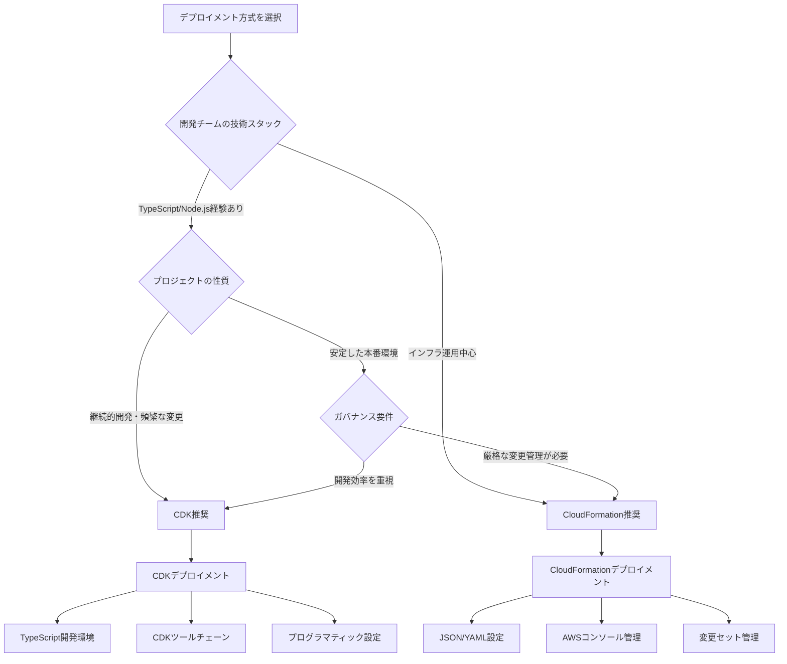

# 🚀 デプロイメント選択ガイド / Deployment Selection Guide

## 📋 概要 / Overview

このガイドでは、FSx for NetApp ONTAP Embedding Batch Workloadをデプロイする際の2つのアプローチ（CDKとCloudFormation）の選択方法について説明します。

This guide explains how to choose between two deployment approaches (CDK and CloudFormation) for the FSx for NetApp ONTAP Embedding Batch Workload.

## 🎯 デプロイメント方式比較 / Deployment Method Comparison

### CDK (Cloud Development Kit) アプローチ

#### 適用場面 / Use Cases
- **開発者向け**: TypeScriptでのプログラマティックなインフラ定義
- **継続的な開発**: 頻繁な変更とイテレーション
- **複雑な設定**: 条件分岐やループを含む動的な設定
- **チーム開発**: バージョン管理とコードレビューが重要

#### メリット / Advantages
✅ **型安全性**: TypeScriptによる型チェック  
✅ **再利用性**: コンストラクトの再利用とモジュール化  
✅ **開発効率**: IDEサポートとオートコンプリート  
✅ **テスト可能**: ユニットテストとスナップショットテスト  
✅ **動的設定**: プログラムロジックによる柔軟な設定  

#### デメリット / Disadvantages
❌ **学習コスト**: TypeScript/Node.jsの知識が必要  
❌ **依存関係**: Node.js環境とCDKツールチェーンが必要  
❌ **複雑性**: 初期セットアップが複雑  

### CloudFormation アプローチ

#### 適用場面 / Use Cases
- **運用者向け**: 宣言的なインフラ定義
- **安定した環境**: 変更頻度が低い本番環境
- **シンプルな設定**: 静的な設定が中心
- **ガバナンス重視**: 厳格な変更管理が必要

#### メリット / Advantages
✅ **シンプル**: JSONまたはYAMLの宣言的記述  
✅ **標準化**: AWS標準のIaCツール  
✅ **可視性**: AWSコンソールでの直接管理  
✅ **依存関係なし**: 追加ツールが不要  
✅ **ガバナンス**: 変更セットによる事前確認  

#### デメリット / Disadvantages
❌ **冗長性**: 繰り返しの記述が多い  
❌ **制限**: プログラムロジックが使用できない  
❌ **保守性**: 大規模テンプレートの管理が困難  

## 🔄 選択フローチャート / Selection Flowchart



## 📊 詳細比較表 / Detailed Comparison Table

| 項目 / Aspect | CDK | CloudFormation |
|---------------|-----|----------------|
| **学習コスト / Learning Curve** | 高 (TypeScript必要) | 低 (JSON/YAML) |
| **開発速度 / Development Speed** | 高 (再利用・自動化) | 中 (手動記述) |
| **保守性 / Maintainability** | 高 (モジュール化) | 中 (大規模時困難) |
| **テスト可能性 / Testability** | 高 (ユニットテスト) | 低 (手動検証) |
| **デバッグ / Debugging** | 高 (IDEサポート) | 中 (ログ確認) |
| **チーム協業 / Team Collaboration** | 高 (コードレビュー) | 中 (ファイル管理) |
| **CI/CD統合 / CI/CD Integration** | 高 (プログラム統合) | 中 (スクリプト必要) |
| **ガバナンス / Governance** | 中 (コード管理) | 高 (変更セット) |
| **可視性 / Visibility** | 中 (生成テンプレート) | 高 (直接確認) |
| **依存関係 / Dependencies** | 高 (Node.js/CDK) | 低 (AWS CLI) |

## 🎯 推奨シナリオ / Recommended Scenarios

### CDKを選ぶべき場合 / Choose CDK When

#### 🏢 エンタープライズ開発チーム
```yaml
チーム構成:
  - TypeScript/JavaScript開発者が中心
  - DevOpsエンジニアが在籍
  - 継続的インテグレーションを実践

プロジェクト特性:
  - マイクロサービスアーキテクチャ
  - 頻繁なデプロイメント (週次以上)
  - 複数環境での展開 (dev/staging/prod)
  - 動的な設定が必要

技術要件:
  - 型安全性が重要
  - ユニットテストが必要
  - コードレビュープロセスがある
```

#### 🚀 スタートアップ・アジャイル開発
```yaml
開発スタイル:
  - 迅速なプロトタイピング
  - 頻繁な機能追加・変更
  - 実験的な機能開発

技術スタック:
  - モダンなJavaScript/TypeScript環境
  - クラウドネイティブアプローチ
  - Infrastructure as Code重視
```

### CloudFormationを選ぶべき場合 / Choose CloudFormation When

#### 🏛️ 大企業・金融機関
```yaml
組織特性:
  - 厳格なガバナンス要件
  - 変更管理プロセスが確立
  - コンプライアンス要件が厳しい

運用体制:
  - インフラ専門チームが管理
  - 変更頻度が低い (月次以下)
  - 安定性を最重視

技術環境:
  - 既存のCloudFormation資産
  - AWS標準ツールのみ使用
  - セキュリティ制約が厳しい
```

#### 🔧 運用・保守中心の組織
```yaml
チーム構成:
  - インフラエンジニア中心
  - プログラミング経験が限定的
  - AWS認定資格保有者が多い

運用方針:
  - 安定性重視
  - 変更は慎重に実施
  - AWSコンソールでの管理を好む
```

## 🛠️ 実装アプローチ / Implementation Approaches

### ハイブリッドアプローチ / Hybrid Approach

多くの組織では、両方のアプローチを組み合わせることが効果的です：

#### フェーズ別採用 / Phased Adoption
```yaml
Phase 1 - プロトタイピング:
  - CDKで迅速な開発・検証
  - 機能要件の確定
  - アーキテクチャの最適化

Phase 2 - 本番化:
  - CDKからCloudFormationテンプレート生成
  - 本番環境はCloudFormationで管理
  - ガバナンスプロセスに適合
```

#### 環境別採用 / Environment-based Adoption
```yaml
開発環境 (dev/staging):
  - CDKで管理
  - 迅速な変更・実験
  - 開発者の生産性重視

本番環境 (prod):
  - CloudFormationで管理
  - 厳格な変更管理
  - 安定性・可視性重視
```

## 📋 移行戦略 / Migration Strategy

### CDK → CloudFormation 移行

#### 1. テンプレート生成 / Template Generation
```bash
# CDKからCloudFormationテンプレート生成
npx cdk synth --output ./cloudformation-templates/

# 生成されたテンプレートの確認
ls -la cloudformation-templates/
```

#### 2. パラメータ化 / Parameterization
```bash
# パラメータファイル作成
./scripts/generate-cloudformation-params.sh

# パラメータ検証
./scripts/validate-cloudformation-params.sh
```

#### 3. 段階的移行 / Gradual Migration
```yaml
Step 1: 開発環境での検証
  - 生成されたテンプレートでデプロイ
  - 機能テストの実行
  - 問題の特定・修正

Step 2: ステージング環境での確認
  - 本番相当環境でのテスト
  - パフォーマンス検証
  - 運用手順の確認

Step 3: 本番環境への適用
  - メンテナンス時間での移行
  - ロールバック計画の準備
  - 監視・アラートの設定
```

### CloudFormation → CDK 移行

#### 1. CDK Import / CDK Import
```bash
# 既存リソースのCDKへのインポート
npx cdk import

# CDKコードの生成
npx cdk init --language typescript
```

#### 2. 段階的リファクタリング / Gradual Refactoring
```typescript
// 既存リソースを段階的にCDKコードに変換
import * as cdk from 'aws-cdk-lib';

export class MigrationStack extends cdk.Stack {
  constructor(scope: Construct, id: string, props?: cdk.StackProps) {
    super(scope, id, props);
    
    // 段階1: 既存リソースの参照
    const existingVpc = ec2.Vpc.fromLookup(this, 'ExistingVpc', {
      vpcId: 'vpc-existing123'
    });
    
    // 段階2: 新しいリソースをCDKで作成
    const newBatchEnvironment = new batch.ComputeEnvironment(this, 'NewBatch', {
      // CDKコンストラクトによる定義
    });
  }
}
```

## 🔍 検証・テスト戦略 / Validation and Testing Strategy

### CDK検証 / CDK Validation

#### 単体テスト / Unit Tests
```typescript
import { Template } from 'aws-cdk-lib/assertions';
import { EmbeddingWorkloadStack } from '../lib/embedding-workload-stack';

test('Batch Compute Environment Created', () => {
  const app = new cdk.App();
  const stack = new EmbeddingWorkloadStack(app, 'TestStack');
  
  const template = Template.fromStack(stack);
  
  template.hasResourceProperties('AWS::Batch::ComputeEnvironment', {
    Type: 'MANAGED',
    State: 'ENABLED'
  });
});
```

#### スナップショットテスト / Snapshot Tests
```bash
# スナップショット生成
npm test -- --updateSnapshot

# スナップショット比較
npm test
```

### CloudFormation検証 / CloudFormation Validation

#### テンプレート検証 / Template Validation
```bash
# 構文チェック
aws cloudformation validate-template \
  --template-body file://template.yaml

# リンター実行
cfn-lint template.yaml

# セキュリティチェック
cfn_nag_scan --input-path template.yaml
```

#### 変更セット検証 / Change Set Validation
```bash
# 変更セット作成
aws cloudformation create-change-set \
  --stack-name test-stack \
  --template-body file://template.yaml \
  --change-set-name validation-test

# 変更内容確認
aws cloudformation describe-change-set \
  --stack-name test-stack \
  --change-set-name validation-test
```

## 🚀 デプロイメント実行 / Deployment Execution

### 統一デプロイメントスクリプト / Unified Deployment Script

```bash
#!/bin/bash
# 統一デプロイメントスクリプト

set -euo pipefail

DEPLOYMENT_METHOD=""
ENVIRONMENT=""
CONFIG_FILE=""

# 使用方法表示
show_usage() {
    cat << EOF
使用方法: $0 [OPTIONS]

OPTIONS:
    -m, --method <cdk|cloudformation>  デプロイメント方式
    -e, --env <dev|staging|prod>       環境名
    -c, --config <file>                設定ファイル
    -h, --help                         このヘルプを表示

例:
    $0 --method cdk --env dev --config config/dev.json
    $0 --method cloudformation --env prod --config config/prod.json
EOF
}

# パラメータ解析
while [[ $# -gt 0 ]]; do
    case $1 in
        -m|--method)
            DEPLOYMENT_METHOD="$2"
            shift 2
            ;;
        -e|--env)
            ENVIRONMENT="$2"
            shift 2
            ;;
        -c|--config)
            CONFIG_FILE="$2"
            shift 2
            ;;
        -h|--help)
            show_usage
            exit 0
            ;;
        *)
            echo "不明なオプション: $1"
            show_usage
            exit 1
            ;;
    esac
done

# 必須パラメータチェック
if [[ -z "$DEPLOYMENT_METHOD" || -z "$ENVIRONMENT" || -z "$CONFIG_FILE" ]]; then
    echo "エラー: 必須パラメータが不足しています"
    show_usage
    exit 1
fi

# 設定ファイル存在チェック
if [[ ! -f "$CONFIG_FILE" ]]; then
    echo "エラー: 設定ファイルが見つかりません: $CONFIG_FILE"
    exit 1
fi

echo "🚀 デプロイメント開始"
echo "方式: $DEPLOYMENT_METHOD"
echo "環境: $ENVIRONMENT"
echo "設定: $CONFIG_FILE"

# デプロイメント方式に応じた実行
case "$DEPLOYMENT_METHOD" in
    "cdk")
        echo "📦 CDKデプロイメント実行中..."
        
        # 前提条件チェック
        ./scripts/check-prerequisites.sh --cdk
        
        # 設定読み込み
        export CDK_CONFIG_FILE="$CONFIG_FILE"
        
        # CDKデプロイ
        cd cdk
        npm install
        npm run build
        npx cdk bootstrap
        npx cdk deploy --require-approval never
        cd ..
        
        echo "✅ CDKデプロイメント完了"
        ;;
        
    "cloudformation")
        echo "☁️ CloudFormationデプロイメント実行中..."
        
        # 前提条件チェック
        ./scripts/check-prerequisites.sh --cloudformation
        
        # パラメータファイル生成
        ./scripts/generate-cloudformation-params.sh \
            --config "$CONFIG_FILE" \
            --env "$ENVIRONMENT" \
            --output "parameters-${ENVIRONMENT}.json"
        
        # CloudFormationデプロイ
        aws cloudformation deploy \
            --template-file "cloudformation-templates/EmbeddingWorkloadStack.template.json" \
            --stack-name "embedding-batch-${ENVIRONMENT}" \
            --parameter-overrides "file://parameters-${ENVIRONMENT}.json" \
            --capabilities CAPABILITY_IAM CAPABILITY_NAMED_IAM
        
        echo "✅ CloudFormationデプロイメント完了"
        ;;
        
    *)
        echo "エラー: サポートされていないデプロイメント方式: $DEPLOYMENT_METHOD"
        echo "サポート方式: cdk, cloudformation"
        exit 1
        ;;
esac

# デプロイメント検証
echo "🔍 デプロイメント検証中..."
./scripts/validate.sh --env "$ENVIRONMENT"

echo "🎉 デプロイメント完了"
```

## 📚 参考資料 / References

- [AWS CDK Developer Guide](https://docs.aws.amazon.com/cdk/)
- [AWS CloudFormation User Guide](https://docs.aws.amazon.com/cloudformation/)
- [CDK vs CloudFormation Comparison](https://aws.amazon.com/cdk/faqs/)
- [Infrastructure as Code Best Practices](https://docs.aws.amazon.com/whitepapers/latest/introduction-devops-aws/infrastructure-as-code.html)

## 🆘 サポート / Support

デプロイメント方式の選択に関する質問：
Questions about deployment method selection:

1. [デプロイメント選択ガイド](./DEPLOYMENT_SELECTION_GUIDE.md)を確認
2. [CDKデプロイメントガイド](./CDK_DEPLOYMENT_GUIDE.md)を参照
3. [CloudFormationデプロイメントガイド](./CLOUDFORMATION_DEPLOYMENT_GUIDE.md)を参照
4. [GitHub Issues](https://github.com/your-repo/issues)で相談

Check the deployment selection guide, refer to specific deployment guides, or consult on GitHub Issues.