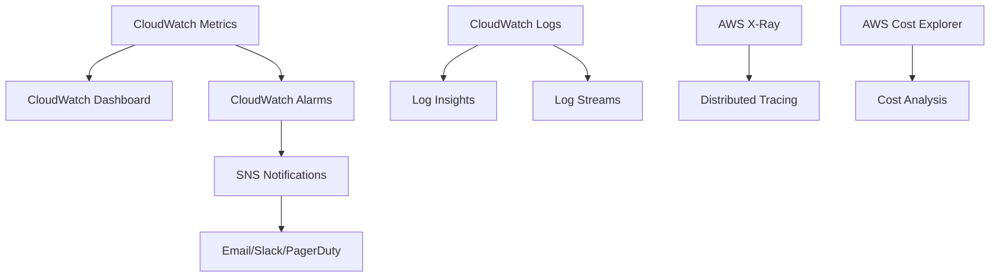

# 📊 Operations & Monitoring Guide

このガイドでは、Embedding Batch Workload Template の運用監視、保守、パフォーマンス最適化について説明します。

## 📋 目次

- [🔍 監視戦略](#-監視戦略)
- [📈 CloudWatch ダッシュボード](#-cloudwatch-ダッシュボード)
- [🚨 アラート設定](#-アラート設定)
- [🔧 日常運用](#-日常運用)
- [📊 パフォーマンス監視](#-パフォーマンス監視)
- [🛠️ 保守作業](#️-保守作業)

---

## 🔍 監視戦略

### 監視レベル

#### 1. インフラストラクチャ監視
- **AWS Batch**: Compute Environment、Job Queue、Job実行状況
- **Amazon FSx**: ファイルシステムの可用性、パフォーマンス
- **VPC**: ネットワーク接続、セキュリティグループ
- **IAM**: ロールとポリシーの使用状況

#### 2. アプリケーション監視
- **ジョブ実行**: 成功率、実行時間、エラー率
- **Bedrock API**: API呼び出し回数、レスポンス時間、エラー率
- **データ処理**: 処理済みドキュメント数、埋め込み生成数

#### 3. ビジネス監視
- **コスト**: リソース使用料金、予算アラート
- **SLA**: 処理時間、可用性、品質指標
- **容量**: ストレージ使用量、処理能力

### 監視ツール構成



---

## 📈 CloudWatch ダッシュボード

### 1. メインダッシュボード作成

#### CDK実装
```typescript
import { Dashboard, GraphWidget, Metric, SingleValueWidget } from 'aws-cdk-lib/aws-cloudwatch';

export class MonitoringDashboard extends Construct {
  constructor(scope: Construct, id: string, props: MonitoringDashboardProps) {
    super(scope, id);

    const dashboard = new Dashboard(this, 'EmbeddingWorkloadDashboard', {
      dashboardName: `${props.projectName}-${props.environment}-monitoring`,
      defaultInterval: Duration.minutes(5)
    });

    // Batch メトリクス
    const batchMetrics = this.createBatchMetrics(props);
    dashboard.addWidgets(...batchMetrics);

    // FSx メトリクス
    const fsxMetrics = this.createFsxMetrics(props);
    dashboard.addWidgets(...fsxMetrics);

    // コストメトリクス
    const costMetrics = this.createCostMetrics(props);
    dashboard.addWidgets(...costMetrics);
  }

  private createBatchMetrics(props: MonitoringDashboardProps) {
    return [
      new SingleValueWidget({
        title: 'Running Jobs',
        metrics: [
          new Metric({
            namespace: 'AWS/Batch',
            metricName: 'RunningJobs',
            dimensionsMap: {
              JobQueue: props.jobQueueName
            }
          })
        ],
        width: 6,
        height: 6
      }),
      new GraphWidget({
        title: 'Job Execution Trends',
        left: [
          new Metric({
            namespace: 'AWS/Batch',
            metricName: 'SubmittedJobs',
            dimensionsMap: { JobQueue: props.jobQueueName }
          }),
          new Metric({
            namespace: 'AWS/Batch',
            metricName: 'RunnableJobs',
            dimensionsMap: { JobQueue: props.jobQueueName }
          }),
          new Metric({
            namespace: 'AWS/Batch',
            metricName: 'RunningJobs',
            dimensionsMap: { JobQueue: props.jobQueueName }
          })
        ],
        width: 12,
        height: 6
      })
    ];
  }
}
```

#### CloudFormation実装
```yaml
MonitoringDashboard:
  Type: AWS::CloudWatch::Dashboard
  Properties:
    DashboardName: !Sub "${ProjectName}-${Environment}-monitoring"
    DashboardBody: !Sub |
      {
        "widgets": [
          {
            "type": "metric",
            "x": 0,
            "y": 0,
            "width": 12,
            "height": 6,
            "properties": {
              "metrics": [
                [ "AWS/Batch", "SubmittedJobs", "JobQueue", "${BatchJobQueue}" ],
                [ ".", "RunnableJobs", ".", "." ],
                [ ".", "RunningJobs", ".", "." ],
                [ ".", "CompletedJobs", ".", "." ],
                [ ".", "FailedJobs", ".", "." ]
              ],
              "period": 300,
              "stat": "Sum",
              "region": "${AWS::Region}",
              "title": "Batch Job Status"
            }
          },
          {
            "type": "metric",
            "x": 0,
            "y": 6,
            "width": 12,
            "height": 6,
            "properties": {
              "metrics": [
                [ "AWS/FSx", "DataReadBytes", "FileSystemId", "${FsxFileSystemId}" ],
                [ ".", "DataWriteBytes", ".", "." ]
              ],
              "period": 300,
              "stat": "Sum",
              "region": "${AWS::Region}",
              "title": "FSx Data Transfer"
            }
          }
        ]
      }
```

### 2. 主要メトリクス

#### Batch メトリクス
```bash
# 主要なBatchメトリクスの確認
aws cloudwatch get-metric-statistics \
  --namespace AWS/Batch \
  --metric-name RunningJobs \
  --dimensions Name=JobQueue,Value=embedding-batch-job-queue \
  --start-time $(date -d '1 hour ago' --iso-8601) \
  --end-time $(date --iso-8601) \
  --period 300 \
  --statistics Sum,Average,Maximum
```

**監視すべきメトリクス:**
- `SubmittedJobs`: 投入されたジョブ数
- `RunnableJobs`: 実行待ちジョブ数
- `RunningJobs`: 実行中ジョブ数
- `CompletedJobs`: 完了ジョブ数
- `FailedJobs`: 失敗ジョブ数

#### FSx メトリクス
```bash
# FSxパフォーマンスメトリクス
aws cloudwatch get-metric-statistics \
  --namespace AWS/FSx \
  --metric-name TotalIOTime \
  --dimensions Name=FileSystemId,Value=fs-12345678 \
  --start-time $(date -d '1 hour ago' --iso-8601) \
  --end-time $(date --iso-8601) \
  --period 300 \
  --statistics Average
```

**監視すべきメトリクス:**
- `DataReadBytes`: 読み取りデータ量
- `DataWriteBytes`: 書き込みデータ量
- `TotalIOTime`: I/O応答時間
- `ClientConnections`: クライアント接続数

#### EC2 メトリクス
```bash
# Compute Environment のEC2インスタンス
aws cloudwatch get-metric-statistics \
  --namespace AWS/EC2 \
  --metric-name CPUUtilization \
  --dimensions Name=AutoScalingGroupName,Value=batch-compute-env-asg \
  --start-time $(date -d '1 hour ago' --iso-8601) \
  --end-time $(date --iso-8601) \
  --period 300 \
  --statistics Average,Maximum
```

---

## 🚨 アラート設定

### 1. 重要度別アラート

#### Critical (即座対応)
```yaml
# ジョブ失敗率アラート
JobFailureRateAlarm:
  Type: AWS::CloudWatch::Alarm
  Properties:
    AlarmName: !Sub "${ProjectName}-${Environment}-job-failure-rate-critical"
    AlarmDescription: "High job failure rate detected"
    MetricName: FailedJobs
    Namespace: AWS/Batch
    Statistic: Sum
    Period: 300
    EvaluationPeriods: 2
    Threshold: 5
    ComparisonOperator: GreaterThanThreshold
    Dimensions:
      - Name: JobQueue
        Value: !Ref BatchJobQueue
    AlarmActions:
      - !Ref CriticalAlarmTopic
    TreatMissingData: notBreaching

# FSx可用性アラート
FsxAvailabilityAlarm:
  Type: AWS::CloudWatch::Alarm
  Properties:
    AlarmName: !Sub "${ProjectName}-${Environment}-fsx-unavailable"
    AlarmDescription: "FSx file system is unavailable"
    MetricName: ClientConnections
    Namespace: AWS/FSx
    Statistic: Sum
    Period: 300
    EvaluationPeriods: 3
    Threshold: 1
    ComparisonOperator: LessThanThreshold
    Dimensions:
      - Name: FileSystemId
        Value: !Ref FsxFileSystemId
    AlarmActions:
      - !Ref CriticalAlarmTopic
```

#### Warning (監視強化)
```yaml
# CPU使用率アラート
HighCpuUtilizationAlarm:
  Type: AWS::CloudWatch::Alarm
  Properties:
    AlarmName: !Sub "${ProjectName}-${Environment}-high-cpu-utilization"
    AlarmDescription: "High CPU utilization in compute environment"
    MetricName: CPUUtilization
    Namespace: AWS/EC2
    Statistic: Average
    Period: 300
    EvaluationPeriods: 3
    Threshold: 80
    ComparisonOperator: GreaterThanThreshold
    AlarmActions:
      - !Ref WarningAlarmTopic

# ジョブキュー滞留アラート
JobQueueBacklogAlarm:
  Type: AWS::CloudWatch::Alarm
  Properties:
    AlarmName: !Sub "${ProjectName}-${Environment}-job-queue-backlog"
    AlarmDescription: "Jobs are backing up in the queue"
    MetricName: RunnableJobs
    Namespace: AWS/Batch
    Statistic: Average
    Period: 600
    EvaluationPeriods: 2
    Threshold: 50
    ComparisonOperator: GreaterThanThreshold
    Dimensions:
      - Name: JobQueue
        Value: !Ref BatchJobQueue
    AlarmActions:
      - !Ref WarningAlarmTopic
```

### 2. 通知設定

#### SNS Topic設定
```yaml
CriticalAlarmTopic:
  Type: AWS::SNS::Topic
  Properties:
    TopicName: !Sub "${ProjectName}-${Environment}-critical-alarms"
    DisplayName: "Critical Alarms"

CriticalAlarmSubscription:
  Type: AWS::SNS::Subscription
  Properties:
    Protocol: email
    TopicArn: !Ref CriticalAlarmTopic
    Endpoint: !Ref AlertEmail

# Slack統合 (Lambda経由)
SlackNotificationFunction:
  Type: AWS::Lambda::Function
  Properties:
    FunctionName: !Sub "${ProjectName}-${Environment}-slack-notification"
    Runtime: python3.9
    Handler: index.lambda_handler
    Code:
      ZipFile: |
        import json
        import urllib3
        import os
        
        def lambda_handler(event, context):
            webhook_url = os.environ['SLACK_WEBHOOK_URL']
            
            message = {
                "text": f"🚨 Alert: {event['Records'][0]['Sns']['Subject']}",
                "attachments": [{
                    "color": "danger",
                    "fields": [{
                        "title": "Message",
                        "value": event['Records'][0]['Sns']['Message'],
                        "short": False
                    }]
                }]
            }
            
            http = urllib3.PoolManager()
            response = http.request('POST', webhook_url,
                                  body=json.dumps(message),
                                  headers={'Content-Type': 'application/json'})
            
            return {'statusCode': 200}
    Environment:
      Variables:
        SLACK_WEBHOOK_URL: !Ref SlackWebhookUrl
```

---

## 🔧 日常運用

### 1. 日次チェックリスト

#### 自動化スクリプト
```bash
#!/bin/bash
# daily-health-check.sh

PROJECT_NAME="embedding-batch-workload"
ENVIRONMENT="production"
DATE=$(date +%Y-%m-%d)

echo "=== Daily Health Check - $DATE ==="

# 1. Batch環境の状態確認
echo "1. Checking Batch Environment..."
aws batch describe-compute-environments \
  --compute-environments "${PROJECT_NAME}-${ENVIRONMENT}-compute-env" \
  --query 'computeEnvironments[0].{Status:status,State:state,RunningCapacity:computeResources.desiredvCpus}'

# 2. ジョブキューの状態確認
echo "2. Checking Job Queue..."
aws batch describe-job-queues \
  --job-queues "${PROJECT_NAME}-${ENVIRONMENT}-job-queue" \
  --query 'jobQueues[0].{State:state,Priority:priority}'

# 3. 過去24時間のジョブ実行状況
echo "3. Job Execution Summary (Last 24h)..."
aws batch list-jobs \
  --job-queue "${PROJECT_NAME}-${ENVIRONMENT}-job-queue" \
  --job-status SUCCEEDED \
  --query 'length(jobSummary)'

aws batch list-jobs \
  --job-queue "${PROJECT_NAME}-${ENVIRONMENT}-job-queue" \
  --job-status FAILED \
  --query 'length(jobSummary)'

# 4. FSxファイルシステムの状態
echo "4. Checking FSx File System..."
aws fsx describe-file-systems \
  --file-system-ids "$FSX_FILE_SYSTEM_ID" \
  --query 'FileSystems[0].{Lifecycle:lifecycle,StorageCapacity:storageCapacity,ThroughputCapacity:throughputCapacity}'

# 5. コスト確認（前日分）
echo "5. Cost Analysis (Yesterday)..."
YESTERDAY=$(date -d '1 day ago' +%Y-%m-%d)
aws ce get-cost-and-usage \
  --time-period Start=$YESTERDAY,End=$DATE \
  --granularity DAILY \
  --metrics BlendedCost \
  --group-by Type=DIMENSION,Key=SERVICE \
  --query 'ResultsByTime[0].Groups[?Keys[0]==`Amazon Elastic Compute Cloud - Compute`].Metrics.BlendedCost.Amount'

echo "=== Health Check Complete ==="
```

### 2. 週次レポート

#### 自動レポート生成
```python
#!/usr/bin/env python3
# weekly-report.py

import boto3
import json
from datetime import datetime, timedelta
import pandas as pd

class WeeklyReportGenerator:
    def __init__(self, project_name, environment):
        self.project_name = project_name
        self.environment = environment
        self.batch_client = boto3.client('batch')
        self.cloudwatch = boto3.client('cloudwatch')
        self.ce_client = boto3.client('ce')
    
    def generate_report(self):
        end_date = datetime.now()
        start_date = end_date - timedelta(days=7)
        
        report = {
            'period': f"{start_date.strftime('%Y-%m-%d')} to {end_date.strftime('%Y-%m-%d')}",
            'job_statistics': self.get_job_statistics(start_date, end_date),
            'performance_metrics': self.get_performance_metrics(start_date, end_date),
            'cost_analysis': self.get_cost_analysis(start_date, end_date),
            'recommendations': self.generate_recommendations()
        }
        
        return report
    
    def get_job_statistics(self, start_date, end_date):
        # ジョブ統計の取得
        job_queue = f"{self.project_name}-{self.environment}-job-queue"
        
        succeeded_jobs = self.batch_client.list_jobs(
            jobQueue=job_queue,
            jobStatus='SUCCEEDED'
        )
        
        failed_jobs = self.batch_client.list_jobs(
            jobQueue=job_queue,
            jobStatus='FAILED'
        )
        
        return {
            'total_succeeded': len(succeeded_jobs['jobSummary']),
            'total_failed': len(failed_jobs['jobSummary']),
            'success_rate': len(succeeded_jobs['jobSummary']) / 
                          (len(succeeded_jobs['jobSummary']) + len(failed_jobs['jobSummary'])) * 100
        }
    
    def get_performance_metrics(self, start_date, end_date):
        # パフォーマンスメトリクスの取得
        metrics = self.cloudwatch.get_metric_statistics(
            Namespace='AWS/Batch',
            MetricName='RunningJobs',
            Dimensions=[
                {
                    'Name': 'JobQueue',
                    'Value': f"{self.project_name}-{self.environment}-job-queue"
                }
            ],
            StartTime=start_date,
            EndTime=end_date,
            Period=3600,
            Statistics=['Average', 'Maximum']
        )
        
        return {
            'avg_running_jobs': sum(d['Average'] for d in metrics['Datapoints']) / len(metrics['Datapoints']),
            'max_running_jobs': max(d['Maximum'] for d in metrics['Datapoints'])
        }
    
    def get_cost_analysis(self, start_date, end_date):
        # コスト分析
        response = self.ce_client.get_cost_and_usage(
            TimePeriod={
                'Start': start_date.strftime('%Y-%m-%d'),
                'End': end_date.strftime('%Y-%m-%d')
            },
            Granularity='DAILY',
            Metrics=['BlendedCost'],
            GroupBy=[
                {
                    'Type': 'DIMENSION',
                    'Key': 'SERVICE'
                }
            ]
        )
        
        total_cost = 0
        service_costs = {}
        
        for result in response['ResultsByTime']:
            for group in result['Groups']:
                service = group['Keys'][0]
                cost = float(group['Metrics']['BlendedCost']['Amount'])
                service_costs[service] = service_costs.get(service, 0) + cost
                total_cost += cost
        
        return {
            'total_cost': total_cost,
            'service_breakdown': service_costs
        }
    
    def generate_recommendations(self):
        # 推奨事項の生成
        recommendations = []
        
        # コスト最適化の推奨
        recommendations.append({
            'category': 'Cost Optimization',
            'recommendation': 'Consider using Spot instances for non-critical workloads',
            'impact': 'High',
            'effort': 'Medium'
        })
        
        return recommendations

if __name__ == "__main__":
    generator = WeeklyReportGenerator("embedding-batch-workload", "production")
    report = generator.generate_report()
    
    # レポートをJSON形式で出力
    print(json.dumps(report, indent=2, default=str))
```

---

## 📊 パフォーマンス監視

### 1. ジョブパフォーマンス分析

#### ジョブ実行時間の分析
```bash
#!/bin/bash
# analyze-job-performance.sh

JOB_QUEUE="embedding-batch-workload-prod-job-queue"
DAYS_BACK=7

echo "=== Job Performance Analysis (Last $DAYS_BACK days) ==="

# 完了したジョブの一覧取得
aws batch list-jobs \
  --job-queue "$JOB_QUEUE" \
  --job-status SUCCEEDED \
  --query 'jobSummary[*].{JobId:jobId,JobName:jobName,CreatedAt:createdAt,StartedAt:startedAt,StoppedAt:stoppedAt}' \
  --output table

# 平均実行時間の計算
echo "Calculating average execution times..."

# ジョブ詳細の取得と分析
aws batch list-jobs \
  --job-queue "$JOB_QUEUE" \
  --job-status SUCCEEDED \
  --query 'jobSummary[*].jobId' \
  --output text | \
while read job_id; do
  aws batch describe-jobs --jobs "$job_id" \
    --query 'jobs[0].{JobName:jobName,StartedAt:startedAt,StoppedAt:stoppedAt}' \
    --output json
done | jq -s '
  map(select(.StartedAt and .StoppedAt)) |
  map({
    JobName: .JobName,
    Duration: ((.StoppedAt | tonumber) - (.StartedAt | tonumber))
  }) |
  group_by(.JobName) |
  map({
    JobType: .[0].JobName,
    Count: length,
    AvgDuration: (map(.Duration) | add / length),
    MinDuration: (map(.Duration) | min),
    MaxDuration: (map(.Duration) | max)
  })
'
```

### 2. リソース使用率監視

#### CPU・メモリ使用率の確認
```bash
#!/bin/bash
# resource-utilization-check.sh

COMPUTE_ENV="embedding-batch-workload-prod-compute-env"
START_TIME=$(date -d '1 hour ago' --iso-8601)
END_TIME=$(date --iso-8601)

echo "=== Resource Utilization Check ==="

# CPU使用率
echo "CPU Utilization:"
aws cloudwatch get-metric-statistics \
  --namespace AWS/EC2 \
  --metric-name CPUUtilization \
  --dimensions Name=AutoScalingGroupName,Value="$COMPUTE_ENV-asg" \
  --start-time "$START_TIME" \
  --end-time "$END_TIME" \
  --period 300 \
  --statistics Average,Maximum \
  --query 'Datapoints[*].{Time:Timestamp,Avg:Average,Max:Maximum}' \
  --output table

# メモリ使用率（CloudWatch Agentが必要）
echo "Memory Utilization:"
aws cloudwatch get-metric-statistics \
  --namespace CWAgent \
  --metric-name mem_used_percent \
  --dimensions Name=AutoScalingGroupName,Value="$COMPUTE_ENV-asg" \
  --start-time "$START_TIME" \
  --end-time "$END_TIME" \
  --period 300 \
  --statistics Average,Maximum \
  --query 'Datapoints[*].{Time:Timestamp,Avg:Average,Max:Maximum}' \
  --output table
```

### 3. ネットワークパフォーマンス

#### FSx接続性能の監視
```bash
#!/bin/bash
# fsx-performance-check.sh

FSX_FILE_SYSTEM_ID="fs-12345678"
START_TIME=$(date -d '1 hour ago' --iso-8601)
END_TIME=$(date --iso-8601)

echo "=== FSx Performance Check ==="

# データ転送量
echo "Data Transfer:"
aws cloudwatch get-metric-statistics \
  --namespace AWS/FSx \
  --metric-name DataReadBytes \
  --dimensions Name=FileSystemId,Value="$FSX_FILE_SYSTEM_ID" \
  --start-time "$START_TIME" \
  --end-time "$END_TIME" \
  --period 300 \
  --statistics Sum \
  --query 'Datapoints[*].{Time:Timestamp,ReadBytes:Sum}' \
  --output table

aws cloudwatch get-metric-statistics \
  --namespace AWS/FSx \
  --metric-name DataWriteBytes \
  --dimensions Name=FileSystemId,Value="$FSX_FILE_SYSTEM_ID" \
  --start-time "$START_TIME" \
  --end-time "$END_TIME" \
  --period 300 \
  --statistics Sum \
  --query 'Datapoints[*].{Time:Timestamp,WriteBytes:Sum}' \
  --output table

# I/O応答時間
echo "I/O Response Time:"
aws cloudwatch get-metric-statistics \
  --namespace AWS/FSx \
  --metric-name TotalIOTime \
  --dimensions Name=FileSystemId,Value="$FSX_FILE_SYSTEM_ID" \
  --start-time "$START_TIME" \
  --end-time "$END_TIME" \
  --period 300 \
  --statistics Average \
  --query 'Datapoints[*].{Time:Timestamp,IOTime:Average}' \
  --output table
```

---

## 🛠️ 保守作業

### 1. 定期メンテナンス

#### 月次メンテナンススクリプト
```bash
#!/bin/bash
# monthly-maintenance.sh

PROJECT_NAME="embedding-batch-workload"
ENVIRONMENT="production"
BACKUP_DATE=$(date +%Y-%m-%d)

echo "=== Monthly Maintenance - $BACKUP_DATE ==="

# 1. ログの圧縮とアーカイブ
echo "1. Archiving old logs..."
aws logs create-export-task \
  --log-group-name "/aws/batch/job" \
  --from $(date -d '30 days ago' +%s)000 \
  --to $(date -d '1 day ago' +%s)000 \
  --destination "${PROJECT_NAME}-${ENVIRONMENT}-logs-archive" \
  --destination-prefix "monthly-archive/$BACKUP_DATE/"

# 2. 不要なジョブ履歴のクリーンアップ
echo "2. Cleaning up old job history..."
# 30日以上前の完了ジョブを削除（実装は環境に応じて調整）

# 3. セキュリティパッチの確認
echo "3. Checking for security updates..."
# AMIの更新確認
aws ec2 describe-images \
  --owners amazon \
  --filters "Name=name,Values=amzn2-ami-ecs-hvm-*" \
  --query 'Images | sort_by(@, &CreationDate) | [-1].{ImageId:ImageId,Name:Name,CreationDate:CreationDate}'

# 4. コスト分析レポート
echo "4. Generating cost analysis..."
python3 monthly-cost-analysis.py

# 5. パフォーマンス最適化の推奨
echo "5. Performance optimization recommendations..."
python3 performance-recommendations.py

echo "=== Monthly Maintenance Complete ==="
```

### 2. 容量管理

#### ストレージ使用量監視
```bash
#!/bin/bash
# storage-monitoring.sh

FSX_FILE_SYSTEM_ID="fs-12345678"
S3_BUCKET="embedding-batch-workload-prod-data"

echo "=== Storage Usage Monitoring ==="

# FSx使用量
echo "FSx Storage Usage:"
aws fsx describe-file-systems \
  --file-system-ids "$FSX_FILE_SYSTEM_ID" \
  --query 'FileSystems[0].{StorageCapacity:storageCapacity,StorageType:storageType}'

# S3使用量
echo "S3 Storage Usage:"
aws cloudwatch get-metric-statistics \
  --namespace AWS/S3 \
  --metric-name BucketSizeBytes \
  --dimensions Name=BucketName,Value="$S3_BUCKET" Name=StorageType,Value=StandardStorage \
  --start-time $(date -d '1 day ago' --iso-8601) \
  --end-time $(date --iso-8601) \
  --period 86400 \
  --statistics Average \
  --query 'Datapoints[0].Average'

# DynamoDB使用量
echo "DynamoDB Table Size:"
aws dynamodb describe-table \
  --table-name "embedding-batch-workload-prod-metadata" \
  --query 'Table.{TableSizeBytes:tableSizeBytes,ItemCount:itemCount}'
```

### 3. セキュリティ監査

#### 定期セキュリティチェック
```bash
#!/bin/bash
# security-audit.sh

PROJECT_NAME="embedding-batch-workload"
ENVIRONMENT="production"

echo "=== Security Audit - $(date) ==="

# 1. IAMロールとポリシーの確認
echo "1. Checking IAM roles and policies..."
aws iam list-roles \
  --query "Roles[?contains(RoleName, '$PROJECT_NAME-$ENVIRONMENT')].{RoleName:RoleName,CreateDate:CreateDate}" \
  --output table

# 2. セキュリティグループの確認
echo "2. Checking security groups..."
aws ec2 describe-security-groups \
  --filters "Name=group-name,Values=*$PROJECT_NAME-$ENVIRONMENT*" \
  --query 'SecurityGroups[*].{GroupId:GroupId,GroupName:GroupName,IpPermissions:IpPermissions}' \
  --output table

# 3. 暗号化設定の確認
echo "3. Checking encryption settings..."
# S3バケットの暗号化
aws s3api get-bucket-encryption \
  --bucket "$PROJECT_NAME-$ENVIRONMENT-data"

# DynamoDBの暗号化
aws dynamodb describe-table \
  --table-name "$PROJECT_NAME-$ENVIRONMENT-metadata" \
  --query 'Table.SSEDescription'

# 4. VPCフローログの確認
echo "4. Checking VPC Flow Logs..."
aws ec2 describe-flow-logs \
  --query 'FlowLogs[*].{FlowLogId:FlowLogId,ResourceId:ResourceId,FlowLogStatus:FlowLogStatus}'

# 5. CloudTrailの確認
echo "5. Checking CloudTrail..."
aws cloudtrail describe-trails \
  --query 'trailList[*].{Name:Name,S3BucketName:S3BucketName,IncludeGlobalServiceEvents:IncludeGlobalServiceEvents}'

echo "=== Security Audit Complete ==="
```

### 4. 災害復旧テスト

#### DR テストスクリプト
```bash
#!/bin/bash
# dr-test.sh

PROJECT_NAME="embedding-batch-workload"
ENVIRONMENT="production"
DR_REGION="us-west-2"

echo "=== Disaster Recovery Test - $(date) ==="

# 1. バックアップの確認
echo "1. Verifying backups..."
aws s3 ls s3://$PROJECT_NAME-$ENVIRONMENT-backup/ --recursive --human-readable

# 2. DRリージョンでのリソース確認
echo "2. Checking DR region resources..."
aws fsx describe-file-systems \
  --region "$DR_REGION" \
  --query 'FileSystems[?contains(Tags[?Key==`Project`].Value, `'$PROJECT_NAME'`)].{FileSystemId:FileSystemId,Lifecycle:Lifecycle}'

# 3. データ同期の確認
echo "3. Verifying data synchronization..."
# S3 Cross-Region Replicationの状態確認
aws s3api get-bucket-replication \
  --bucket "$PROJECT_NAME-$ENVIRONMENT-data"

# 4. 復旧手順のテスト（非破壊的）
echo "4. Testing recovery procedures (dry-run)..."
# CloudFormationテンプレートの検証
aws cloudformation validate-template \
  --template-body file://dr-recovery-template.yaml \
  --region "$DR_REGION"

echo "=== DR Test Complete ==="
```

---

## 📋 運用チェックリスト

### 日次チェック
- [ ] Batch環境の状態確認
- [ ] ジョブ実行状況の確認
- [ ] エラーログの確認
- [ ] リソース使用率の確認
- [ ] コスト使用量の確認

### 週次チェック
- [ ] パフォーマンス分析レポートの確認
- [ ] セキュリティアラートの確認
- [ ] 容量使用量の確認
- [ ] バックアップ状況の確認

### 月次チェック
- [ ] 包括的なセキュリティ監査
- [ ] コスト最適化の検討
- [ ] パフォーマンス最適化の実施
- [ ] 災害復旧テストの実施
- [ ] ドキュメントの更新

---

この運用監視ガイドを参考に、システムの安定稼働と最適化を図ってください。定期的な監視と保守により、高い可用性とパフォーマンスを維持できます。