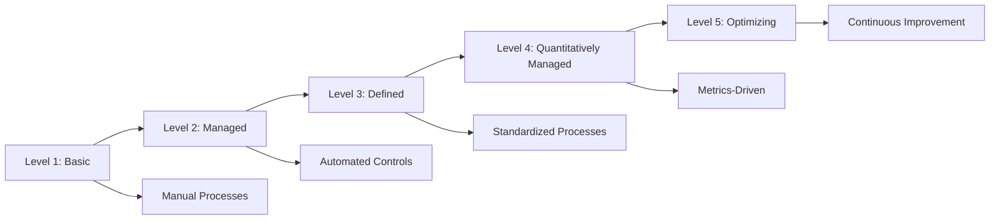

# 🔒 Security Best Practices Guide

このガイドでは、Embedding Batch Workload Template のセキュリティベストプラクティス、IAM設定、ネットワークセキュリティについて説明します。

## 📋 目次

- [🛡️ セキュリティフレームワーク](#️-セキュリティフレームワーク)
- [🔐 IAM セキュリティ](#-iam-セキュリティ)
- [🌐 ネットワークセキュリティ](#-ネットワークセキュリティ)
- [🔒 データ保護](#-データ保護)
- [📊 監査とコンプライアンス](#-監査とコンプライアンス)
- [🚨 インシデント対応](#-インシデント対応)

---

## 🛡️ セキュリティフレームワーク

### AWS Well-Architected Security Pillar

#### 5つのセキュリティ原則

1. **Identity and Access Management (IAM)**
   - 最小権限の原則
   - 多要素認証 (MFA)
   - 定期的なアクセスレビュー

2. **Detective Controls (検知制御)**
   - ログ記録と監視
   - 異常検知
   - セキュリティイベントの追跡

3. **Infrastructure Protection (インフラ保護)**
   - ネットワークセキュリティ
   - システム強化
   - 脆弱性管理

4. **Data Protection (データ保護)**
   - 暗号化（保存時・転送時）
   - データ分類
   - バックアップとリカバリ

5. **Incident Response (インシデント対応)**
   - 対応計画
   - 自動化された対応
   - 事後分析

### セキュリティ成熟度モデル



---

## 🔐 IAM セキュリティ

### 1. 最小権限の原則

#### ロール設計のベストプラクティス
```yaml
# ✅ 良い例: 最小権限のジョブロール
BatchJobRole:
  Type: AWS::IAM::Role
  Properties:
    RoleName: !Sub "${ProjectName}-${Environment}-batch-job-role"
    AssumeRolePolicyDocument:
      Version: '2012-10-17'
      Statement:
        - Effect: Allow
          Principal:
            Service: ecs-tasks.amazonaws.com
          Action: sts:AssumeRole
          Condition:
            StringEquals:
              'aws:RequestedRegion': !Ref AWS::Region
    Policies:
      - PolicyName: BedrockAccess
        PolicyDocument:
          Version: '2012-10-17'
          Statement:
            - Effect: Allow
              Action:
                - bedrock:InvokeModel
                - bedrock:InvokeModelWithResponseStream
              Resource:
                - !Sub "arn:aws:bedrock:${AWS::Region}::foundation-model/amazon.titan-embed-text-v1"
                - !Sub "arn:aws:bedrock:${AWS::Region}::foundation-model/amazon.nova-pro-v1:0"
              Condition:
                StringEquals:
                  'aws:RequestedRegion': !Ref AWS::Region
            - Effect: Allow
              Action:
                - s3:GetObject
                - s3:PutObject
              Resource: !Sub "${DataBucket}/embeddings/*"
              Condition:
                StringLike:
                  's3:x-amz-server-side-encryption': 'aws:kms'
    Tags:
      - Key: SecurityLevel
        Value: Restricted
      - Key: DataClassification
        Value: Confidential
```

#### 権限境界の実装
```yaml
PermissionsBoundary:
  Type: AWS::IAM::ManagedPolicy
  Properties:
    ManagedPolicyName: !Sub "${ProjectName}-${Environment}-permissions-boundary"
    Description: "Permissions boundary for batch workload roles"
    PolicyDocument:
      Version: '2012-10-17'
      Statement:
        - Effect: Allow
          Action:
            - bedrock:InvokeModel*
            - s3:GetObject
            - s3:PutObject
            - dynamodb:GetItem
            - dynamodb:PutItem
            - dynamodb:UpdateItem
            - dynamodb:Query
            - logs:CreateLogStream
            - logs:PutLogEvents
          Resource: "*"
          Condition:
            StringEquals:
              'aws:RequestedRegion': !Ref AWS::Region
        - Effect: Deny
          Action:
            - iam:*
            - organizations:*
            - account:*
          Resource: "*"

# ロールに権限境界を適用
BatchJobRoleWithBoundary:
  Type: AWS::IAM::Role
  Properties:
    PermissionsBoundary: !Ref PermissionsBoundary
    # ... その他のプロパティ
```

### 2. アクセス制御の強化

#### リソースベースポリシー
```yaml
S3BucketPolicy:
  Type: AWS::S3::BucketPolicy
  Properties:
    Bucket: !Ref DataBucket
    PolicyDocument:
      Version: '2012-10-17'
      Statement:
        - Sid: DenyInsecureConnections
          Effect: Deny
          Principal: "*"
          Action: "s3:*"
          Resource:
            - !Sub "${DataBucket}/*"
            - !Ref DataBucket
          Condition:
            Bool:
              "aws:SecureTransport": "false"
        - Sid: DenyUnencryptedObjectUploads
          Effect: Deny
          Principal: "*"
          Action: "s3:PutObject"
          Resource: !Sub "${DataBucket}/*"
          Condition:
            StringNotEquals:
              "s3:x-amz-server-side-encryption": "aws:kms"
        - Sid: AllowBatchJobAccess
          Effect: Allow
          Principal:
            AWS: !GetAtt BatchJobRole.Arn
          Action:
            - "s3:GetObject"
            - "s3:PutObject"
          Resource: !Sub "${DataBucket}/embeddings/*"
          Condition:
            StringEquals:
              "s3:x-amz-server-side-encryption": "aws:kms"
            DateGreaterThan:
              "aws:CurrentTime": "2024-01-01T00:00:00Z"
```

#### VPC Endpoint ポリシー
```yaml
BedrockVPCEndpointPolicy:
  Type: AWS::EC2::VPCEndpoint
  Properties:
    VpcId: !Ref VpcId
    ServiceName: !Sub "com.amazonaws.${AWS::Region}.bedrock-runtime"
    VpcEndpointType: Interface
    SubnetIds: !Split [',', !Ref PrivateSubnetIds]
    SecurityGroupIds:
      - !Ref VPCEndpointSecurityGroup
    PolicyDocument:
      Version: '2012-10-17'
      Statement:
        - Effect: Allow
          Principal:
            AWS: !GetAtt BatchJobRole.Arn
          Action:
            - bedrock:InvokeModel
            - bedrock:InvokeModelWithResponseStream
          Resource:
            - !Sub "arn:aws:bedrock:${AWS::Region}::foundation-model/amazon.titan-embed-text-v1"
            - !Sub "arn:aws:bedrock:${AWS::Region}::foundation-model/amazon.nova-pro-v1:0"
          Condition:
            StringEquals:
              "aws:PrincipalTag/Project": !Ref ProjectName
            IpAddress:
              "aws:SourceIp": "10.0.0.0/8"
```

### 3. セキュリティ監査

#### IAM Access Analyzer
```yaml
AccessAnalyzer:
  Type: AWS::AccessAnalyzer::Analyzer
  Properties:
    AnalyzerName: !Sub "${ProjectName}-${Environment}-access-analyzer"
    Type: ACCOUNT
    Tags:
      - Key: Project
        Value: !Ref ProjectName
      - Key: Environment
        Value: !Ref Environment

# 外部アクセスの検出
ExternalAccessFinding:
  Type: AWS::CloudWatch::Alarm
  Properties:
    AlarmName: !Sub "${ProjectName}-${Environment}-external-access-detected"
    AlarmDescription: "External access to resources detected"
    MetricName: "ExternalAccessFindings"
    Namespace: "AWS/AccessAnalyzer"
    Statistic: Sum
    Period: 300
    EvaluationPeriods: 1
    Threshold: 1
    ComparisonOperator: GreaterThanOrEqualToThreshold
    AlarmActions:
      - !Ref SecurityAlertTopic
```

---

## 🌐 ネットワークセキュリティ

### 1. VPC セキュリティ

#### セキュリティグループの設計
```yaml
# Batch Compute Environment用セキュリティグループ
BatchComputeSecurityGroup:
  Type: AWS::EC2::SecurityGroup
  Properties:
    GroupName: !Sub "${ProjectName}-${Environment}-batch-compute-sg"
    GroupDescription: "Security group for Batch compute environment"
    VpcId: !Ref VpcId
    SecurityGroupEgress:
      # FSx NFS アクセス
      - IpProtocol: tcp
        FromPort: 2049
        ToPort: 2049
        CidrIp: 10.0.0.0/8
        Description: "NFS access to FSx"
      # HTTPS for AWS services
      - IpProtocol: tcp
        FromPort: 443
        ToPort: 443
        DestinationSecurityGroupId: !Ref VPCEndpointSecurityGroup
        Description: "HTTPS to VPC endpoints"
      # DNS
      - IpProtocol: tcp
        FromPort: 53
        ToPort: 53
        CidrIp: 10.0.0.0/8
        Description: "DNS queries"
      - IpProtocol: udp
        FromPort: 53
        ToPort: 53
        CidrIp: 10.0.0.0/8
        Description: "DNS queries"
    Tags:
      - Key: Name
        Value: !Sub "${ProjectName}-${Environment}-batch-compute-sg"
      - Key: SecurityLevel
        Value: Restricted

# VPC Endpoint用セキュリティグループ
VPCEndpointSecurityGroup:
  Type: AWS::EC2::SecurityGroup
  Properties:
    GroupName: !Sub "${ProjectName}-${Environment}-vpc-endpoint-sg"
    GroupDescription: "Security group for VPC endpoints"
    VpcId: !Ref VpcId
    SecurityGroupIngress:
      - IpProtocol: tcp
        FromPort: 443
        ToPort: 443
        SourceSecurityGroupId: !Ref BatchComputeSecurityGroup
        Description: "HTTPS from Batch compute environment"
    Tags:
      - Key: Name
        Value: !Sub "${ProjectName}-${Environment}-vpc-endpoint-sg"
```

#### Network ACLs
```yaml
PrivateNetworkAcl:
  Type: AWS::EC2::NetworkAcl
  Properties:
    VpcId: !Ref VpcId
    Tags:
      - Key: Name
        Value: !Sub "${ProjectName}-${Environment}-private-nacl"

# インバウンドルール
PrivateNetworkAclInboundRule:
  Type: AWS::EC2::NetworkAclEntry
  Properties:
    NetworkAclId: !Ref PrivateNetworkAcl
    RuleNumber: 100
    Protocol: 6  # TCP
    RuleAction: allow
    CidrBlock: 10.0.0.0/8
    PortRange:
      From: 1024
      To: 65535

# アウトバウンドルール
PrivateNetworkAclOutboundRule:
  Type: AWS::EC2::NetworkAclEntry
  Properties:
    NetworkAclId: !Ref PrivateNetworkAcl
    RuleNumber: 100
    Protocol: 6  # TCP
    RuleAction: allow
    CidrBlock: 0.0.0.0/0
    PortRange:
      From: 443
      To: 443
    Egress: true
```

### 2. VPC Flow Logs

#### フローログの設定
```yaml
VPCFlowLogsRole:
  Type: AWS::IAM::Role
  Properties:
    AssumeRolePolicyDocument:
      Version: '2012-10-17'
      Statement:
        - Effect: Allow
          Principal:
            Service: vpc-flow-logs.amazonaws.com
          Action: sts:AssumeRole
    Policies:
      - PolicyName: FlowLogsDeliveryRolePolicy
        PolicyDocument:
          Version: '2012-10-17'
          Statement:
            - Effect: Allow
              Action:
                - logs:CreateLogGroup
                - logs:CreateLogStream
                - logs:PutLogEvents
                - logs:DescribeLogGroups
                - logs:DescribeLogStreams
              Resource: "*"

VPCFlowLogsGroup:
  Type: AWS::Logs::LogGroup
  Properties:
    LogGroupName: !Sub "/aws/vpc/flowlogs/${ProjectName}-${Environment}"
    RetentionInDays: 30

VPCFlowLogs:
  Type: AWS::EC2::FlowLog
  Properties:
    ResourceType: VPC
    ResourceId: !Ref VpcId
    TrafficType: ALL
    LogDestinationType: cloud-watch-logs
    LogGroupName: !Ref VPCFlowLogsGroup
    DeliverLogsPermissionArn: !GetAtt VPCFlowLogsRole.Arn
    LogFormat: "${srcaddr} ${dstaddr} ${srcport} ${dstport} ${protocol} ${packets} ${bytes} ${windowstart} ${windowend} ${action}"
    Tags:
      - Key: Name
        Value: !Sub "${ProjectName}-${Environment}-vpc-flow-logs"
```

### 3. WAF (Web Application Firewall)

#### WAF ルール設定
```yaml
WebACL:
  Type: AWS::WAFv2::WebACL
  Properties:
    Name: !Sub "${ProjectName}-${Environment}-web-acl"
    Scope: REGIONAL
    DefaultAction:
      Allow: {}
    Rules:
      # AWS Managed Rules - Core Rule Set
      - Name: AWSManagedRulesCommonRuleSet
        Priority: 1
        OverrideAction:
          None: {}
        Statement:
          ManagedRuleGroupStatement:
            VendorName: AWS
            Name: AWSManagedRulesCommonRuleSet
        VisibilityConfig:
          SampledRequestsEnabled: true
          CloudWatchMetricsEnabled: true
          MetricName: CommonRuleSetMetric
      
      # Rate limiting
      - Name: RateLimitRule
        Priority: 2
        Action:
          Block: {}
        Statement:
          RateBasedStatement:
            Limit: 2000
            AggregateKeyType: IP
        VisibilityConfig:
          SampledRequestsEnabled: true
          CloudWatchMetricsEnabled: true
          MetricName: RateLimitMetric
      
      # IP whitelist
      - Name: IPWhitelistRule
        Priority: 3
        Action:
          Allow: {}
        Statement:
          IPSetReferenceStatement:
            Arn: !GetAtt AllowedIPSet.Arn
        VisibilityConfig:
          SampledRequestsEnabled: true
          CloudWatchMetricsEnabled: true
          MetricName: IPWhitelistMetric

AllowedIPSet:
  Type: AWS::WAFv2::IPSet
  Properties:
    Name: !Sub "${ProjectName}-${Environment}-allowed-ips"
    Scope: REGIONAL
    IPAddressVersion: IPV4
    Addresses:
      - "10.0.0.0/8"      # VPC CIDR
      - "172.16.0.0/12"   # Private networks
      - "192.168.0.0/16"  # Private networks
```

---

## 🔒 データ保護

### 1. 暗号化

#### KMS キー管理
```yaml
DataEncryptionKey:
  Type: AWS::KMS::Key
  Properties:
    Description: !Sub "Encryption key for ${ProjectName}-${Environment} data"
    KeyPolicy:
      Version: '2012-10-17'
      Statement:
        - Sid: Enable IAM User Permissions
          Effect: Allow
          Principal:
            AWS: !Sub "arn:aws:iam::${AWS::AccountId}:root"
          Action: "kms:*"
          Resource: "*"
        - Sid: Allow Batch Job Role
          Effect: Allow
          Principal:
            AWS: !GetAtt BatchJobRole.Arn
          Action:
            - kms:Decrypt
            - kms:GenerateDataKey
            - kms:DescribeKey
          Resource: "*"
          Condition:
            StringEquals:
              'kms:ViaService': 
                - !Sub "s3.${AWS::Region}.amazonaws.com"
                - !Sub "dynamodb.${AWS::Region}.amazonaws.com"
        - Sid: Deny Direct Key Usage
          Effect: Deny
          Principal: "*"
          Action:
            - kms:Decrypt
            - kms:GenerateDataKey
          Resource: "*"
          Condition:
            StringNotEquals:
              'kms:ViaService': 
                - !Sub "s3.${AWS::Region}.amazonaws.com"
                - !Sub "dynamodb.${AWS::Region}.amazonaws.com"
    KeyRotationEnabled: true
    KeySpec: SYMMETRIC_DEFAULT
    KeyUsage: ENCRYPT_DECRYPT

DataEncryptionKeyAlias:
  Type: AWS::KMS::Alias
  Properties:
    AliasName: !Sub "alias/${ProjectName}-${Environment}-data-key"
    TargetKeyId: !Ref DataEncryptionKey
```

#### S3 暗号化設定
```yaml
DataBucket:
  Type: AWS::S3::Bucket
  Properties:
    BucketName: !Sub "${ProjectName}-${Environment}-data-${AWS::AccountId}"
    BucketEncryption:
      ServerSideEncryptionConfiguration:
        - ServerSideEncryptionByDefault:
            SSEAlgorithm: aws:kms
            KMSMasterKeyID: !Ref DataEncryptionKey
          BucketKeyEnabled: true
    PublicAccessBlockConfiguration:
      BlockPublicAcls: true
      BlockPublicPolicy: true
      IgnorePublicAcls: true
      RestrictPublicBuckets: true
    VersioningConfiguration:
      Status: Enabled
    LoggingConfiguration:
      DestinationBucketName: !Ref AccessLogsBucket
      LogFilePrefix: "data-bucket-access/"
    NotificationConfiguration:
      CloudWatchConfigurations:
        - Event: "s3:ObjectCreated:*"
          CloudWatchConfiguration:
            LogGroupName: !Ref S3AccessLogGroup
    LifecycleConfiguration:
      Rules:
        - Id: DeleteIncompleteMultipartUploads
          Status: Enabled
          AbortIncompleteMultipartUpload:
            DaysAfterInitiation: 7
        - Id: TransitionToIA
          Status: Enabled
          Transition:
            StorageClass: STANDARD_IA
            TransitionInDays: 30
        - Id: TransitionToGlacier
          Status: Enabled
          Transition:
            StorageClass: GLACIER
            TransitionInDays: 90
```

#### DynamoDB 暗号化
```yaml
MetadataTable:
  Type: AWS::DynamoDB::Table
  Properties:
    TableName: !Sub "${ProjectName}-${Environment}-metadata"
    BillingMode: PAY_PER_REQUEST
    SSESpecification:
      SSEEnabled: true
      KMSMasterKeyId: !Ref DataEncryptionKey
    PointInTimeRecoverySpecification:
      PointInTimeRecoveryEnabled: true
    StreamSpecification:
      StreamViewType: NEW_AND_OLD_IMAGES
    AttributeDefinitions:
      - AttributeName: document_id
        AttributeType: S
      - AttributeName: user_id
        AttributeType: S
    KeySchema:
      - AttributeName: document_id
        KeyType: HASH
    GlobalSecondaryIndexes:
      - IndexName: user-index
        KeySchema:
          - AttributeName: user_id
            KeyType: HASH
        Projection:
          ProjectionType: ALL
    Tags:
      - Key: DataClassification
        Value: Confidential
      - Key: EncryptionStatus
        Value: Encrypted
```

### 2. データ分類とタグ付け

#### データ分類タグ戦略
```yaml
# データ分類タグの定義
DataClassificationTags:
  Public: &public-tags
    - Key: DataClassification
      Value: Public
    - Key: RetentionPeriod
      Value: "7years"
    - Key: BackupRequired
      Value: "false"
  
  Internal: &internal-tags
    - Key: DataClassification
      Value: Internal
    - Key: RetentionPeriod
      Value: "5years"
    - Key: BackupRequired
      Value: "true"
  
  Confidential: &confidential-tags
    - Key: DataClassification
      Value: Confidential
    - Key: RetentionPeriod
      Value: "3years"
    - Key: BackupRequired
      Value: "true"
    - Key: EncryptionRequired
      Value: "true"
  
  Restricted: &restricted-tags
    - Key: DataClassification
      Value: Restricted
    - Key: RetentionPeriod
      Value: "1year"
    - Key: BackupRequired
      Value: "true"
    - Key: EncryptionRequired
      Value: "true"
    - Key: AccessLogging
      Value: "required"

# リソースへのタグ適用
ConfidentialDataBucket:
  Type: AWS::S3::Bucket
  Properties:
    Tags: *confidential-tags

RestrictedMetadataTable:
  Type: AWS::DynamoDB::Table
  Properties:
    Tags: *restricted-tags
```

---

## 📊 監査とコンプライアンス

### 1. CloudTrail 設定

#### 包括的な監査ログ
```yaml
SecurityAuditTrail:
  Type: AWS::CloudTrail::Trail
  Properties:
    TrailName: !Sub "${ProjectName}-${Environment}-security-audit"
    S3BucketName: !Ref AuditLogsBucket
    S3KeyPrefix: !Sub "${ProjectName}/${Environment}/cloudtrail/"
    IncludeGlobalServiceEvents: true
    IsMultiRegionTrail: true
    EnableLogFileValidation: true
    KMSKeyId: !Ref AuditEncryptionKey
    EventSelectors:
      # データイベント
      - ReadWriteType: All
        IncludeManagementEvents: false
        DataResources:
          - Type: "AWS::S3::Object"
            Values:
              - !Sub "${DataBucket}/*"
          - Type: "AWS::DynamoDB::Table"
            Values:
              - !GetAtt MetadataTable.Arn
      # 管理イベント
      - ReadWriteType: All
        IncludeManagementEvents: true
        DataResources: []
    InsightSelectors:
      - InsightType: ApiCallRateInsight
    Tags:
      - Key: Purpose
        Value: SecurityAudit
      - Key: Compliance
        Value: Required

AuditLogsBucket:
  Type: AWS::S3::Bucket
  Properties:
    BucketName: !Sub "${ProjectName}-${Environment}-audit-logs-${AWS::AccountId}"
    BucketEncryption:
      ServerSideEncryptionConfiguration:
        - ServerSideEncryptionByDefault:
            SSEAlgorithm: aws:kms
            KMSMasterKeyID: !Ref AuditEncryptionKey
    PublicAccessBlockConfiguration:
      BlockPublicAcls: true
      BlockPublicPolicy: true
      IgnorePublicAcls: true
      RestrictPublicBuckets: true
    LifecycleConfiguration:
      Rules:
        - Id: AuditLogRetention
          Status: Enabled
          ExpirationInDays: 2555  # 7 years
          Transition:
            StorageClass: GLACIER
            TransitionInDays: 90
```

### 2. Config Rules

#### コンプライアンス監視
```yaml
ConfigurationRecorder:
  Type: AWS::Config::ConfigurationRecorder
  Properties:
    Name: !Sub "${ProjectName}-${Environment}-config-recorder"
    RoleARN: !GetAtt ConfigRole.Arn
    RecordingGroup:
      AllSupported: true
      IncludeGlobalResourceTypes: true

# S3暗号化チェック
S3EncryptionConfigRule:
  Type: AWS::Config::ConfigRule
  Properties:
    ConfigRuleName: !Sub "${ProjectName}-${Environment}-s3-encryption-check"
    Description: "Checks if S3 buckets are encrypted"
    Source:
      Owner: AWS
      SourceIdentifier: S3_BUCKET_SERVER_SIDE_ENCRYPTION_ENABLED
    Scope:
      ComplianceResourceTypes:
        - "AWS::S3::Bucket"

# IAM最小権限チェック
IAMPolicyConfigRule:
  Type: AWS::Config::ConfigRule
  Properties:
    ConfigRuleName: !Sub "${ProjectName}-${Environment}-iam-policy-check"
    Description: "Checks for overly permissive IAM policies"
    Source:
      Owner: AWS
      SourceIdentifier: IAM_POLICY_NO_STATEMENTS_WITH_ADMIN_ACCESS
    Scope:
      ComplianceResourceTypes:
        - "AWS::IAM::Policy"

# VPCフローログチェック
VPCFlowLogsConfigRule:
  Type: AWS::Config::ConfigRule
  Properties:
    ConfigRuleName: !Sub "${ProjectName}-${Environment}-vpc-flow-logs-check"
    Description: "Checks if VPC Flow Logs are enabled"
    Source:
      Owner: AWS
      SourceIdentifier: VPC_FLOW_LOGS_ENABLED
    Scope:
      ComplianceResourceTypes:
        - "AWS::EC2::VPC"
```

### 3. Security Hub

#### セキュリティ標準の有効化
```yaml
SecurityHub:
  Type: AWS::SecurityHub::Hub
  Properties:
    Tags:
      - Key: Project
        Value: !Ref ProjectName
      - Key: Environment
        Value: !Ref Environment

# AWS Foundational Security Standard
AWSFoundationalStandard:
  Type: AWS::SecurityHub::StandardsSubscription
  Properties:
    StandardsArn: !Sub "arn:aws:securityhub:::ruleset/finding-format/aws-foundational-security-standard/v/1.0.0"

# CIS AWS Foundations Benchmark
CISStandard:
  Type: AWS::SecurityHub::StandardsSubscription
  Properties:
    StandardsArn: !Sub "arn:aws:securityhub:::ruleset/finding-format/cis-aws-foundations-benchmark/v/1.2.0"

# PCI DSS (必要に応じて)
PCIDSSStandard:
  Type: AWS::SecurityHub::StandardsSubscription
  Condition: EnablePCIDSS
  Properties:
    StandardsArn: !Sub "arn:aws:securityhub:::ruleset/finding-format/pci-dss/v/3.2.1"
```

---

## 🚨 インシデント対応

### 1. 自動インシデント検知

#### 異常検知アラーム
```yaml
# 異常なAPI呼び出し検知
UnusualAPICallsAlarm:
  Type: AWS::CloudWatch::Alarm
  Properties:
    AlarmName: !Sub "${ProjectName}-${Environment}-unusual-api-calls"
    AlarmDescription: "Unusual API call patterns detected"
    MetricName: "CallCount"
    Namespace: "AWS/Usage"
    Statistic: Sum
    Period: 300
    EvaluationPeriods: 2
    Threshold: 1000
    ComparisonOperator: GreaterThanThreshold
    Dimensions:
      - Name: Type
        Value: API
      - Name: Resource
        Value: !Sub "${ProjectName}-${Environment}"
    AlarmActions:
      - !Ref SecurityIncidentTopic

# 権限昇格の検知
PrivilegeEscalationAlarm:
  Type: AWS::CloudWatch::Alarm
  Properties:
    AlarmName: !Sub "${ProjectName}-${Environment}-privilege-escalation"
    AlarmDescription: "Potential privilege escalation detected"
    MetricName: "ErrorCount"
    Namespace: "AWS/CloudTrail"
    Statistic: Sum
    Period: 300
    EvaluationPeriods: 1
    Threshold: 5
    ComparisonOperator: GreaterThanThreshold
    AlarmActions:
      - !Ref CriticalSecurityTopic

# データ流出の検知
DataExfiltrationAlarm:
  Type: AWS::CloudWatch::Alarm
  Properties:
    AlarmName: !Sub "${ProjectName}-${Environment}-data-exfiltration"
    AlarmDescription: "Potential data exfiltration detected"
    MetricName: "BytesDownloaded"
    Namespace: "AWS/S3"
    Statistic: Sum
    Period: 300
    EvaluationPeriods: 2
    Threshold: 10737418240  # 10GB
    ComparisonOperator: GreaterThanThreshold
    Dimensions:
      - Name: BucketName
        Value: !Ref DataBucket
    AlarmActions:
      - !Ref CriticalSecurityTopic
```

### 2. 自動対応

#### Lambda による自動対応
```python
#!/usr/bin/env python3
# security-incident-response.py

import boto3
import json
import os
from datetime import datetime

def lambda_handler(event, context):
    """セキュリティインシデントの自動対応"""
    
    # SNSメッセージの解析
    sns_message = json.loads(event['Records'][0]['Sns']['Message'])
    alarm_name = sns_message['AlarmName']
    
    # AWSクライアント初期化
    iam_client = boto3.client('iam')
    batch_client = boto3.client('batch')
    s3_client = boto3.client('s3')
    sns_client = boto3.client('sns')
    
    response_actions = []
    
    # インシデントタイプ別の対応
    if 'privilege-escalation' in alarm_name:
        response_actions.extend(handle_privilege_escalation(iam_client))
    elif 'data-exfiltration' in alarm_name:
        response_actions.extend(handle_data_exfiltration(s3_client, batch_client))
    elif 'unusual-api-calls' in alarm_name:
        response_actions.extend(handle_unusual_api_calls(batch_client))
    
    # インシデント報告
    incident_report = {
        'timestamp': datetime.now().isoformat(),
        'alarm_name': alarm_name,
        'actions_taken': response_actions,
        'severity': determine_severity(alarm_name)
    }
    
    # 報告送信
    sns_client.publish(
        TopicArn=os.environ['INCIDENT_REPORT_TOPIC'],
        Subject=f"Security Incident Response: {alarm_name}",
        Message=json.dumps(incident_report, indent=2)
    )
    
    return {
        'statusCode': 200,
        'body': json.dumps(incident_report)
    }

def handle_privilege_escalation(iam_client):
    """権限昇格インシデントの対応"""
    actions = []
    
    try:
        # 疑わしいロールの一時無効化
        suspicious_roles = get_suspicious_roles(iam_client)
        
        for role_name in suspicious_roles:
            # ロールの信頼ポリシーを制限
            iam_client.update_assume_role_policy(
                RoleName=role_name,
                PolicyDocument=json.dumps({
                    "Version": "2012-10-17",
                    "Statement": [{
                        "Effect": "Deny",
                        "Principal": "*",
                        "Action": "sts:AssumeRole"
                    }]
                })
            )
            actions.append(f"Disabled role: {role_name}")
    
    except Exception as e:
        actions.append(f"Error handling privilege escalation: {str(e)}")
    
    return actions

def handle_data_exfiltration(s3_client, batch_client):
    """データ流出インシデントの対応"""
    actions = []
    
    try:
        # S3バケットのパブリックアクセスを即座にブロック
        bucket_name = os.environ['DATA_BUCKET_NAME']
        
        s3_client.put_public_access_block(
            Bucket=bucket_name,
            PublicAccessBlockConfiguration={
                'BlockPublicAcls': True,
                'IgnorePublicAcls': True,
                'BlockPublicPolicy': True,
                'RestrictPublicBuckets': True
            }
        )
        actions.append(f"Blocked public access to bucket: {bucket_name}")
        
        # Batch環境の一時停止
        compute_env = os.environ['COMPUTE_ENVIRONMENT_NAME']
        batch_client.update_compute_environment(
            computeEnvironment=compute_env,
            state='DISABLED'
        )
        actions.append(f"Disabled compute environment: {compute_env}")
    
    except Exception as e:
        actions.append(f"Error handling data exfiltration: {str(e)}")
    
    return actions

def handle_unusual_api_calls(batch_client):
    """異常なAPI呼び出しの対応"""
    actions = []
    
    try:
        # ジョブキューの一時停止
        job_queue = os.environ['JOB_QUEUE_NAME']
        batch_client.update_job_queue(
            jobQueue=job_queue,
            state='DISABLED'
        )
        actions.append(f"Disabled job queue: {job_queue}")
    
    except Exception as e:
        actions.append(f"Error handling unusual API calls: {str(e)}")
    
    return actions

def get_suspicious_roles(iam_client):
    """疑わしいロールを特定"""
    # 実装は環境に応じて調整
    return []

def determine_severity(alarm_name):
    """インシデントの重要度を判定"""
    if 'privilege-escalation' in alarm_name or 'data-exfiltration' in alarm_name:
        return 'CRITICAL'
    elif 'unusual-api-calls' in alarm_name:
        return 'HIGH'
    else:
        return 'MEDIUM'
```

### 3. インシデント対応プレイブック

#### 対応手順の自動化
```yaml
IncidentResponseStateMachine:
  Type: AWS::StepFunctions::StateMachine
  Properties:
    StateMachineName: !Sub "${ProjectName}-${Environment}-incident-response"
    RoleArn: !GetAtt StepFunctionsRole.Arn
    DefinitionString: !Sub |
      {
        "Comment": "Security incident response workflow",
        "StartAt": "ClassifyIncident",
        "States": {
          "ClassifyIncident": {
            "Type": "Task",
            "Resource": "${ClassifyIncidentFunction.Arn}",
            "Next": "DetermineSeverity"
          },
          "DetermineSeverity": {
            "Type": "Choice",
            "Choices": [
              {
                "Variable": "$.severity",
                "StringEquals": "CRITICAL",
                "Next": "CriticalResponse"
              },
              {
                "Variable": "$.severity",
                "StringEquals": "HIGH",
                "Next": "HighResponse"
              }
            ],
            "Default": "StandardResponse"
          },
          "CriticalResponse": {
            "Type": "Parallel",
            "Branches": [
              {
                "StartAt": "IsolateResources",
                "States": {
                  "IsolateResources": {
                    "Type": "Task",
                    "Resource": "${IsolateResourcesFunction.Arn}",
                    "End": true
                  }
                }
              },
              {
                "StartAt": "NotifySOC",
                "States": {
                  "NotifySOC": {
                    "Type": "Task",
                    "Resource": "${NotifySOCFunction.Arn}",
                    "End": true
                  }
                }
              }
            ],
            "Next": "GenerateReport"
          },
          "HighResponse": {
            "Type": "Task",
            "Resource": "${HighResponseFunction.Arn}",
            "Next": "GenerateReport"
          },
          "StandardResponse": {
            "Type": "Task",
            "Resource": "${StandardResponseFunction.Arn}",
            "Next": "GenerateReport"
          },
          "GenerateReport": {
            "Type": "Task",
            "Resource": "${GenerateReportFunction.Arn}",
            "End": true
          }
        }
      }
```

---

## 📋 セキュリティチェックリスト

### デプロイ前チェック
- [ ] IAMロールが最小権限の原則に従っている
- [ ] 全てのデータが暗号化されている
- [ ] セキュリティグループが適切に設定されている
- [ ] VPCエンドポイントが設定されている
- [ ] CloudTrailが有効化されている
- [ ] Config Rulesが設定されている

### 運用中チェック
- [ ] セキュリティアラートの確認
- [ ] アクセスログの監視
- [ ] 権限の定期レビュー
- [ ] 脆弱性スキャンの実行
- [ ] インシデント対応計画の更新

### 定期監査
- [ ] IAMアクセスレビュー（四半期）
- [ ] セキュリティ設定の監査（月次）
- [ ] ペネトレーションテスト（年次）
- [ ] コンプライアンス評価（年次）

---

このセキュリティベストプラクティスガイドを参考に、堅牢で安全なシステムを構築・運用してください。セキュリティは継続的なプロセスであり、定期的な見直しと改善が重要です。