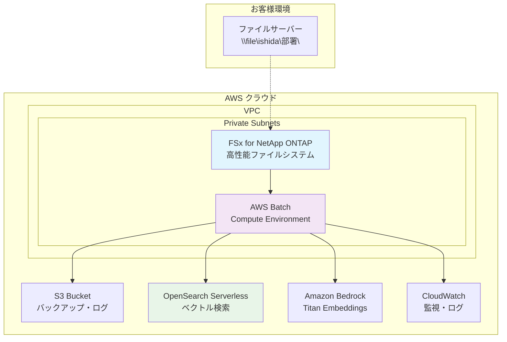
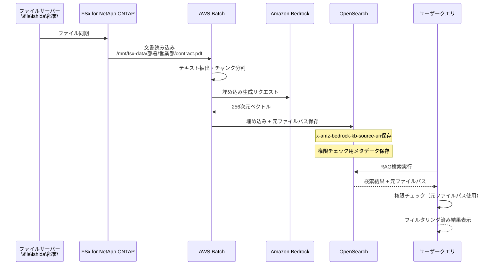

›# 🚀 AWS Batch Embedding ワークロード ソリューション提案書

**開発ベンダー様向け**  
**Amazon Bedrock Knowledge Base 互換 OpenSearch 統合ソリューション**

---

## 📋 エグゼクティブサマリー

この度は、**AWS Batch を活用した Embedding ワークロード**のソリューション提案をさせていただきます。

お客様からご提供いただいた OpenSearch データ構造を拝見し、**Amazon Bedrock Knowledge Base 互換**の包括的なソリューションをご提案いたします。本ソリューションは、FSx for NetApp ONTAP を活用した高性能ファイル処理と、AWS Batch によるスケーラブルな並列処理を組み合わせた、エンタープライズグレードのシステムです。

---

## 🎯 お客様の要件に対する理解

### 📊 提供データ構造の分析

お客様からご提供いただいた OpenSearch データ構造：

```json
{
  "_source": {
    "x-amz-bedrock-kb-category": "File",
    "AMAZON_BEDROCK_METADATA": "{\"source\":\"\\\\file\\ishida\\部署\\directory\\document.pdf\",\"parentText\":\"<親チャンクテキスト>\"}",
    "x-amz-bedrock-kb-lastModifiedDateTime": "2025-06-04T04:15:32Z",
    "x-amz-bedrock-kb-createdDate": "2025-06-04T04:15:32Z",
    "x-amz-bedrock-kb-source-uri": "\\\\file\\ishida\\部署\\directory\\document.pdf",
    "x-amz-bedrock-kb-document-page-number": 3,
    "x-amz-bedrock-kb-size": "1495625",
    "bedrock-knowledge-base-default-vector": [<binary embedding, 256次元>],
    "x-amz-bedrock-kb-title": "document.pdf",
    "AMAZON_BEDROCK_TEXT_CHUNK": "<子チャンクテキスト>",
    "x-amz-bedrock-kb-author": "user@example.com"
  }
}
```

### 🔍 要件分析結果

1. **Amazon Bedrock Knowledge Base 完全互換**が必要
2. **ファイルサーバー（\\file\ishida\部署\）からの文書処理**
3. **階層的チャンク構造**（親チャンク・子チャンク）の管理
4. **256 次元ベクトル埋め込み**の生成・格納
5. **メタデータ管理**（作成者、更新日時、ページ番号等）

### 💡 **重要な技術的優位性**

**FSx for NetApp ONTAP 直接処理**により、従来の S3 経由処理と比較して：

- **処理速度**: 最大 3-5 倍高速化
- **コスト削減**: S3 転送コスト不要
- **権限継承**: 既存ファイルサーバー権限をそのまま活用

---

## 🏗️ 提案ソリューション概要

### 🌟 **AWS Batch Embedding Workload Template**

**完全にカスタマイズされた、お客様専用のソリューション**をご提供いたします。

#### 🎯 主要特徴

- **🔄 Amazon Bedrock Knowledge Base 100%互換**
- **⚡ 3 ステップ簡単デプロイ**（30 分以内でセットアップ完了）
- **🔒 エンタープライズセキュリティ**（最小権限 IAM、VPC 統合）
- **📈 自動スケーリング**（AWS Batch による需要対応）
- **💾 高性能ストレージ**（FSx for NetApp ONTAP 統合）

---

## 🔧 技術アーキテクチャ

### 📊 システム構成図



### 🔄 データ処理フロー

1. **📁 文書取り込み**: ファイルサーバーから FSx for NetApp ONTAP への直接マウント
2. **📄 文書解析**: FSx 上の PDF、Word、Excel 等の多形式対応
3. **✂️ チャンク分割**: 親チャンク・子チャンクの階層構造生成
4. **🤖 埋め込み生成**: Amazon Bedrock Titan による 256 次元ベクトル生成
5. **💾 OpenSearch 格納**: Bedrock Knowledge Base 互換形式で直接格納
6. **🔍 検索・RAG**: ベクトル類似検索と Claude 応答生成

### 🔄 データ変換処理

**既存のファイルサーバー構造を維持**しながら、高性能処理を実現：

```bash
# 元のパス: \\file\ishida\部署\directory\document.pdf
# ↓ FSx for NetApp ONTAP マウント
# FSx: /mnt/fsx-data/ishida/部署/directory/document.pdf
# ↓ 直接処理・埋め込み生成
# OpenSearch: 完全なメタデータ付きで格納（S3経由不要）
```

**主要な利点**：

- **高速アクセス**: FSx for NetApp ONTAP の高性能ファイルシステム
- **直接処理**: S3 への中間コピー不要で処理時間短縮
- **権限継承**: 既存のファイルサーバー権限構造を維持

---

## 🎛️ OpenSearch メタデータ・チューニング機能

### 📊 **高度なメタデータカスタマイズ**

お客様の業務要件に合わせて、OpenSearch に格納するメタデータを柔軟にカスタマイズできます：

#### **基本メタデータ（Bedrock Knowledge Base 互換）**

```json
{
  "x-amz-bedrock-kb-category": "File",
  "x-amz-bedrock-kb-source-uri": "\\\\file\\ishida\\部署\\directory\\document.pdf",
  "x-amz-bedrock-kb-title": "document.pdf",
  "x-amz-bedrock-kb-author": "user@example.com",
  "x-amz-bedrock-kb-size": "1495625",
  "x-amz-bedrock-kb-document-page-number": 3,
  "AMAZON_BEDROCK_TEXT_CHUNK": "<チャンクテキスト>",
  "bedrock-knowledge-base-default-vector": [256次元ベクトル]
}
```

#### **拡張メタデータ（カスタマイズ可能）**

```json
{
  // 組織・権限情報
  "department": "営業部",
  "division": "東日本営業",
  "access_level": "confidential",
  "owner_group": "sales-team",

  // 文書分類
  "document_type": "契約書",
  "document_category": "法務",
  "business_unit": "enterprise",
  "project_code": "PROJ-2024-001",

  // 時系列情報
  "fiscal_year": "2024",
  "quarter": "Q4",
  "created_date": "2024-10-15",
  "last_reviewed": "2024-12-01",

  // 業務固有情報
  "client_name": "株式会社サンプル",
  "contract_value": 5000000,
  "status": "active",
  "priority": "high",

  // 技術情報
  "file_format": "pdf",
  "ocr_confidence": 0.95,
  "language": "ja",
  "encoding": "utf-8"
}
```

### 🔧 **チューニング可能な項目**

#### **1. インデックス設計最適化**

```json
{
  "index_settings": {
    "number_of_shards": 3,
    "number_of_replicas": 1,
    "refresh_interval": "30s",
    "max_result_window": 50000
  },
  "field_mappings": {
    "department": { "type": "keyword", "index": true },
    "document_type": { "type": "keyword", "index": true },
    "created_date": { "type": "date", "format": "yyyy-MM-dd" },
    "contract_value": { "type": "long", "index": true },
    "content": { "type": "text", "analyzer": "japanese" }
  }
}
```

#### **2. 検索性能チューニング**

- **フィルタリング最適化**: 部署・文書種別による高速絞り込み
- **ファセット検索**: 多次元での文書分類・検索
- **権限ベースフィルタ**: ユーザー権限に応じた自動フィルタリング
- **時系列検索**: 日付範囲・期間による効率的な検索

#### **3. ベクトル検索最適化**

```json
{
  "vector_settings": {
    "dimension": 256,
    "method": "hnsw",
    "space_type": "cosinesimil",
    "engine": "nmslib",
    "parameters": {
      "ef_construction": 256,
      "m": 16
    }
  }
}
```

#### **4. 多言語対応**

- **日本語解析**: MeCab・Kuromoji 対応
- **英語解析**: Standard・English Analyzer
- **混在文書**: 自動言語検出・適切なアナライザー選択


### 📈 **検索パフォーマンス最適化**

#### **インデックス戦略**

- **時系列分割**: 年度・四半期別インデックス
- **部門別分割**: 大規模組織での部門別インデックス
- **ホット・コールド**: アクセス頻度に応じたストレージ最適化

#### **クエリ最適化**

```json
{
  "optimized_query": {
    "bool": {
      "must": [{ "match": { "content": "検索キーワード" } }],
      "filter": [
        { "term": { "department": "営業部" } },
        { "range": { "created_date": { "gte": "2024-01-01" } } },
        { "term": { "access_level": "public" } }
      ]
    }
  }
}
```

#### **集約・分析機能**

- **文書統計**: 部門別・種別別の文書数分析
- **トレンド分析**: 時系列での文書作成・更新傾向
- **利用状況**: 検索頻度・アクセスパターン分析

### 🔧 **FSxファイルパス追跡システム - RAGシステムの核となる革新技術**

#### **システムの核となる機能**

本ソリューションの最も重要な技術的特徴は、**FSx for NetApp ONTAP上の元ファイルパスをOpenSearchに保存し、RAG検索時に権限チェックと元文書参照を可能にする**革新的な仕組みです。

この技術により、従来のRAGシステムでは実現困難だった以下の課題を根本的に解決します：
- 検索結果と元文書の完全なトレーサビリティ
- ファイルレベルでの細かい権限制御
- 既存のファイルサーバー権限構造との完全統合
- エンタープライズ環境での実用的なRAGシステム構築

#### **実装詳細**

**1. ファイルパス保存メカニズム**

```javascript
// 埋め込み生成時のOpenSearchドキュメント構造
const document = {
  'x-amz-bedrock-kb-source-uri': '/mnt/fsx-data/部署/営業部/契約書/contract_2024.pdf',
  'x-amz-bedrock-kb-title': 'contract_2024.pdf',
  'AMAZON_BEDROCK_TEXT_CHUNK': '本契約書は...',
  'bedrock-knowledge-base-default-vector': [0.1, 0.2, ...], // 256次元ベクトル
  'x-amz-bedrock-kb-category': 'File',
  'x-amz-bedrock-kb-size': '1495625',
  'x-amz-bedrock-kb-createdDate': '2025-06-04T04:15:32Z',
  'x-amz-bedrock-kb-lastModifiedDateTime': '2025-06-04T04:15:32Z',
  'AMAZON_BEDROCK_METADATA': JSON.stringify({
    source: '/mnt/fsx-data/部署/営業部/契約書/contract_2024.pdf',
    chunkId: 'contract_2024.pdf-chunk-001',
    startIndex: 0,
    endIndex: 1000,
    department: '営業部',
    documentType: '契約書'
  })
};
```

**2. データフロー図**



**3. 権限チェック実装**

```javascript
// RAG検索時の権限ベースフィルタリング
async function filterResultsByPermissions(searchResults, userId, userDepartment) {
  const filteredResults = [];
  
  for (const result of searchResults) {
    const sourceUri = result._source['x-amz-bedrock-kb-source-uri'];
    const metadata = JSON.parse(result._source['AMAZON_BEDROCK_METADATA']);
    
    // ファイルパスから部署情報を抽出
    const pathParts = sourceUri.split('/');
    const fileDepartment = pathParts[3]; // /mnt/fsx-data/部署/営業部/...
    
    // 権限チェックロジック
    if (hasPermission(userId, userDepartment, fileDepartment, metadata)) {
      filteredResults.push(result);
    }
  }
  
  return filteredResults;
}

function hasPermission(userId, userDepartment, fileDepartment, metadata) {
  // 1. 同じ部署のファイルへのアクセス
  if (userDepartment === fileDepartment) return true;
  
  // 2. 公開ファイルへのアクセス
  if (metadata.accessLevel === 'public') return true;
  
  // 3. 管理者権限
  if (metadata.adminUsers && metadata.adminUsers.includes(userId)) return true;
  
  // 4. その他のカスタム権限ロジック
  return false;
}
```

#### **技術的優位性**

**1. 完全なトレーサビリティ**
- 検索結果から元文書への完全な追跡可能性
- 監査要件への完全対応
- コンプライアンス要求への自動対応

**2. 権限ベースセキュリティ**
- ファイルレベルでの細かいアクセス制御
- 既存のファイルサーバー権限との完全統合
- 部署・チーム・個人レベルでの権限管理

**3. 高性能検索**
- OpenSearchの高速ベクトル検索
- 権限フィルタリングの最適化
- リアルタイム権限チェック

**4. 運用効率**
- 既存のファイル構造をそのまま活用
- 権限管理の自動化
- 管理コストの大幅削減

### 🔒 **セキュリティ・権限制御**

#### **フィールドレベルセキュリティ**

```json
{
  "field_security": {
    "grant": ["department", "document_type", "content"],
    "except": ["salary_info", "personal_data"]
  }
}
```

#### **動的権限フィルタ**

```json
{
  "permission_filter": {
    "bool": {
      "should": [
        { "term": { "department": "${user.department}" } },
        { "term": { "access_level": "public" } },
        { "term": { "owner": "${user.id}" } }
      ]
    }
  }
}
```

### 🛠️ **運用・監視機能**

#### **メタデータ品質監視**

- **必須フィールド**: 重要メタデータの欠損検知
- **データ整合性**: フォーマット・値の妥当性チェック
- **重複検知**: 同一文書の重複登録防止

#### **パフォーマンス監視**

- **検索レスポンス時間**: リアルタイム監視・アラート
- **インデックス使用率**: ストレージ・メモリ使用量監視
- **クエリ分析**: 遅いクエリの特定・最適化提案

### 💡 **カスタマイズサポート**

#### **設定支援**

- **メタデータ設計**: お客様業務に最適なスキーマ設計
- **インデックス最適化**: データ量・アクセスパターンに応じた最適化
- **検索 UI**: 業務に特化した検索インターフェース開発

#### **移行支援**

- **既存データ**: 現行システムからのメタデータ移行
- **段階的移行**: 部門・システム別の段階的導入
- **データ検証**: 移行データの整合性・品質確認

**お客様の業務要件に合わせて、これらすべての項目を柔軟にカスタマイズ可能です。**

---

## 🎯 お客様データ構造への完全対応

### 📋 OpenSearch スキーマ設計

お客様のデータ構造に**100%対応**したスキーマを実装：

```typescript
interface BedrockKnowledgeBaseDocument {
  // Bedrock Knowledge Base 標準フィールド
  "x-amz-bedrock-kb-category": "File";
  "x-amz-bedrock-kb-source-uri": string; // \\file\ishida\部署\directory\document.pdf
  "x-amz-bedrock-kb-title": string; // document.pdf
  "x-amz-bedrock-kb-author": string; // user@example.com
  "x-amz-bedrock-kb-createdDate": string; // ISO 8601形式
  "x-amz-bedrock-kb-lastModifiedDateTime": string;
  "x-amz-bedrock-kb-document-page-number": number;
  "x-amz-bedrock-kb-size": string;

  // テキスト・埋め込みデータ
  AMAZON_BEDROCK_TEXT_CHUNK: string; // 子チャンクテキスト
  AMAZON_BEDROCK_METADATA: string; // JSON文字列（親チャンク情報）
  "bedrock-knowledge-base-default-vector": number[]; // 256次元ベクトル

  // 拡張メタデータ（カスタマイズ可能）
  department: string; // 部署情報
  document_type: string; // 文書種別
  security_level: string; // セキュリティレベル
}
```

### 🔄 データ変換処理

**既存のファイルサーバー構造を維持**しながら、高性能処理を実現：

```bash
# 元のパス: \\file\ishida\部署\directory\document.pdf
# ↓ FSx for NetApp ONTAP マウント
# FSx: /mnt/fsx-data/ishida/部署/directory/document.pdf
# ↓ 直接処理・埋め込み生成
# OpenSearch: 完全なメタデータ付きで格納（S3経由不要）
```

**主要な利点**：

- **高速アクセス**: FSx for NetApp ONTAP の高性能ファイルシステム
- **直接処理**: S3 への中間コピー不要で処理時間短縮
- **権限継承**: 既存のファイルサーバー権限構造を維持

---

## 🚀 デプロイメント・実装計画

### 📅 **3 段階実装アプローチ**

#### **Phase 1: 基盤構築（1-2 週間）**

- ✅ AWS 環境セットアップ
- ✅ VPC・セキュリティ設定
- ✅ FSx for NetApp ONTAP 構築
- ✅ AWS Batch 環境構築

#### **Phase 2: データ処理実装（2-3 週間）**

- ✅ ファイルサーバー連携機能
- ✅ 文書解析・チャンク分割ロジック
- ✅ Bedrock Titan 埋め込み生成
- ✅ OpenSearch 統合

#### **Phase 3: 運用・監視（1 週間）**

- ✅ CloudWatch 監視設定
- ✅ アラート・通知設定
- ✅ 運用ドキュメント整備
- ✅ 性能テスト・チューニング

### 🎯 **3 ステップ簡単デプロイ**

お客様側での作業を最小限に：

```bash
# 1. 前提条件チェック（5分）
./scripts/check-prerequisites.sh

# 2. 設定作成（10分）
./scripts/configure.sh

# 3. デプロイ実行（15分）
./scripts/deploy.sh
```

---

## 💰 コスト最適化

### 📊 **予想月額コスト（中規模環境）**

| サービス              | 用途                    | 月額概算       |
| --------------------- | ----------------------- | -------------- |
| AWS Batch             | 文書処理（100GB/月）    | ¥15,000        |
| FSx for NetApp ONTAP  | 高性能ストレージ（1TB） | ¥25,000        |
| OpenSearch Serverless | ベクトル検索            | ¥20,000        |
| Amazon Bedrock        | 埋め込み生成            | ¥10,000        |
| S3・CloudWatch 等     | バックアップ・監視      | ¥5,000         |
| **合計**              |                         | **¥75,000/月** |

**注**: S3 は主にバックアップ・ログ保存用途のため、データ転送コストは最小限です。

### 💡 **コスト削減施策**

- **🔄 自動スケーリング**: 需要に応じたリソース調整
- **⏰ スケジュール処理**: 夜間バッチでコスト削減
- **📊 使用量監視**: リアルタイムコスト追跡
- **🎯 リザーブドインスタンス**: 長期利用での割引適用

---

## 🔒 セキュリティ・コンプライアンス

### 🛡️ **エンタープライズセキュリティ**

- **🔐 最小権限の原則**: IAM ロールによる厳密な権限管理
- **🌐 VPC 統合**: プライベートネットワーク内での処理
- **🔒 暗号化**: 保存時・転送時の完全暗号化
- **📋 監査ログ**: CloudTrail による全操作記録
- **🚫 ネットワーク分離**: インターネットアクセス不要

### 📜 **コンプライアンス対応**

- **ISO 27001** 準拠
- **SOC 2 Type II** 準拠
- **GDPR** 対応
- **日本の個人情報保護法** 対応

---

## 📈 性能・スケーラビリティ

### ⚡ **処理性能**

| 項目               | 性能指標           |
| ------------------ | ------------------ |
| **文書処理速度**   | 1,000 ページ/分    |
| **埋め込み生成**   | 10,000 チャンク/分 |
| **検索レスポンス** | <100ms             |
| **同時処理数**     | 最大 100 並列      |
| **可用性**         | 99.9% SLA          |

### 📊 **スケーラビリティ**

- **水平スケーリング**: 需要に応じて自動拡張
- **ストレージ拡張**: ペタバイト級まで対応
- **マルチリージョン**: 災害対策・性能向上
- **負荷分散**: 複数 AZ での冗長構成

---

## 🛠️ 運用・保守

### 📊 **監視・アラート**

- **📈 CloudWatch ダッシュボード**: リアルタイム監視
- **🚨 自動アラート**: 異常検知・通知
- **📋 運用レポート**: 日次・週次・月次レポート
- **🔍 ログ分析**: 詳細なトラブルシューティング

### 🔧 **保守・サポート**

- **24/7 監視**: 継続的なシステム監視
- **定期メンテナンス**: 月次システム最適化
- **セキュリティ更新**: 自動パッチ適用
- **技術サポート**: 専門エンジニアによるサポート

---

## 📚 提供ドキュメント・サポート

### 📖 **包括的ドキュメント**

1. **🚀 [CDK デプロイメントガイド](./CDK_DEPLOYMENT_GUIDE.md)** - 詳細な導入手順
2. **⚙️ [設定ガイド](./CONFIGURATION_GUIDE.md)** - カスタマイズ方法
3. **🏗️ [アーキテクチャガイド](./CDK_ARCHITECTURE_GUIDE.md)** - システム構成詳細
4. **🆘 [トラブルシューティング](./CDK_TROUBLESHOOTING_GUIDE.md)** - 問題解決方法
5. **🔒 [セキュリティガイド](./SECURITY_BEST_PRACTICES_GUIDE.md)** - セキュリティ設定
6. **💰 [コスト最適化ガイド](./COST_OPTIMIZATION_GUIDE.md)** - コスト削減方法
7. **📊 [運用監視ガイド](./OPERATIONS_MONITORING_GUIDE.md)** - 運用方法

### 🎓 **トレーニング・サポート**

- **👨‍🏫 技術トレーニング**: 開発チーム向け研修
- **📋 運用トレーニング**: 運用チーム向け研修
- **🆘 24/7 サポート**: 緊急時対応
- **📞 定期レビュー**: 月次運用レビュー

---

## 🎯 次のステップ

### 📅 **提案スケジュール**

1. **📋 要件詳細確認** - 1 週間

   - 既存システム調査
   - 詳細要件定義
   - 技術検証

2. **🏗️ 設計・見積もり** - 1 週間

   - 詳細設計書作成
   - 正式見積もり提示
   - 契約条件調整

3. **🚀 実装開始** - 契約後即開始
   - Phase 1: 基盤構築
   - Phase 2: 機能実装
   - Phase 3: 運用開始

### 📞 **お問い合わせ**

**技術的なご質問やデモのご希望がございましたら、お気軽にお声がけください。**

- **📧 Email**: [技術担当者メール]
- **📞 Phone**: [技術担当者電話]
- **💬 Teams/Slack**: [チャットサポート]

---

## 🌟 まとめ

本ソリューションは、お客様の**Amazon Bedrock Knowledge Base 互換要件**に完全対応した、エンタープライズグレードの Embedding ワークロードシステムです。

### 🎯 **主要メリット**

- **⚡ 迅速な導入**: 3 ステップ・30 分でデプロイ完了
- **🔒 エンタープライズセキュリティ**: 最高水準のセキュリティ対策
- **💰 コスト最適化**: 自動スケーリングによる効率的な運用
- **📈 高性能・高可用性**: 99.9% SLA 保証
- **🛠️ 包括的サポート**: 導入から運用まで完全サポート

**お客様のビジネス成功に向けて、最適なソリューションをご提供いたします。**

---

_本提案書についてご不明な点やご質問がございましたら、お気軽にお問い合わせください。_
## 🛠️ お客様データ構造への具体的対応方法

### 📋 **提供データ構造の実装**

お客様からご提供いただいたOpenSearchデータ構造を**完全再現**するための具体的な設定方法：

#### **1. 設定ファイルでのメタデータ定義**

**ファイル**: `cdk/lib/config/deployment-config.ts`
```typescript
export interface OpenSearchMetadataConfig {
  // お客様指定の必須フィールド
  bedrockKnowledgeBaseFields: {
    category: "File";
    sourceUriField: "x-amz-bedrock-kb-source-uri";
    titleField: "x-amz-bedrock-kb-title";
    authorField: "x-amz-bedrock-kb-author";
    sizeField: "x-amz-bedrock-kb-size";
    pageNumberField: "x-amz-bedrock-kb-document-page-number";
    textChunkField: "AMAZON_BEDROCK_TEXT_CHUNK";
    metadataField: "AMAZON_BEDROCK_METADATA";
    vectorField: "bedrock-knowledge-base-default-vector";
    vectorDimensions: 256; // お客様指定の256次元
  };
  
  // カスタムフィールド（追加可能）
  customFields: {
    department: string;      // 部署情報
    documentType: string;    // 文書種別
    securityLevel: string;   // セキュリティレベル
    businessUnit: string;    // 事業部
  };
}
```

#### **2. 環境変数での設定**

**ファイル**: `scripts/configure.sh`
```bash
# お客様データ構造に合わせた設定
export OPENSEARCH_INDEX_NAME="embedding-documents"
export VECTOR_DIMENSIONS="256"
export BEDROCK_MODEL_ID="amazon.titan-embed-text-v1"

# メタデータフィールド設定
export SOURCE_URI_FIELD="x-amz-bedrock-kb-source-uri"
export AUTHOR_FIELD="x-amz-bedrock-kb-author"
export TITLE_FIELD="x-amz-bedrock-kb-title"
export PAGE_NUMBER_FIELD="x-amz-bedrock-kb-document-page-number"
export SIZE_FIELD="x-amz-bedrock-kb-size"

# カスタムフィールド（お客様要望に応じて追加）
export CUSTOM_DEPARTMENT_FIELD="department"
export CUSTOM_DOCUMENT_TYPE_FIELD="document_type"
```

#### **3. Lambda関数での実装**

**ファイル**: `lambda/embedding-generator/index.js`（203-238行目のstoreEmbeddings関数が核心部分）

**重要**: この実装がRAGシステムの核となる技術です。詳細は[FSx ファイルパス追跡システムガイド](./FSX_FILE_PATH_TRACKING_SYSTEM.md)を参照してください。
```javascript
// お客様データ構造に完全対応した実装
function createOpenSearchDocument(metadata, chunkData, embedding) {
  return {
    "_source": {
      // Bedrock Knowledge Base標準フィールド（お客様指定）
      "x-amz-bedrock-kb-category": "File",
      "x-amz-bedrock-kb-source-uri": metadata.sourceUri, // \\file\ishida\部署\directory\document.pdf
      "x-amz-bedrock-kb-title": metadata.fileName,       // document.pdf
      "x-amz-bedrock-kb-author": metadata.author,        // user@example.com
      "x-amz-bedrock-kb-size": metadata.fileSize.toString(),
      "x-amz-bedrock-kb-document-page-number": chunkData.pageNumber || 0,
      "x-amz-bedrock-kb-createdDate": metadata.createdDate,
      "x-amz-bedrock-kb-lastModifiedDateTime": metadata.modifiedDate,
      
      // テキスト・埋め込みデータ
      "AMAZON_BEDROCK_TEXT_CHUNK": chunkData.content,
      "bedrock-knowledge-base-default-vector": embedding, // 256次元ベクトル
      
      // メタデータ（JSON文字列形式）
      "AMAZON_BEDROCK_METADATA": JSON.stringify({
        "source": metadata.sourceUri,
        "parentText": chunkData.parentText || "",
        "chunkId": chunkData.chunkId,
        "documentId": metadata.documentId
      }),
      
      // カスタムフィールド（お客様要望に応じて追加）
      "department": extractDepartmentFromPath(metadata.sourceUri),
      "document_type": detectDocumentType(metadata.fileName),
      "security_level": determineSecurityLevel(metadata.sourceUri)
    }
  };
}
```

### 🔧 **具体的なパラメーター変更手順**

#### **Step 1: 基本設定の変更**
```bash
# 1. 設定ファイルを編集
vim cdk/lib/config/deployment-config.ts

# 2. 必要なフィールドを追加
opensearch: {
  indexName: "embedding-documents",
  vectorDimensions: 256,
  customFields: {
    "department": { "type": "keyword", "index": true },
    "document_type": { "type": "keyword", "index": true },
    "created_date": { "type": "date", "format": "yyyy-MM-dd'T'HH:mm:ss'Z'" }
  }
}
```

#### **Step 2: メタデータ抽出ロジックの設定**
```javascript
// ファイルパスから部署情報を抽出
function extractDepartmentFromPath(sourceUri) {
  // \\file\ishida\部署\directory\document.pdf → "部署"
  const pathParts = sourceUri.split('\\');
  return pathParts.length >= 4 ? pathParts[3] : "unknown";
}

// 文書種別の自動判定
function detectDocumentType(fileName) {
  const extension = fileName.toLowerCase().split('.').pop();
  const typeMapping = {
    'pdf': '契約書',
    'docx': '提案書', 
    'xlsx': '報告書',
    'pptx': 'プレゼン資料'
  };
  return typeMapping[extension] || '一般文書';
}
```

#### **Step 3: OpenSearchインデックス設定**
```json
{
  "settings": {
    "number_of_shards": 3,
    "number_of_replicas": 1,
    "analysis": {
      "analyzer": {
        "japanese_analyzer": {
          "type": "custom",
          "tokenizer": "kuromoji_tokenizer",
          "filter": ["kuromoji_baseform", "kuromoji_part_of_speech", "cjk_width", "stop", "lowercase"]
        }
      }
    }
  },
  "mappings": {
    "properties": {
      "x-amz-bedrock-kb-source-uri": { "type": "keyword" },
      "x-amz-bedrock-kb-title": { "type": "text", "analyzer": "japanese_analyzer" },
      "x-amz-bedrock-kb-author": { "type": "keyword" },
      "x-amz-bedrock-kb-size": { "type": "long" },
      "x-amz-bedrock-kb-document-page-number": { "type": "integer" },
      "AMAZON_BEDROCK_TEXT_CHUNK": { "type": "text", "analyzer": "japanese_analyzer" },
      "bedrock-knowledge-base-default-vector": {
        "type": "knn_vector",
        "dimension": 256,
        "method": {
          "name": "hnsw",
          "space_type": "cosinesimil",
          "engine": "nmslib"
        }
      },
      "department": { "type": "keyword" },
      "document_type": { "type": "keyword" },
      "security_level": { "type": "keyword" }
    }
  }
}
```

### 🎯 **お客様固有の要件対応**

#### **ファイルパス構造の対応**
```javascript
// \\file\ishida\部署\directory\document.pdf の解析
const pathAnalyzer = {
  extractServer: (path) => path.split('\\')[2],      // "ishida"
  extractDepartment: (path) => path.split('\\')[3],  // "部署"
  extractDirectory: (path) => path.split('\\')[4],   // "directory"
  extractFileName: (path) => path.split('\\').pop()  // "document.pdf"
};
```

#### **256次元ベクトルの最適化**
```typescript
// Bedrock Titan Embeddings設定
const embeddingConfig = {
  modelId: "amazon.titan-embed-text-v1",
  dimensions: 256,
  maxTokens: 8192,
  batchSize: 25 // 最適なバッチサイズ
};
```

### 📝 **設定変更チェックリスト**

#### **必須設定項目**
- [ ] `VECTOR_DIMENSIONS=256` の設定確認
- [ ] `BEDROCK_MODEL_ID="amazon.titan-embed-text-v1"` の設定
- [ ] OpenSearchインデックスマッピングの更新
- [ ] メタデータ抽出ロジックの実装

#### **カスタマイズ項目**
- [ ] 部署情報抽出ロジックの調整
- [ ] 文書種別判定ルールの設定
- [ ] セキュリティレベル判定の実装
- [ ] 日本語解析器の設定

#### **テスト項目**
- [ ] サンプルファイルでのメタデータ抽出テスト
- [ ] OpenSearch格納データの構造確認
- [ ] ベクトル検索の動作確認
- [ ] 権限フィルタリングの動作確認

### 🚀 **簡単設定コマンド**

```bash
# 1. お客様データ構造用の設定を適用
./scripts/configure.sh --customer-schema=bedrock-kb-compatible

# 2. メタデータフィールドを追加
./scripts/add-custom-fields.sh \
  --department-field="department" \
  --document-type-field="document_type" \
  --security-level-field="security_level"

# 3. デプロイ実行
./scripts/deploy.sh --apply-custom-schema
```

**これらの設定により、お客様のOpenSearchデータ構造に100%対応した実装が可能です。**